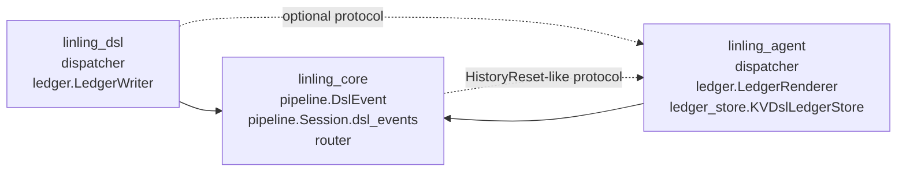
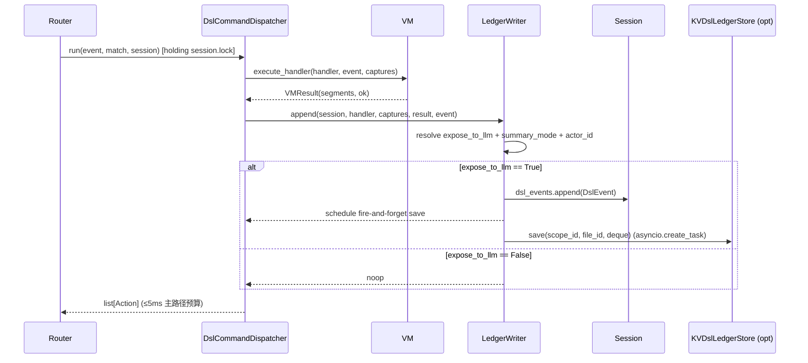

# Design Document — DSL Action Ledger

本设计基于已批准的 `requirements.md`(11 项 Requirements,EARS 格式)。目标是让 LLM 兜底对话能够"看见"用户在同一会话中刚刚执行过的 DSL 操作,同时保持现有 DSL 命令路径与 chat 路径在数据流上互不污染。

## Overview

### 问题陈述

当前架构(`packages/`)下:

- **DSL 命令路径**:`Router._dispatch → DslCommandDispatcher.run → VM.execute_handler → segments → Action`,segments **从不**进入 `Session.history`,也不通过 `KVHistoryStore` 持久化。
- **LLM chat 路径**:`Router._dispatch → AgentChatDispatcher.run → AgentRuntime.invoke(history=session.history) → AgentResult`,`history` **只**包含 user / assistant turn(`KVHistoryStore._only_turn_messages` 显式过滤掉非 turn 角色)。

两条路径共享 `session.lock` 但**不共享上下文**。结果:用户在同一会话中先用 DSL 指令做了几次操作(签到、查灵玉、扭蛋),再用自然语言提问"我刚才做了什么",LLM 完全看不到 DSL 那几轮发生过什么 —— 上下文断层。

### 设计目标

1. **可见性**:LLM 调用前能拿到最近 DSL 操作的紧凑摘要。
2. **解耦**:不污染 `Session.history`,不破坏 `_only_turn_messages` 不变量,不引入 provider-specific `tool_call` schema。
3. **可控性**:handler 级 `expose_to_llm` 白/黑名单 + 字符 budget + 两档 summary 模式。
4. **持久化**:支持跨进程重启的 1 小时 TTL 复活,但与 chat history 完全独立的 KV 命名空间。
5. **作用域语义一致性**:group 共享、DM 隔离;`/reset` 同步清空 history 与 ledger;`/cancel` 不污染 ledger。
6. **分阶段可上线**:严格按 6 个阶段渐进式落地,每个阶段独立可测。

### 架构原则

- `linling_core` 不依赖 `linling_dsl` / `linling_agent`(现有约束)。`DslEvent` 与 `Session.dsl_events` 字段必须落在 `linling_core.pipeline`,且不引入 DSL/Agent 的导入。
- `LedgerWriter` 与 `LedgerRenderer` 是纯逻辑组件(无 IO,可单测),分别部署在它们各自的"宿主"包:`LedgerWriter` 跟 DSL 派发相关 → `linling_dsl`;`LedgerRenderer` 跟 LLM 注入相关 → `linling_agent`。
- `KVDslLedgerStore` 与 `KVHistoryStore` 同层、同模块风格(不复用键空间) → `linling_agent`。
- 渲染产物是**临时** `Message`,**绝不**进 `Session.history`,**绝不**经 `HistoryStore.save`。

## Architecture

### 模块归属表

| 组件 | 包 | 文件 | 依赖方向 |
|---|---|---|---|
| `DslEvent` 数据类 | `linling_core` | `linling_core/pipeline.py` | 不导入 dsl/agent |
| `Session.dsl_events: deque[DslEvent]` | `linling_core` | `linling_core/pipeline.py` | 同上 |
| `LedgerWriter` | `linling_dsl` | `linling_dsl/ledger.py` (新增) | 依赖 `linling_core` 与可选 `KVDslLedgerStore` 协议 |
| `DslCommandDispatcher` 修改 | `linling_dsl` | `linling_dsl/dispatcher.py` | 调用 `LedgerWriter` |
| `LedgerRenderer` | `linling_agent` | `linling_agent/ledger.py` (新增) | 依赖 `linling_core.DslEvent`、`linling_agent.llm.Message` |
| `KVDslLedgerStore` | `linling_agent` | `linling_agent/ledger_store.py` (新增) | 依赖 `linling_core.storage.kv.KVStore` |
| `AgentChatDispatcher` 修改 | `linling_agent` | `linling_agent/dispatcher.py` | 注入 ledger 渲染产物 |
| `Router._do_reset` 修改 | `linling_core` | `linling_core/router.py` | 仅清 `session.dsl_events` + 通过协议调用 store |

依赖方向(箭头表示"依赖"):



`Core` 仍然不向 `DSL`/`Agent` 反向依赖。`DSL → Agent` 的虚线表示:`DslCommandDispatcher` 通过**结构化协议**接受一个 `LedgerStore` 对象(无具体类导入),由 bootstrap 注入 `KVDslLedgerStore` 实例。

### 派发时序

#### DSL 命令派发(写入 ledger)



#### LLM 兜底派发(读取并注入 ledger)

```mermaid
sequenceDiagram
  participant Router
  participant Chat as AgentChatDispatcher
  participant Sess as Session
  participant HStore as KVHistoryStore
  participant LStore as KVDslLedgerStore
  participant Render as LedgerRenderer
  participant Agent as AgentRuntime

  Router->>Chat: run(event, session) [holding session.lock]
  par 并发 rehydrate
    Chat->>HStore: load(scope, sender) [if not history_hydrated]
    Chat->>LStore: load(scope_id, file_id) [if not ledger_hydrated]
  end
  HStore-->>Chat: messages
  LStore-->>Chat: events
  Chat->>Sess: history.extend(messages); dsl_events.extend(events)
  Chat->>Render: render(session.dsl_events, budgets, scope_kind)
  alt 有可见事件 且 字符预算可容纳
    Render-->>Chat: Message(role="system", content="<recent_user_actions>...")
  else
    Render-->>Chat: None
  end
  Chat->>Agent: invoke(user_input, history=[history... + ledger_msg?] )
  Agent-->>Chat: AgentResult
  Chat->>Sess: history.append(user); history.append(assistant)
  Chat->>HStore: save(turn-only, no ledger msg)  [fire-and-forget under lock]
  Chat-->>Router: AgentResult / Action
```

### 派发取消、reset 路径

- `/cancel`:`Router._do_cancel` 仅 `session.cancel_event.set()`,**不**触碰 `session.dsl_events`。`AgentChatDispatcher.dispatch` 在 cancel 路径返回 `None`,既不 append 任何 turn,也不调用任何 ledger save。
- `/reset`:`Router._do_reset` 在持有 `session.lock` 的同一个 `try` 块内同步执行:`session.history.clear()` → `session.dsl_events.clear()` → `_chats.clear_history(...)`(已存在) → `_chats.clear_ledger(...)`(新协议)。三者顺序固定,任一抛错降级为日志,不阻断后续步骤。

## Components and Interfaces

### `linling_core.pipeline` 改动

#### 新增 `DslEvent` 数据类

```python
# linling_core/pipeline.py 顶部, 紧跟 ConversationKey

from dataclasses import dataclass

@dataclass(frozen=True, slots=True)
class DslEvent:
    """One DSL operation surfaced to the LLM-visible ledger.

    Frozen so deque mutations only happen via append/popleft and never
    via in-place edit; slots to keep memory tight under Ledger_Maxlen=200.
    """
    timestamp: str        # "HH:MM:SS" (零填充, 长度恒为 8)
    trigger: str          # handler.trigger (parser 已剥离 [内部] 前缀)
    args: tuple[str, ...] # HandlerMatch.captures 的不可变快照
    summary: str          # Single_Char_Budget 截断后的摘要; trigger_only 模式下为 ""
    outcome: str          # "ok" | "error"
    mode: str             # "trigger_only" | "with_result"
    actor_id: str         # group 场景下的 sender_id; DM/system 下也填充, renderer 决定是否输出
    occurred_at: float    # time.time(); 持久化排序、TTL 比对用
```

设计理由:

- `args` 用 `tuple` 而非 `list`:配合 `frozen=True` 保证 hash/比较稳定,简化属性测试。
- `actor_id` 不可选(总是有值),renderer 根据 `event.scope.kind` 决定是否输出 `by="..."` 属性。空白/未知用 `"_unknown"`(Requirement 6.4)。
- `occurred_at` 用 `time.time()`(epoch 秒,float),不用 `time.monotonic()` —— 跨进程 rehydrate 需要绝对时间做 TTL 判断。

#### `Session` 字段扩展

```python
@dataclass
class Session:
    key: ConversationKey
    lock: asyncio.Lock = field(default_factory=asyncio.Lock)
    rate_limiter: TokenBucket | None = None
    history: deque[Message] = field(default_factory=deque)
    dsl_events: deque[DslEvent] = field(default_factory=deque)  # 新增
    last_active: float = field(default_factory=time.monotonic)
    cancel_event: asyncio.Event = field(default_factory=asyncio.Event)
```

`ConversationStore.__init__` 增加可选参数 `ledger_maxlen: int = 20`(取值范围 1–200,验证类似 `max_sessions`)。`get_or_create` 在创建 `Session` 时:

```python
session = Session(
    key=key,
    rate_limiter=TokenBucket(rate=self._rate, capacity=self._burst),
    history=deque(maxlen=self._turns),
    dsl_events=deque(maxlen=self._ledger_maxlen),  # 新增
)
```

#### Conversation_Scope(group vs DM)

在 `pipeline.py` 增加纯函数:

```python
def ledger_scope_keys(event: Event, *, logger: structlog.BoundLogger | None = None) -> tuple[str, str]:
    """Returns (scope_id, file_id) for ledger KV writes / lookups.

    - group  → (event.scope.id, "_group")  共享
    - dm     → (event.scope.id, event.sender.id)
    - other  → (event.scope.id, event.sender.id) + 结构化日志 pipeline.ledger_scope_unknown
    """
    if event.scope.kind == "group":
        return event.scope.id, "_group"
    if event.scope.kind == "dm":
        return event.scope.id, event.sender.id or "_unknown"
    if logger is not None:
        logger.warning(
            "pipeline.ledger_scope_unknown",
            scope_kind=event.scope.kind,
            scope_id=event.scope.id,
            sender_id=event.sender.id,
        )
    return event.scope.id, event.sender.id or "_unknown"
```

**注意**:此函数仅用于 ledger。`chat history` 仍用 `(event.scope.id, event.sender.id)` 不变(Requirement 6.7)。

会话锁定的 `ConversationKey` 也保持现状(`Router._conversation_key` 不动)—— group 场景下,**多个 sender 各自有独立 Session**,但他们的 ledger KV 写到同一个 `(scope_id, "_group")` 文件。这意味着 group ledger 的"共享视图"是通过 `KVDslLedgerStore.load` rehydrate 实现的,不是通过共用同一 `Session.dsl_events` 实例。**取舍说明**:

- 优点:不破坏 `Session` 的 per-(bot, scope, sender) 锁语义,DSL 命令派发仍按 sender 串行,避免群里两人同时戳同一 handler 的写竞争。
- 缺点:同一群内两个 sender 同时各派发一个 DSL,他们各自的 in-memory `dsl_events` 可能在短时间窗口内不一致(对方刚 append 的事件在自己进程内尚未 rehydrate)。
- 缓解:每次 chat 进入 `_maybe_rehydrate_ledger` 都从 KV 读最新副本(若 `ledger_hydrated=False` 或 deque 为空),并按 `occurred_at` 升序合并去重,让"我提问 LLM 的那一刻"看到的是 KV 最新状态。
- 备选方案(未采纳):让 group 共享同一 `Session` 实例(`ConversationKey.sender_id=""`)。被否决,因为破坏了现有 `Router._conversation_key` 与 `KVHistoryStore` 的 per-sender 隔离,改动面过大,违反 Requirement 6.7。

### `linling_dsl.ledger` 新模块

```python
# linling_dsl/ledger.py
from __future__ import annotations

import asyncio
import time
from typing import Protocol, runtime_checkable

import structlog

from linling_core.pipeline import DslEvent, Session, ledger_scope_keys
from linling_core.events import Event

from linling_dsl.ast_nodes import Handler

logger = structlog.get_logger(__name__)

_INTERNAL_PREFIX = "[内部]"
_ELLIPSIS = "\u2026"  # U+2026


@runtime_checkable
class LedgerStore(Protocol):
    async def save(self, scope_id: str, file_id: str, events: list[DslEvent]) -> None: ...
    async def load(self, scope_id: str, file_id: str) -> list[DslEvent]: ...
    async def clear(self, scope_id: str, file_id: str) -> None: ...


class LedgerWriter:
    """Resolves expose_to_llm / summary_mode and appends a DslEvent."""

    def __init__(
        self,
        *,
        store: LedgerStore | None = None,
        single_char_budget: int = 200,
        global_default_expose: bool = True,
    ) -> None:
        if not 150 <= single_char_budget <= 300:
            raise ValueError("single_char_budget out of range [150, 300]")
        self._budget = single_char_budget
        self._default_expose = bool(global_default_expose)
        self._store = store

    def append(
        self,
        *,
        session: Session,
        handler: Handler,
        captures: list[str],
        raw_summary: str,
        outcome: str,           # "ok" | "error"
        event: Event,
    ) -> None:
        if not self._resolve_expose(handler):
            return
        mode = self._resolve_mode(handler)
        summary = "" if (outcome == "error" or mode == "trigger_only") else self._truncate(raw_summary)
        ev = DslEvent(
            timestamp=time.strftime("%H:%M:%S", time.localtime()),
            trigger=handler.trigger,
            args=tuple(captures),
            summary=summary,
            outcome=outcome,
            mode=mode,
            actor_id=event.sender.id or "_unknown",
            occurred_at=time.time(),
        )
        session.dsl_events.append(ev)  # deque.maxlen 自动 FIFO 淘汰
        if self._store is not None:
            scope_id, file_id = ledger_scope_keys(event, logger=logger)
            asyncio.create_task(self._safe_save(scope_id, file_id, list(session.dsl_events)))

    async def _safe_save(self, scope_id: str, file_id: str, events: list[DslEvent]) -> None:
        try:
            assert self._store is not None
            await self._store.save(scope_id, file_id, events)
        except Exception:
            logger.exception("dsl_dispatcher.ledger_save_failed",
                             scope_id=scope_id, file_id=file_id)

    def _resolve_expose(self, handler: Handler) -> bool:
        # Requirement 3.1–3.6:显式 True/False > [内部] 前缀 → False > Global_Default_Expose
        explicit = getattr(handler, "expose_to_llm", None)
        if explicit is True or explicit is False:
            return explicit
        if handler.is_internal:  # parser 已剥离前缀, 这是等价判定
            return False
        return self._default_expose

    def _resolve_mode(self, handler: Handler) -> str:
        mode = getattr(handler, "summary_mode", None)
        if mode in ("trigger_only", "with_result"):
            return mode
        return "with_result"

    def _truncate(self, text: str) -> str:
        # Requirement 4.3 / 4.4:严格大于 budget 时截到 (budget-1) 个字符 + 单字符省略号
        if len(text) <= self._budget:
            return text
        return text[: self._budget - 1] + _ELLIPSIS
```

### `DslCommandDispatcher` 修改

```python
# linling_dsl/dispatcher.py
class DslCommandDispatcher:
    def __init__(
        self,
        *,
        registry: ToolRegistry,
        kv: KVStore,
        bot_id: str = "linling",
        max_steps: int = 10_000,
        max_output_segments: int = 20,
        timeout_ms: int = 2_000,
        extras: dict[str, Any] | None = None,
        ledger_writer: LedgerWriter | None = None,   # 新增
    ) -> None:
        ...
        self._ledger = ledger_writer  # None 时所有 ledger 写入路径短路

    async def run(self, event: Event, match: HandlerMatch, session: Session) -> list[Action]:
        vm = VM(...)
        try:
            result = await vm.execute_handler(match.handler, event, captures=match.captures)
        except Exception:
            if self._ledger is not None:
                self._ledger.append(
                    session=session,
                    handler=match.handler,
                    captures=match.captures,
                    raw_summary="",
                    outcome="error",
                    event=event,
                )
            raise  # Requirement 2.3:不 swallow, 让 Router._safe 接住
        if self._ledger is not None:
            raw_summary = "".join(s.text for s in result.segments if isinstance(s, TextSegment))
            self._ledger.append(
                session=session,
                handler=match.handler,
                captures=match.captures,
                raw_summary=raw_summary,
                outcome="ok",
                event=event,
            )
        if not result.segments:
            return []
        return [_segments_to_action(event, result.segments)]
```

设计理由:

- 异常路径**先**追加 `outcome="error"` 再 `raise`(Requirement 2.3)。`session.lock` 仍由 `Router._dispatch` 持有,append 操作受锁保护。
- 5ms 主路径预算:`asyncio.create_task` 立即返回,save 在 event loop 下一次 tick 真正执行;不阻塞 `Router._dispatch`。

### `Handler` 数据类扩展

`linling_dsl/ast_nodes.py` 增加两个可选字段:

```python
@dataclass(frozen=True)
class Handler:
    trigger: str
    is_internal: bool
    body: list[Stmt]
    line: int
    expose_to_llm: bool | None = None  # 新增 (Phase 4)
    summary_mode: str | None = None    # 新增 (Phase 4)
```

Phase 1–3 直接使用 `getattr(handler, "expose_to_llm", None)` 兼容旧 Handler。Phase 4 由 parser 实际解析填充(parser 改动属于后续 task,不在本 design 详述)。

### `linling_agent.ledger.LedgerRenderer`

```python
# linling_agent/ledger.py
from __future__ import annotations

from collections.abc import Iterable
from xml.sax.saxutils import escape, quoteattr

from linling_core.pipeline import DslEvent
from linling_agent.llm import Message

_OPEN = "<recent_user_actions>"
_CLOSE = "</recent_user_actions>"


class LedgerRenderer:
    def __init__(
        self,
        *,
        total_char_budget: int = 800,
        include_actor: bool = False,  # group 场景由调用方传 True
    ) -> None:
        if not 200 <= total_char_budget <= 8000:
            raise ValueError("total_char_budget out of range [200, 8000]")
        self._budget = total_char_budget
        self._include_actor = include_actor

    def render(self, events: Iterable[DslEvent]) -> Message | None:
        # Requirement 1.9 / 2.2:仅保留 outcome == "ok"
        visible = [e for e in events if e.outcome == "ok"]
        if not visible:
            return None
        # Requirement 4.6:由旧到新累加, 首次超 budget 前停止追加 (倒序裁剪)
        # 实现:从全集开始, 反复丢最旧 (visible.pop(0)) 直到 frame 长度 ≤ budget
        kept = list(visible)
        omitted = 0
        while True:
            content = self._frame(kept, omitted)
            if len(content) <= self._budget:
                break
            if not kept:
                # Requirement 4.9:全部丢光 → 返回 None, 不输出仅含 truncated 的空块
                return None
            kept.pop(0)
            omitted += 1
        return Message(role="system", content=content)

    def _frame(self, kept: list[DslEvent], omitted: int) -> str:
        lines: list[str] = [_OPEN]
        if omitted > 0:
            lines.append(f'  <truncated count="{omitted}"/>')
        for ev in kept:
            lines.append("  " + self._render_event(ev))
        lines.append(_CLOSE)
        return "\n".join(lines)

    def _render_event(self, ev: DslEvent) -> str:
        attrs = [
            f'time="{escape(ev.timestamp)}"',
            f'trigger={quoteattr(ev.trigger)}',
        ]
        if ev.args:
            joined = " ".join(escape(a) for a in ev.args)
            attrs.append(f'args="{joined}"')
        if self._include_actor and ev.actor_id and ev.actor_id != "_unknown":
            attrs.append(f'by={quoteattr(ev.actor_id)}')
        # Requirement 5.3:trigger_only 不输出 summary
        # Requirement 5.4 / 5.5:with_result 且 summary 非空才输出
        if ev.mode == "with_result" and ev.summary:
            attrs.append(f'summary={quoteattr(ev.summary)}')
        return f"<action {' '.join(attrs)}/>"
```

设计理由(回答 Open Question 2):**采用 stdlib `xml.sax.saxutils.escape` / `quoteattr`**。stdlib 已经覆盖 `<`、`>`、`&`(`escape`)与额外的 `"` / `'`(`quoteattr` 自动选引号包裹),避免手写 replace 漏掉控制字符。`quoteattr` 返回带引号的字符串,所以代码中相应位置不再额外加引号(`f'trigger={quoteattr(...)}'`)。

### `KVDslLedgerStore`

```python
# linling_agent/ledger_store.py
from __future__ import annotations

import json
import time
from collections.abc import Iterable
from typing import TYPE_CHECKING, Protocol, runtime_checkable

import structlog

from linling_core.pipeline import DslEvent

if TYPE_CHECKING:
    from linling_core.storage.kv import KVStore

logger = structlog.get_logger(__name__)

_LEDGER_SCOPE_PREFIX = "__dsl_ledger__"
_EVENTS_KEY = "events"
_DEFAULT_TTL = 3600
_TTL_MIN = 60
_TTL_MAX = 86400
_DEFAULT_MAXLEN = 20
_ABSOLUTE_MAXLEN = 200


@runtime_checkable
class LedgerStore(Protocol):  # 与 linling_dsl.ledger.LedgerStore 结构相同
    async def save(self, scope_id: str, file_id: str, events: list[DslEvent]) -> None: ...
    async def load(self, scope_id: str, file_id: str) -> list[DslEvent]: ...
    async def clear(self, scope_id: str, file_id: str) -> None: ...


class KVDslLedgerStore:
    """Persist DslEvent deques into a KVStore under __dsl_ledger__/<scope>."""

    def __init__(
        self,
        kv: KVStore,
        *,
        ttl_seconds: int = _DEFAULT_TTL,
        maxlen: int = _DEFAULT_MAXLEN,
    ) -> None:
        if not _TTL_MIN <= ttl_seconds <= _TTL_MAX:
            logger.warning("kv_dsl_ledger_store.ttl_invalid",
                           given=ttl_seconds, fallback=_DEFAULT_TTL)
            ttl_seconds = _DEFAULT_TTL
        if not 1 <= maxlen <= _ABSOLUTE_MAXLEN:
            raise ValueError("maxlen out of range [1, 200]")
        self._kv = kv
        self._ttl = ttl_seconds
        self._maxlen = maxlen

    async def save(self, scope_id: str, file_id: str, events: list[DslEvent]) -> None:
        # Requirement 8.1: 必须 ≤ 5ms;调用方已用 asyncio.create_task fire-and-forget
        # Requirement 8.10: 持久化时也按 maxlen 截断 (取最新)
        trimmed = list(events)[-self._maxlen:]
        payload = json.dumps(
            {"saved_at": time.time(), "ttl": self._ttl,
             "events": [self._to_dict(e) for e in trimmed]},
            ensure_ascii=False,
        )
        await self._kv.write(
            _LEDGER_SCOPE_PREFIX + "/" + scope_id, file_id or "_group", _EVENTS_KEY, payload,
        )

    async def load(self, scope_id: str, file_id: str) -> list[DslEvent]:
        raw = await self._kv.read(
            _LEDGER_SCOPE_PREFIX + "/" + scope_id, file_id or "_group", _EVENTS_KEY, default=None,
        )
        if not raw:
            return []
        try:
            payload = json.loads(raw)
        except (json.JSONDecodeError, TypeError):
            logger.warning("kv_dsl_ledger_store.record_corrupt",
                           scope_id=scope_id, file_id=file_id, reason="json_decode")
            return []
        ttl = payload.get("ttl") if isinstance(payload, dict) else None
        items = payload.get("events", []) if isinstance(payload, dict) else []
        if not isinstance(items, list):
            return []
        out: list[DslEvent] = []
        now = time.time()
        for item in items:
            if not isinstance(item, dict):
                logger.warning("kv_dsl_ledger_store.record_corrupt",
                               scope_id=scope_id, file_id=file_id, reason="not_dict")
                continue
            try:
                ev = self._from_dict(item)
            except (KeyError, TypeError, ValueError):
                logger.warning("kv_dsl_ledger_store.record_corrupt",
                               scope_id=scope_id, file_id=file_id, reason="schema_mismatch")
                continue
            if isinstance(ttl, int | float) and ttl > 0 and ev.occurred_at + ttl < now:
                # Requirement 8.4: 仅装载未过期事件
                continue
            out.append(ev)
        # Requirement 8.4: 按 occurred_at 升序
        out.sort(key=lambda e: e.occurred_at)
        return out[-self._maxlen:]

    async def clear(self, scope_id: str, file_id: str) -> None:
        await self._kv.delete(
            _LEDGER_SCOPE_PREFIX + "/" + scope_id, file_id or "_group", _EVENTS_KEY,
        )

    @staticmethod
    def _to_dict(e: DslEvent) -> dict[str, object]:
        return {
            "timestamp": e.timestamp,
            "trigger": e.trigger,
            "args": list(e.args),
            "summary": e.summary,
            "outcome": e.outcome,
            "mode": e.mode,
            "actor_id": e.actor_id,
            "occurred_at": e.occurred_at,
        }

    @staticmethod
    def _from_dict(d: dict[str, object]) -> DslEvent:
        return DslEvent(
            timestamp=str(d["timestamp"]),
            trigger=str(d["trigger"]),
            args=tuple(str(x) for x in (d.get("args") or [])),
            summary=str(d.get("summary", "")),
            outcome=str(d["outcome"]),
            mode=str(d.get("mode", "with_result")),
            actor_id=str(d.get("actor_id", "_unknown")),
            occurred_at=float(d["occurred_at"]),
        )
```

### `AgentChatDispatcher` 修改

新增 `ledger_store` 与 `ledger_renderer` 注入:

```python
class AgentChatDispatcher:
    def __init__(
        self,
        *,
        agent: AgentRuntime,
        empty_reply: str = "...",
        history_store: HistoryStore | None = None,
        ledger_store: LedgerStore | None = None,           # 新增
        ledger_renderer: LedgerRenderer | None = None,     # 新增
    ) -> None:
        ...
        self._ledger_store = ledger_store
        self._ledger_renderer = ledger_renderer

    async def dispatch(self, event: Event, session: Session) -> AgentResult | None:
        user_input = event.text
        if not user_input:
            return None
        session.cancel_event.clear()
        await self._maybe_rehydrate(session, event)  # 内部并发跑 history + ledger

        history = list(session.history)

        # 渲染 ledger 注入消息(可选)
        injected: list[Message] = list(history)
        ledger_msg = self._render_ledger(session, event)
        if ledger_msg is not None:
            injected.append(ledger_msg)

        agent_task = asyncio.create_task(
            self._agent.invoke(user_input, event=event, history=injected),
            name="agent_invoke",
        )
        ... # 与现有 cancel race 逻辑保持不变

        # 持久化时不带 ledger 消息 —— history 仍只追加 user/assistant
        session.history.append(Message(role="user", content=user_input))
        session.history.append(Message(role="assistant", content=result.content))
        if self._history_store is not None:
            await self._persist(session, event)
        return result

    def _render_ledger(self, session: Session, event: Event) -> Message | None:
        if self._ledger_renderer is None or not session.dsl_events:
            return None
        # 决定是否带 by="..." 属性
        renderer = self._ledger_renderer
        if event.scope.kind == "group":
            renderer = renderer if renderer._include_actor else self._ledger_renderer.with_actor(True)
        return renderer.render(session.dsl_events)

    async def _maybe_rehydrate(self, session: Session, event: Event) -> None:
        # Requirement 8.5: 并发触发, 失败互不阻塞
        tasks: list[asyncio.Task[None]] = []
        if not getattr(session, _HYDRATED_FLAG, False):
            tasks.append(asyncio.create_task(self._rehydrate_history(session, event)))
        if not getattr(session, _LEDGER_HYDRATED_FLAG, False):
            tasks.append(asyncio.create_task(self._rehydrate_ledger(session, event)))
        if tasks:
            await asyncio.gather(*tasks, return_exceptions=True)

    async def _rehydrate_ledger(self, session: Session, event: Event) -> None:
        if self._ledger_store is None:
            object.__setattr__(session, _LEDGER_HYDRATED_FLAG, True)
            return
        try:
            scope_id, file_id = ledger_scope_keys(event)
            restored = await self._ledger_store.load(scope_id, file_id)
        except Exception:
            logger.exception("chat_dispatcher.ledger_load_failed",
                             scope_id=event.scope.id, sender_id=event.sender.id)
            restored = []
        if not session.dsl_events:
            for ev in restored:
                session.dsl_events.append(ev)  # deque maxlen 自动裁剪
        object.__setattr__(session, _LEDGER_HYDRATED_FLAG, True)

    async def clear_history(self, scope_id: str, sender_id: str) -> None:
        # 保持现有签名向后兼容 (Backward compatibility)
        if self._history_store is not None:
            await asyncio.wait_for(
                self._history_store.clear(scope_id, sender_id), timeout=2.0)

    async def clear_ledger(self, scope_id: str, file_id: str) -> None:
        # Phase 6 新增, Router._do_reset 会 hasattr 检测
        if self._ledger_store is not None:
            await asyncio.wait_for(
                self._ledger_store.clear(scope_id, file_id), timeout=2.0)
```

`_LEDGER_HYDRATED_FLAG = "_linling_ledger_hydrated"`(与 `_HYDRATED_FLAG` 同模式,独立标志位 → Requirement 8.5)。

### `Router._do_reset` 修改

```python
# linling_core/router.py

@runtime_checkable
class LedgerReset(Protocol):
    async def clear_ledger(self, scope_id: str, file_id: str) -> None: ...

async def _do_reset(self, event: Event) -> None:
    key = self._conversation_key(event, Intent(kind="chat"))
    session = await self._conversations.get_or_create(
        ConversationKey(bot_id=key[0], scope_id=key[1], sender_id=key[2])
    )
    try:
        await asyncio.wait_for(session.lock.acquire(), timeout=self._cfg.session_timeout_s)
    except TimeoutError:
        logger.warning("router.reset_lock_timeout", event_id=event.id, key=str(session.key))
        await self._emit_text(event, self._cfg.busy_session_reply)
        return
    try:
        # Requirement 7.1:同一临界区, 同一原子流程
        session.history.clear()
        session.dsl_events.clear()
        if isinstance(self._chats, HistoryReset):
            try:
                await self._chats.clear_history(event.scope.id, event.sender.id)
            except Exception:
                logger.exception("router.reset_history_clear_failed", event_id=event.id)
        if isinstance(self._chats, LedgerReset):
            try:
                from linling_core.pipeline import ledger_scope_keys  # 局部导入避免循环
                scope_id, file_id = ledger_scope_keys(event)
                await self._chats.clear_ledger(scope_id, file_id)
            except Exception:
                # Requirement 7.4
                logger.exception("router.reset_ledger_clear_failed",
                                 scope_id=event.scope.id, sender_id=event.sender.id)
        object.__setattr__(session, "_linling_history_hydrated", False)
        object.__setattr__(session, "_linling_ledger_hydrated", False)
    finally:
        session.lock.release()
    await self._emit_text(event, self._cfg.reset_reply)
```

`reset_reply` 字符串保持 `RouterConfig.reset_reply`(Requirement 7.3 字段、值不变)。

## Data Models

### `DslEvent` 字段语义对照表

| 字段 | 类型 | 取值规则 | 来源 Requirement |
|---|---|---|---|
| `timestamp` | `str` | `time.strftime("%H:%M:%S", time.localtime())`,长度恒为 8 | 1.3 |
| `trigger` | `str` | `handler.trigger`(parser 已剥离 `[内部]`) | 1.4 |
| `args` | `tuple[str, ...]` | `tuple(match.captures)` | 1.4 |
| `summary` | `str` | `outcome=="error"` 或 `mode=="trigger_only"` 时为 `""`;否则 `Single_Char_Budget` 截断后的 raw_summary | 1.5 / 1.6 / 2.1 / 4.3 / 4.4 |
| `outcome` | `str` | `"ok"` 或 `"error"`(枚举) | 1.1 / 1.2 |
| `mode` | `str` | `"trigger_only"` 或 `"with_result"`(`summary_mode` 默认 `"with_result"`) | 5.1 / 5.2 / 5.6 |
| `actor_id` | `str` | `event.sender.id`,空时 `"_unknown"` | 6.4 |
| `occurred_at` | `float` | `time.time()` epoch 秒 | 内部排序 |

### `Session.dsl_events`

- 类型:`deque[DslEvent]`,`maxlen=Ledger_Maxlen`(默认 20,绝对上限 200)。
- 初始化:`Session(dsl_events=deque(maxlen=ledger_maxlen))`。
- 不变量:`len(session.dsl_events) ≤ ledger_maxlen`(由 `deque.maxlen` 保证,FIFO 淘汰)。

### KV schema

```
table: kv
columns: bot_id, scope, file, key, value, updated_at
row example:
  bot_id  = "linling"
  scope   = "__dsl_ledger__/group_12345"        # group 共享
  file    = "_group"                             # group 共享标记
  key     = "events"
  value   = '{"saved_at": 1733880000.0, "ttl": 3600, "events": [...]}'

row example (DM):
  scope   = "__dsl_ledger__/dm_user_67890"
  file    = "user_67890"
  key     = "events"
```

JSON payload 格式:

```json
{
  "saved_at": 1733880000.0,
  "ttl": 3600,
  "events": [
    {
      "timestamp": "12:34:56",
      "trigger": "签到",
      "args": [],
      "summary": "签到成功,获得 10 灵玉",
      "outcome": "ok",
      "mode": "with_result",
      "actor_id": "u1",
      "occurred_at": 1733879996.123
    }
  ]
}
```

设计理由(回答 Open Question 1):**采用整 deque 一行 blob**,与 `KVHistoryStore` 写入 `messages` 单 key 的风格一致。理由:

- `KVStore.write` 是 upsert,一次写覆盖,不需要事务。
- `Ledger_Maxlen` ≤ 200 且每条 ≤ 几 KB(`Single_Char_Budget` ≤ 300 + meta),整 blob 序列化 ≤ 几百 KB,远低于常见 KV 行大小阈值。
- 单 key 简化 TTL 处理:整行一个 TTL,一次 `delete` 即可彻底清除;不需要扫描 N 行做 vacuum。
- 与 `KVHistoryStore` 行为对称,运维心智模型一致。

权衡:每次 append 都重写整 blob。在 `Ledger_Maxlen=200` 且 `Single_Char_Budget=300` 下,单次写入约 60–80 KB,对 SQLite/Postgres 可接受;对极高频写入场景可后续引入"per-event row + 周期合并"策略,但当前不需要。

## Correctness Properties

<!-- 在写本节前已通过 `prework` 工具登记每条 acceptance criteria 的可测试性分类 -->


*Property(属性)是一种应在系统所有合法执行中保持成立的特性或行为 —— 即关于系统应做什么的形式化陈述。属性是将人类可读的需求转化为机器可验证正确性保证的桥梁。*

经过 prework 分类与冗余合并,11 条 acceptance criteria 中可属性测试的部分聚合为以下 12 条核心、互相正交的属性。剩余 EXAMPLE / EDGE_CASE / SMOKE 类条目以单元测试或集成测试覆盖,见 Testing Strategy。

### Property 1: Ledger maxlen 不变量

*For any* 初始为空的 `Session`、任意正整数 `maxlen ∈ [1, 200]` 与任意 `DslEvent` 列表 `events`,在 `LedgerWriter` 按顺序 append 完成后,`len(session.dsl_events) == min(len(events), maxlen)`,且当 `len(events) > maxlen` 时 `session.dsl_events` 的内容恰为 `events[-maxlen:]`(FIFO 淘汰最旧)。

**Validates: Requirements 1.8, 2.4, 2.5, 8.10**

### Property 2: Append 字段一致性

*For any* `(handler, captures, raw_summary, outcome, event)` 五元组,使 `_resolve_expose(handler) == True` 成立,在 `LedgerWriter.append` 完成后,`session.dsl_events[-1]` 字段同时满足:`timestamp` 匹配 `^\d{2}:\d{2}:\d{2}$` 且长度 8;`trigger == handler.trigger`;`tuple(args) == tuple(captures)`;`outcome ∈ {"ok", "error"}`;`mode ∈ {"trigger_only", "with_result"}`;若 `outcome == "error"` 或 `mode == "trigger_only"` 则 `summary == ""`,否则 `summary == raw_summary` 或(当 `len(raw_summary) > Single_Char_Budget`)`len(summary) == Single_Char_Budget` 且 `summary[-1] == "…"`;`actor_id == event.sender.id or "_unknown"`。

**Validates: Requirements 1.1, 1.2, 1.3, 1.4, 1.5, 1.6, 2.1, 4.3, 4.4, 5.1, 5.2, 6.4**

### Property 3: Expose 决策表

*For any* `handler` 与 `global_default ∈ {True, False}`,`LedgerWriter._resolve_expose(handler)` 的返回值仅由以下决策表决定且每条规则按声明顺序首条匹配生效:(a) `handler.expose_to_llm is True` → `True`;(b) `handler.expose_to_llm is False` → `False`;(c) `handler.is_internal == True` → `False`;(d) 否则 → `global_default`。

**Validates: Requirements 1.7, 3.1, 3.2, 3.3, 3.5, 3.6**

### Property 4: Mode 决策

*For any* `handler.summary_mode` 取值(含 `None`、合法字符串、非法字符串、非字符串),`LedgerWriter._resolve_mode(handler)` 的返回值 `∈ {"trigger_only", "with_result"}`,且当 `handler.summary_mode ∉ {"trigger_only", "with_result"}` 时返回值恒为 `"with_result"`。

**Validates: Requirements 5.1, 5.2, 5.6**

### Property 5: Renderer 确定性(纯函数)

*For any* `DslEvent` 列表 `events` 与 `LedgerRenderer` 配置 `cfg`(`total_char_budget`、`include_actor`),两次 `LedgerRenderer(cfg).render(events)` 调用的返回值在 UTF-8 字节序列上严格相等(包括都返回 `None` 的情况);该等价不依赖任何外部状态(系统时钟、随机数、IO)。

**Validates: Requirements 11.4, 10.2**

### Property 6: 渲染产物字符 budget 上限

*For any* `events` 与 `total_char_budget ∈ [200, 8000]`,若 `LedgerRenderer.render(events)` 返回非 `None` 的 `Message`,则 `len(message.content) ≤ total_char_budget`,且 `message.content` 以 `<recent_user_actions>` 起始、以 `</recent_user_actions>` 结尾、各恰好出现 1 次,起止标签前后无空白或换行。

**Validates: Requirements 4.6, 4.8, 11.1, 11.2**

### Property 7: 截断计数对账

*For any* 通过 `outcome == "ok"` 过滤后的事件列表 `visible`,若 `render(events).content` 包含 `<truncated count="N"/>`,则 `N` 等于 `visible` 中被 budget 裁剪丢弃的事件数(`N == len(visible) - len(kept_visible)`);若不含 `<truncated />` 行,则 `kept_visible == visible`。

**Validates: Requirements 4.7**

### Property 8: 渲染产物 XML 往返

*For any* `events`(其字段允许包含 `<`、`>`、`&`、`"`、`'` 等 XML 特殊字符)与 `LedgerRenderer` 配置,若 `render(events)` 返回非 `None` `Message`,则 `message.content` 经标准 XML 1.0 解析器(如 `xml.etree.ElementTree.fromstring`)解析无语法错误;解析后每个 `<action>` 元素的 `trigger` / `summary` / `args` / `by` / `time` 属性值与生成它的 `DslEvent` 对应字段值在字符序列上一致,且 `summary` 属性出现 ⇔ (`mode == "with_result"` 且 `summary != ""`);`by` 属性出现 ⇔ (`include_actor == True` 且 `actor_id != "_unknown"`)。

**Validates: Requirements 5.3, 5.4, 5.5, 6.5, 6.6, 11.6**

### Property 9: 空 / 全过滤 → None

*For any* `events` 列表使其全部不满足 `outcome == "ok"`(含空列表),`LedgerRenderer.render(events) is None`;该 `None` 返回不依赖 `total_char_budget`、`include_actor` 等其他配置。

**Validates: Requirements 1.12, 4.9, 4.10, 11.7, 10.3**

### Property 10: Save 失败隔离

*For any* `session.dsl_events` 当前状态、任意 `(handler, captures, raw_summary, outcome, event)`,与一个会 raise 任意异常的 `LedgerStore.save` 实现,`LedgerWriter.append` 完成后 `session.dsl_events` 与"未注入失败 store 时 append 同一参数"的结果在元素层面严格相等;且 `store.save` 抛错不向上传播到 `DslCommandDispatcher.run` 的调用者(异常仅以 `dsl_dispatcher.ledger_save_failed` 结构化日志可见)。

**Validates: Requirements 8.7, 9.1, 9.5**

### Property 11: Scope 隔离

*For any* 两个 `Event` `event_A`、`event_B` 满足 `ledger_scope_keys(event_A) != ledger_scope_keys(event_B)`,在 `KVDslLedgerStore.save(*ledger_scope_keys(event_A), [eA])` 之后,`KVDslLedgerStore.load(*ledger_scope_keys(event_B))` 的返回值不包含 `eA`(集合不相交)。该性质同时对 (group, group)、(dm, dm)、(group, dm) 三类组合成立。

**Validates: Requirements 6.1, 6.2, 6.7**

### Property 12: Persist 往返

*For any* `events` 列表与未过期 TTL,`KVDslLedgerStore.load(*ledger_scope_keys(event))`(在 `save` 之后,且时钟差 < TTL)返回的事件列表 `events'` 满足:(a) `events'` 按 `occurred_at` 严格升序排列;(b) `len(events') ≤ maxlen`;(c) 对每条 `e' ∈ events'`,存在唯一 `e ∈ events` 使 `e' == e`(逐字段相等);(d) 若部分原始记录在 KV payload 中字段缺失或非法,则它们被 `kv_dsl_ledger_store.record_corrupt` 日志跳过,但其余合法记录仍按 (a)–(c) 返回。

**Validates: Requirements 8.4, 8.9**

## Error Handling

### 错误分类与处理矩阵

| 路径 | 异常源 | 处理 | 结构化日志 code |
|---|---|---|---|
| DSL 派发 | VM 抛异常 | `LedgerWriter.append(outcome="error")` 后 raise,Router._safe 捕获 | (无新增 — 沿用 `router.dispatcher_failed`) |
| DSL 派发 | `LedgerStore.save` 抛错 | 仅日志,主路径继续返回原 actions | `dsl_dispatcher.ledger_save_failed` |
| Chat 派发 | `LedgerStore.load` 抛错 | 仅日志,以空 ledger 继续 LLM 调用 | `chat_dispatcher.ledger_load_failed` |
| Router `/reset` | `LedgerStore.clear` 抛错 | 仅日志,仍向用户返回 `reset_reply`,且 `dsl_events` 已被 in-memory 清空 | `router.reset_ledger_clear_failed` |
| KVDslLedgerStore 构造 | TTL 越界 | 回退 `_DEFAULT_TTL=3600`,日志告警 | `kv_dsl_ledger_store.ttl_invalid` |
| KVDslLedgerStore.load | 单条 record 字段缺失/类型不符 | 跳过该条,继续解析后续 | `kv_dsl_ledger_store.record_corrupt` |
| Pipeline | `event.scope.kind` 既非 group 也非 dm | 回退到 `(scope_id, sender_id)` | `pipeline.ledger_scope_unknown` |
| LedgerWriter 构造 | `Single_Char_Budget` 越界 | raise `ValueError`(配置错误,fail-fast) | (无 — 构造期错误) |
| LedgerRenderer 构造 | `Total_Char_Budget` 越界 | raise `ValueError` | (无 — 构造期错误) |

### 异常传播契约

- `DslCommandDispatcher.run` 中,VM 抛异常 → 先 `ledger.append(outcome="error")` → re-raise(Requirement 2.3 明确禁止 swallow)。`Router._safe` 接住后 `errored=True`,触发现有 `error_reply` 路径。
- `AgentChatDispatcher.dispatch` 在 cancel 路径与 LLM 完成路径都不调用任何 ledger 写入(Requirement 9)。`asyncio.create_task(_safe_save(...))` 创建的后台 task 在 cancel 时**不**被 cancel —— 它已脱离 dispatch 协程的取消树,继续在后台完成或失败,失败仅记录日志(防 task GC warning 用 `with contextlib.suppress(...)` 包裹)。
- 实际上 `_safe_save` 内部已 `try/except`,`asyncio.create_task` 不会向调用方传播异常,但仍建议在 dispatcher 析构 / 停机阶段 await 残留的 ledger save tasks(后续 task 可优化,不在本特性范围)。

### 不变量与防御性边界

- `DslEvent` 是 `frozen=True` dataclass,deque 中的元素不可被原地修改;唯一的状态变更途径是 `append` / `popleft`(由 `deque.maxlen` 自动触发)。
- `Session.dsl_events` 初始化时即设 `maxlen`,无需在 append 路径主动检查长度。
- `KVDslLedgerStore.save` 写入前先 `events[-self._maxlen:]` 截断 → 即使 caller 传入超过 `maxlen` 长度的列表,KV 存储仍保证 ≤ `maxlen`。
- `LedgerRenderer` 的 budget 检查使用 `len(content)`(Unicode code points),与 `Single_Char_Budget` 计量方式严格一致。

## Testing Strategy

### 双轨测试方法

- **属性测试 (PBT)**:覆盖上述 12 条 Property,使用 [Hypothesis](https://hypothesis.readthedocs.io/) 作为属性测试库(项目已存在 `.hypothesis/` 目录,与现有测试基础设施对齐)。
- **示例测试 (Unit + Integration)**:覆盖 EXAMPLE / EDGE_CASE / SMOKE 类 acceptance criteria。

### PBT 配置

- 库选型:**Hypothesis**(Python 生态首选,异步 helpers 通过 `pytest-asyncio` 配合)。
- 迭代次数:每个 property 至少 100 次(`@settings(max_examples=100)` 显式设置;Hypothesis 默认 100 已满足)。
- Tag 格式:每个 property 测试的 docstring / 装饰器 comment 中包含 **Feature: dsl-action-ledger, Property {N}: {简短描述}**。
- 生成器:
  - `dsl_event_strategy()`:生成合法 `DslEvent`,带 XML 特殊字符语料(覆盖 P8)。
  - `handler_strategy()`:`Handler` with 随机 `is_internal`、`expose_to_llm ∈ {None, True, False, "garbage", 1}`、`summary_mode ∈ {None, "trigger_only", "with_result", "garbage"}`(覆盖 P3、P4)。
  - `event_strategy()`:`Event` with `scope.kind ∈ {"group", "dm", "system"}`、`sender.id ∈ {空、随机字符串}`(覆盖 P11、Requirement 6.3 EDGE_CASE)。

### Property 实现指引

| Property | 实现位置 | 关键 strategy |
|---|---|---|
| P1 maxlen | `tests/test_ledger_writer.py` | `lists(dsl_event_strategy())` × `integers(1, 200)` |
| P2 字段一致性 | `tests/test_ledger_writer.py` | `handler_strategy() × tuples_of_str × text() × event_strategy()` |
| P3 expose 决策表 | `tests/test_ledger_writer.py` | `handler_strategy() × booleans()`(global_default) |
| P4 mode 决策 | `tests/test_ledger_writer.py` | `handler_strategy()`(覆盖 None / 合法 / 非法 summary_mode) |
| P5 确定性 | `tests/test_ledger_renderer.py` | `lists(dsl_event_strategy())`,断言 `render(e) == render(e)` |
| P6 budget 上限 | `tests/test_ledger_renderer.py` | `lists(dsl_event_strategy()) × integers(200, 8000)` |
| P7 截断对账 | `tests/test_ledger_renderer.py` | 同 P6,额外解析 `<truncated count="...">` |
| P8 XML 往返 | `tests/test_ledger_renderer.py` | `lists(dsl_event_strategy(with_xml_chars=True))` |
| P9 空/全过滤 → None | `tests/test_ledger_renderer.py` | `lists(dsl_event_strategy(outcome=just("error")))` ∪ 空列表 |
| P10 save 隔离 | `tests/test_ledger_writer.py` | mocked `LedgerStore` raising,断言 `dsl_events` 状态 |
| P11 scope 隔离 | `tests/test_kv_dsl_ledger_store.py` | `event_strategy() × event_strategy()` filter 不同 keys |
| P12 persist 往返 | `tests/test_kv_dsl_ledger_store.py` | `lists(dsl_event_strategy())`,save → load → 比较 |

### Unit / Integration 测试覆盖

| 类别 | 测试 | 覆盖 |
|---|---|---|
| EXAMPLE | `test_dsl_dispatcher_propagates_vm_exception` | Req 2.3 |
| EXAMPLE | `test_internal_debug_can_read_error_events` | Req 2.6 |
| EXAMPLE | `test_global_default_expose_immutable_after_construction` | Req 3.4 |
| EXAMPLE | `test_reset_clears_ledger_under_session_lock` | Req 7.1 |
| EXAMPLE | `test_reset_calls_clear_ledger_with_correct_scope_key` | Req 7.2 |
| EXAMPLE | `test_reset_ledger_clear_failure_logs_and_replies` | Req 7.4 |
| EXAMPLE | `test_dispatch_save_under_5ms_main_path` | Req 8.1(性能) |
| EXAMPLE | `test_rehydrate_concurrent_history_and_ledger` | Req 8.5 |
| EXAMPLE | `test_rehydrate_ledger_load_failure_falls_back_empty` | Req 8.6 |
| EXAMPLE | `test_save_failure_does_not_propagate` | Req 8.7 |
| EXAMPLE | `test_audit_failure_does_not_block_ledger_append` | Req 10.5 |
| EXAMPLE | `test_chat_history_unchanged_when_ledger_msg_injected` | Req 11.5 |
| EDGE_CASE | `test_single_char_budget_out_of_range_raises` | Req 4.2 |
| EDGE_CASE | `test_total_char_budget_out_of_range_raises` | Req 4.5 |
| EDGE_CASE | `test_ttl_out_of_range_falls_back_to_default` | Req 8.3 |
| EDGE_CASE | `test_unknown_scope_kind_falls_back_with_log` | Req 6.3 |
| SMOKE | `test_kv_dsl_ledger_store_uses_separate_prefix` | Req 8.2, 8.8 |
| SMOKE | `test_chat_history_scope_logic_unchanged` | Req 6.7 |
| SMOKE | `test_audit_sink_not_called_on_ledger_append` | Req 10.1 |

### 向后兼容性测试

`packages/core/tests/test_router.py` 现有测试(尤其是 `test_builtin_reset_clears_in_memory_history` 与 `test_builtin_reset_invokes_history_store_when_supported`,行 304–331)必须继续通过。设计保证:

- `Session` 仍是 dataclass 且现有字段位置/名称不变,新增 `dsl_events` 字段为 `default_factory`,旧测试 `Session(history=...)` 风格构造仍合法。
- `Router._do_reset` 行为对**未注入** `LedgerReset` 的 chat dispatcher 是无操作(`isinstance` 失败 → 短路)—— 现有 `FakeChatDispatcher` 不实现 `clear_ledger`,测试不变。
- `RouterConfig.reset_reply` 与 `_emit_text(event, reset_reply)` 的字段、值不变。

## Migration / 分阶段实施

设计严格支持用户已确认的 6 个阶段,每个阶段独立可上线、可回滚:

### Phase 1 — In-memory `Session.dsl_events`(scaffolding)

新增:`linling_core/pipeline.py` 中的 `DslEvent` 数据类与 `Session.dsl_events: deque[DslEvent]` 字段。`ConversationStore` 接受 `ledger_maxlen` 参数,缺省 20。

退出条件:现有所有测试通过(deque 默认空,无行为变化);新增 `test_session_has_empty_dsl_events_by_default`。

### Phase 2 — `DslCommandDispatcher` append 路径

新增:`linling_dsl/ledger.py` 含 `LedgerWriter` 与 `LedgerStore` Protocol;`DslCommandDispatcher.__init__` 接受 `ledger_writer` 可选参数;`run` 方法在 VM 成功 / 失败两条路径上调用 `ledger.append`。

退出条件:Property 1–4、Property 10 通过(`store=None` 即可);现有 DSL 派发测试通过。

### Phase 3 — `AgentChatDispatcher` 注入 ledger

新增:`linling_agent/ledger.py` 含 `LedgerRenderer`;`AgentChatDispatcher.__init__` 接受 `ledger_renderer` 可选参数;`dispatch` 在调用 `agent.invoke` 前注入渲染产物。`Session.history` 不被改动。

退出条件:Property 5–9 通过;`AgentChatDispatcher.run` 输出语义不变(`history` 不写 ledger msg)。

### Phase 4 — Handler 级 `expose_to_llm` / `summary_mode` 解析

`Handler` dataclass 新增可选字段;DSL parser 实际解析这两个 metadata 标记(语法以后续 task 决定,可选 `; expose_to_llm: false` / 注释或专用 `^DSL_META:` 行)。`LedgerWriter._resolve_expose` / `_resolve_mode` 已在 Phase 2 用 `getattr(handler, ..., None)` 兼容,parser 改动是纯加法。

退出条件:Property 3、4 在真正声明了 metadata 的 handler 上仍通过;新增 parser 单元测试覆盖语法。

### Phase 5 — `KVDslLedgerStore` 持久化

新增:`linling_agent/ledger_store.py` 含 `KVDslLedgerStore`。Bootstrap 注入到 `LedgerWriter` 与 `AgentChatDispatcher`。

退出条件:Property 11、12 通过;Req 8.1 性能测试通过(主路径 < 5ms)。

### Phase 6 — `/reset` 集成

`Router._do_reset` 增加 `LedgerReset` Protocol 检测与 `clear_ledger` 调用;`session.dsl_events.clear()` 在同一 `try` 块内同步执行。

退出条件:Req 7 全部 acceptance criteria 通过;现有 `test_builtin_reset_*` 测试通过。

### 阶段间依赖

- Phase 1 是所有后续阶段的前提(数据类与字段)。
- Phase 2 与 Phase 3 可并行(各自独立),但都依赖 Phase 1。
- Phase 4 是 Phase 2 的"质量提升",可延后。
- Phase 5 是 Phase 2、3 的"持久化加成",可独立上线。
- Phase 6 必须在 Phase 5 之后,因为它依赖 `LedgerStore.clear` 协议。

## 向后兼容性

### 现有测试保证

- `packages/core/tests/test_router.py::test_builtin_reset_clears_in_memory_history`:`/reset` 后 `len(session.history) == 0` 且 reply 含 "cleared"。设计保证 `_do_reset` 仍按现有顺序清 `session.history` 与回复 `reset_reply`,新增的 `session.dsl_events.clear()` 在 history.clear 之后、`clear_history` / `clear_ledger` 之前,不影响 history 清空可观测语义。
- `packages/core/tests/test_router.py::test_builtin_reset_invokes_history_store_when_supported`:`FakeChatDispatcher` 不实现 `LedgerReset`,`isinstance(self._chats, LedgerReset)` 为 `False`,`clear_ledger` 不被调用。新增的 `LedgerReset` 检测 `isinstance` 短路,不破坏既有测试。
- `KVHistoryStore` 与 `_only_turn_messages` 不变,渲染产物的 `role="system"` 消息天然被过滤(它根本没被 append 进 `session.history`)。
- `Session` dataclass 仍是 `@dataclass`(非 frozen),新增字段使用 `default_factory=deque`,旧代码 `Session(key=..., lock=...)` 风格构造仍合法。

### 协议增量

- `HistoryReset`(已存在)与 `LedgerReset`(新增)是两个独立 Protocol;同一 chat dispatcher 实例可同时实现两者。Router 通过 `isinstance` 独立判定,任一缺失即跳过该清理步骤。

### 配置增量

- `RouterConfig`、`ConversationStore` 仅新增可选参数,默认值保持现有行为。
- `LedgerWriter`、`LedgerRenderer`、`KVDslLedgerStore` 是全新组件,不存在影响现有代码的修改。

## Open Questions(已采纳决策)

### Q1:DslEvent 持久化是 per-event row 还是整 deque blob?

**采纳:整 deque blob**(与 `KVHistoryStore.save` 写整个 messages 列表对称)。

理由:`Ledger_Maxlen ≤ 200` 且单条 ≤ ~500 字符 + meta,blob ≤ ~100KB,SQLite/Postgres 一行可容纳。每次 append 一次 KV write 是可接受成本(fire-and-forget,不阻塞主路径)。整 blob 简化 TTL 管理(单行 TTL,一次 delete 彻底清除),且与 history 行为对称、运维心智一致。极高频写入场景可后续切换 per-event row + 周期合并,但当前不必要。

### Q2:Renderer 的 XML 转义用 stdlib 还是手动?

**采纳:`xml.sax.saxutils.escape` + `quoteattr`**。

理由:stdlib 经过广泛验证,`escape` 覆盖 `<` / `>` / `&`,`quoteattr` 自动选择引号包裹并处理 `"` / `'` 与控制字符。手写 replace 容易漏掉 attribute value 中的混合引号场景。Python 标准库无需额外依赖。

### Q3:`Ledger_Maxlen` 配置位置 — `ConversationStore` 还是新字段?

**采纳:`ConversationStore.__init__(ledger_maxlen=20)`**(与 `history_turns` 并列)。

理由:`history_turns` 已经是 `ConversationStore` 的参数,用于初始化 `Session.history` 的 deque maxlen;`ledger_maxlen` 行为完全对称(初始化 `Session.dsl_events` 的 deque maxlen)。新字段会迫使 caller 多记一处配置,违反"对称的东西放一起"原则。配置项暴露给 bootstrap 层后,可由命令行/环境变量在该层统一读取。
