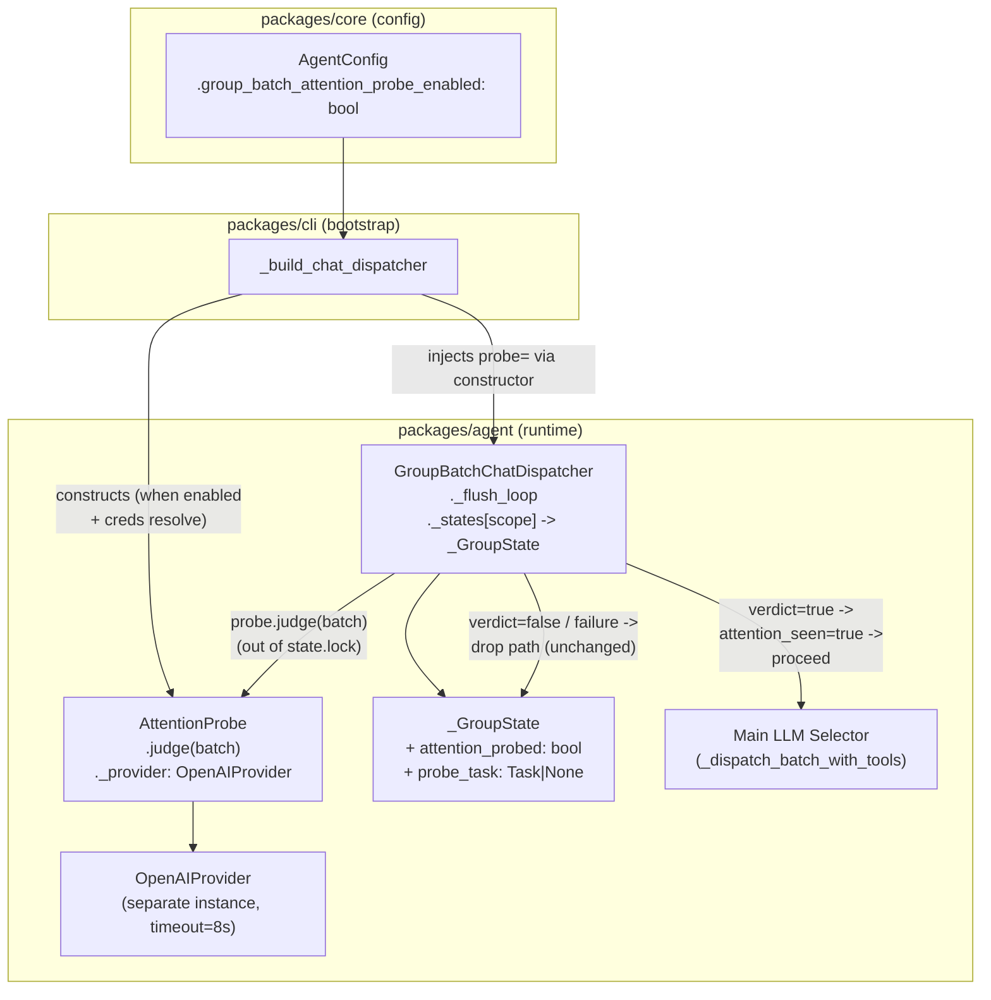
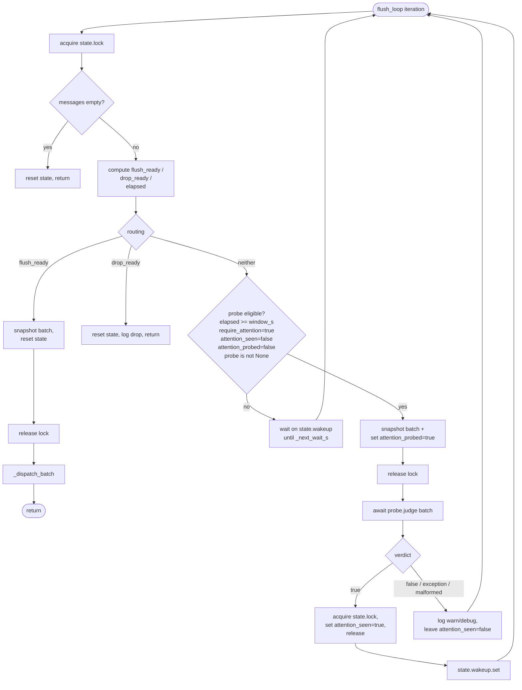
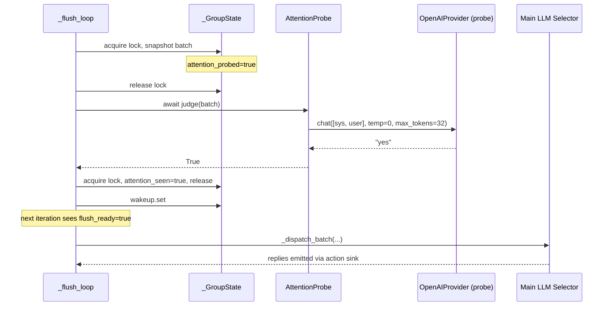
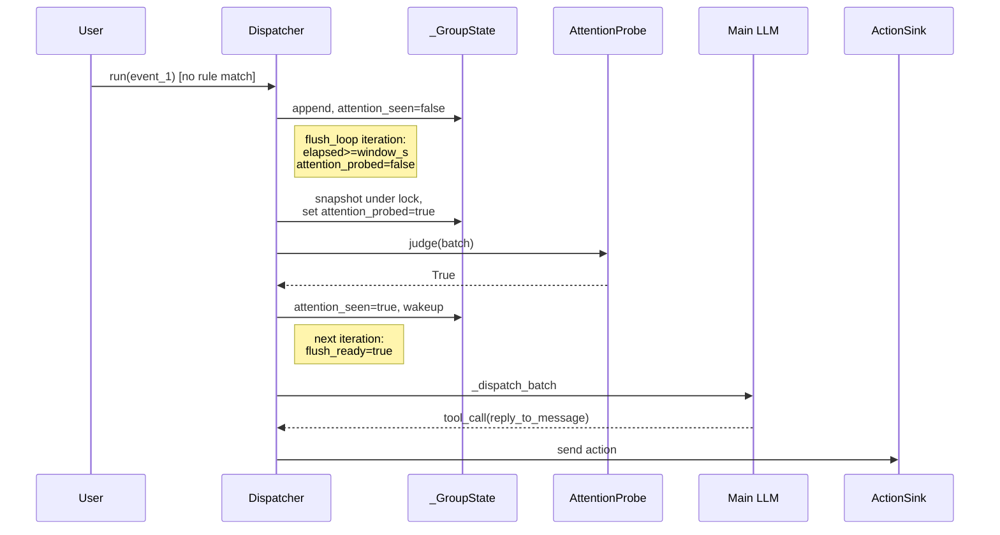
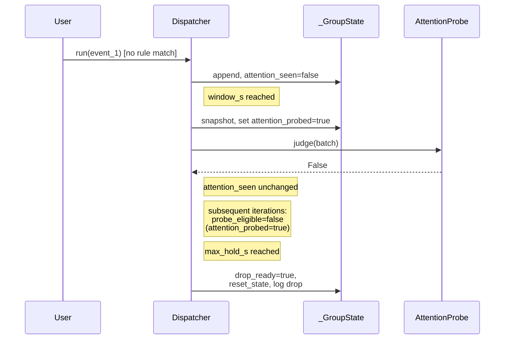
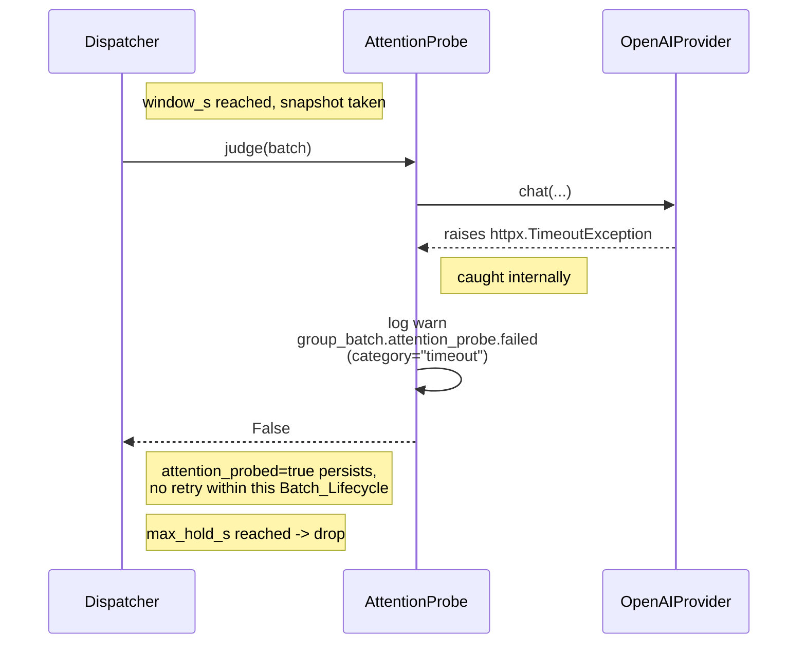
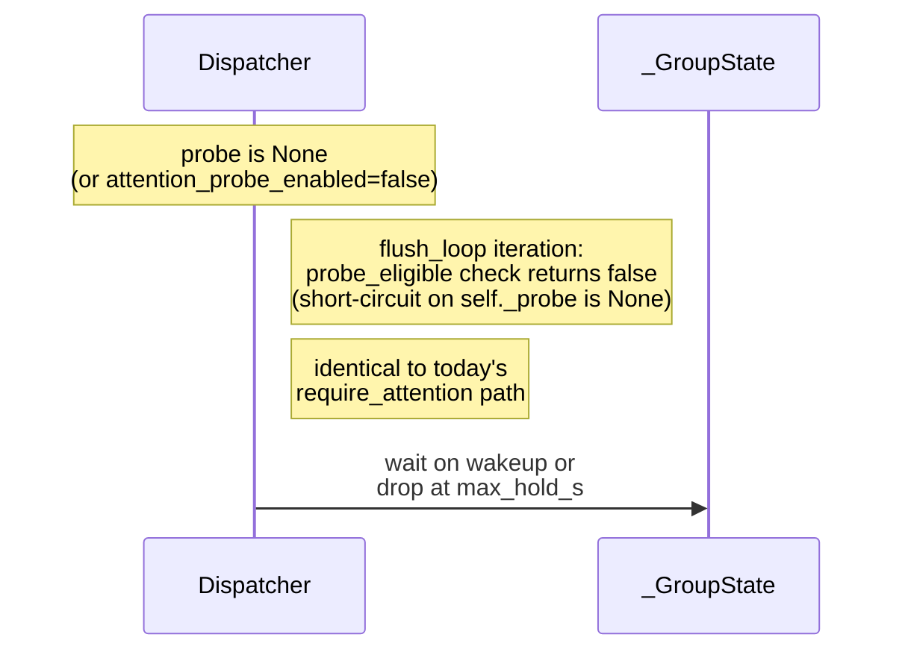

# Design Document — Lightweight Attention Probe

## Overview

The group-chat batching pipeline today decides whether a buffered batch is
worth invoking the main LLM with a single rule-based check
(`GroupBatchChatDispatcher._is_attention_candidate`). When `require_attention`
is on and the rule never fires, the batch is held until `max_hold_s`
(30s default in code, 300s in `bot/bot.yaml`) and then dropped. That leaves a
real category of conversations on the table — soft questions, indirect cues,
context-only mentions — that the rule cannot pattern-match but that a small
LLM can recognise in a few hundred milliseconds.

This feature inserts a second-stage **Attention Probe** at the `window_s`
flush boundary. The probe asks one yes/no question — "is any message in this
batch worth a reply?" — and, on yes, lets the same flush iteration proceed to
the existing main-LLM selective-replier flow exactly as if the rule had
fired. On no, network failure, malformed output, or missing credentials, the
batch follows today's drop path unchanged. The probe is purely additive: it
does not emit replies on its own, does not see conversation history, and
does not change any existing reply path.

The probe reuses `OpenAIProvider` against an OpenAI-compatible endpoint with
a separate API key, base URL, and model that all fall back to the main LLM's
settings when unset. Operators who do nothing keep today's behaviour bit-for-
bit (the `bootstrap` flips `attention_probe_enabled=True` only when both the
config toggle is on *and* a usable key resolves — anything less results in
`probe=None` and the existing dispatcher path). The new env vars
(`ATTENTION_PROBE_API_KEY`, `_BASE_URL`, `_MODEL`) are documented in
`.env.example` and the new YAML toggle (`group_batch_attention_probe_enabled`)
is documented in `bot/bot.yaml`.

The design's two organising principles are:

1. **Additive.** No existing public surface changes meaning. Existing tests
   that construct `GroupBatchConfig(...)` and `GroupBatchChatDispatcher(...)`
   without the new fields keep working — defaults preserve today's
   behaviour, and the dispatcher's new constructor parameter
   (`probe: AttentionProbe | None = None`) is keyword-only with a `None`
   default.
2. **Fail-closed.** Anything other than an unambiguous "yes" verdict is
   treated as "no": exception in the HTTP call, malformed parser output,
   401/403 auth error, timeout, empty batch — all route through the existing
   drop path. A misconfigured probe never causes extra LLM spend on the main
   model; it only ever loses the new opportunity.

## Architecture

### Module Layout

```
packages/agent/src/linling_agent/
├── group_batch.py          # existing — extended with probe trigger point
├── attention_probe.py      # NEW — AttentionProbe class
└── providers/
    └── openai.py           # existing — reused unchanged
```

```
packages/core/src/linling_core/
└── config.py               # existing — AgentConfig gains one field
```

```
packages/cli/src/linling_cli/
└── bootstrap.py            # existing — wires up AttentionProbe
```

### Component Diagram



### Modified `_flush_loop` Control Flow

The probe insertion point is the existing `not flush_ready and not
drop_ready` branch in `_flush_loop`. Today this branch waits on
`state.wakeup` until either a flush trigger or the hold deadline arrives;
the probe runs once, in this branch, when the `window_s` boundary has been
reached and the rule-based detector hasn't fired.



The crucial property: **`state.lock` is released before the HTTP call.**
`dispatcher.run()` continues to ingest messages into `state.messages` while
the probe call is in flight. New messages arriving during the call can flip
`state.attention_seen=true` through the rule-based detector independently;
the verdict is then OR'd into that flag (verdict=true sets it, verdict=false
leaves it untouched).

### Data Flow on a Probe-Yes Verdict



## Components and Interfaces

### 1. `AttentionProbe` (new)

**File**: `packages/agent/src/linling_agent/attention_probe.py`

Single-responsibility class: given a list of `_BufferedMessage`, return a
boolean verdict. Owns its own `OpenAIProvider`. Does not see conversation
history. Does not subclass `OpenAIProvider`.

Responsibilities:
- Hold the resolved `(api_key, base_url, model)` tuple and the
  `OpenAIProvider` instance.
- Build the system + user prompt (one-shot, no history).
- Call `provider.chat` with `temperature=0.0`, `max_tokens=32`,
  `tools=None`.
- Parse the response with the yes/no token table.
- Translate any exception or malformed output into `False` and emit one
  structlog `warning` per failure.
- Close its provider's httpx client on `aclose()`.

### 2. `GroupBatchConfig` extension

**File**: `packages/agent/src/linling_agent/group_batch.py` (existing
frozen dataclass)

Add one field, defaulting to `False` so existing test instantiations like
`GroupBatchConfig(enabled=True, window_s=0, require_attention=False)`
continue to construct unchanged. Bootstrap flips it to `True` when wiring
up the production dispatcher, mirroring how `enabled` is already
overridden.

### 3. `_GroupState` extension

**File**: `packages/agent/src/linling_agent/group_batch.py` (existing
mutable dataclass)

Add `attention_probed: bool = False` and (optionally, for shutdown
hygiene) `probe_task: asyncio.Task[bool] | None = None`. Both are cleared
in `_reset_state_locked` atomically with the existing fields under
`state.lock`, so flush / drop / `clear_history` / `stop` all reset probe
state in one atomic step.

### 4. `GroupBatchChatDispatcher` constructor extension

**File**: `packages/agent/src/linling_agent/group_batch.py`

Adds a keyword-only `probe: AttentionProbe | None = None` parameter.
Existing tests (every call site in `test_group_batch.py`) omit this
parameter and observe today's behaviour. The new probe-eligibility check
in `_flush_loop` short-circuits when `self._probe is None`, so the entire
new code path is dead weight for tests that don't opt in.

`stop()` is extended to call `self._probe.aclose()` when a probe is
present, after cancelling the existing flush tasks.

### 5. `AgentConfig` field

**File**: `packages/core/src/linling_core/config.py`

Adds one pydantic field `group_batch_attention_probe_enabled: bool =
True`. The default is `True` so an operator who upgrades the codebase
without editing `bot.yaml` opts in by default — but the bootstrap-side
auto-skip on missing credentials (Requirement 3) still keeps deployments
that have no probe key configured on the existing path with no behaviour
change.

### 6. Bootstrap wiring

**File**: `packages/cli/src/linling_cli/bootstrap.py`

In the existing `if config.agent.group_batch_enabled:` block, after
constructing the `GroupBatchChatDispatcher` arguments, the bootstrap:

1. If `config.agent.group_batch_attention_probe_enabled` is `False` →
   log `group_batch.attention_probe.disabled` (reason=`"config_off"`),
   inject `probe=None`.
2. Else, resolve credentials per the table in
   §"Configuration & Credential Resolution". If
   `api_key` resolves empty → log
   `group_batch.attention_probe.disabled` (reason=`"no_api_key"`),
   inject `probe=None`.
3. Else, construct `AttentionProbe(api_key=..., base_url=...,
   model=..., timeout=8.0)`, log
   `group_batch.attention_probe.configured` (with `model` and
   `base_url`), and inject as `probe=...`. Also flip
   `attention_probe_enabled=True` on the `GroupBatchConfig` instance.

`RunningBot.stop` already chains into `chat_dispatcher.stop()`, which now
awaits `probe.aclose()` internally. No changes needed at the `RunningBot`
level.

## Sequence Diagrams

### (a) Probe yes → main LLM



### (b) Probe no → drop



### (c) Probe failure → drop with warning



### (d) Probe disabled → today's path



### (e) Probe call concurrent with new ingest

```mermaid
sequenceDiagram
    participant U as User
    participant D as Dispatcher (run)
    participant FL as _flush_loop
    participant S as _GroupState
    participant P as AttentionProbe

    Note right of FL: snapshot taken,<br/>state.lock released
    FL->>P: judge(batch_v1)
    U->>D: run(event_2) [matches rule]
    D->>S: lock.acquire
    D->>S: append event_2,<br/>attention_seen=true
    D->>S: lock.release
    P-->>FL: True / False
    FL->>S: lock.acquire
    Note right of FL: if verdict=true -> attention_seen<br/>already true; if verdict=false<br/>-> attention_seen still true
    FL->>S: lock.release
    Note right of FL: next iteration:<br/>flush_ready=true (rule won)
```

## Data Models

### `AttentionProbe` (new class signature)

```python
@dataclass(frozen=True)
class _ProbeBatchInput:
    """Snapshot of a buffered batch passed into AttentionProbe.judge.

    Decoupled from group_batch._BufferedMessage so the probe module
    has no inbound dependency on group_batch internals — the dispatcher
    builds this from its own _BufferedMessage list at call time.
    """
    message_id: str
    sender_name: str
    timestamp: str
    text: str


class AttentionProbe:
    """Lightweight yes/no LLM call invoked at the window_s boundary."""

    def __init__(
        self,
        *,
        api_key: str,
        base_url: str,
        model: str,
        timeout: float = 8.0,
        max_chars: int = 6_000,
    ) -> None: ...

    @property
    def model(self) -> str: ...

    @property
    def base_url(self) -> str: ...

    async def judge(
        self,
        batch: list[_ProbeBatchInput],
        *,
        scope_id: str,
    ) -> bool: ...

    async def aclose(self) -> None: ...
```

Internal helpers (private, not part of the public contract):

| Symbol | Type | Purpose |
| --- | --- | --- |
| `_provider: OpenAIProvider` | instance | The probe's own httpx-backed provider. Constructed in `__init__` with `timeout=timeout`. |
| `_SYSTEM_PROMPT: str` | class const | The fixed one-liner described in §"Prompt". |
| `_YES_TOKENS: frozenset[str]` | class const | `{"yes", "y", "true", "1", "是", "需要", "回复"}`. |
| `_NO_TOKENS: frozenset[str]` | class const | `{"no", "n", "false", "0", "否", "不需要", "不回复"}`. |
| `_parse_verdict(content: str) -> bool` | static | Trim → lower → first whitespace-split token → table lookup → fail-closed `False`. |
| `_build_user_prompt(batch) -> str` | method | JSON-line snapshot capped at `max_chars`. |

### `_GroupState` deltas

| Field | Type | Default | Lifecycle |
| --- | --- | --- | --- |
| `attention_probed` (NEW) | `bool` | `False` | Set to `True` immediately after the snapshot is taken (under lock), before the HTTP call. Cleared in `_reset_state_locked`. |
| `probe_task` (NEW, optional) | `asyncio.Task[bool] \| None` | `None` | Held only when the dispatcher schedules the probe via `asyncio.create_task` rather than awaiting inline. With the design choice to await inline (see §"Concurrency"), this stays `None` and may be omitted; reserved for future iterations. |

All other fields unchanged.

### `GroupBatchConfig` deltas

| Field | Type | Default | Effect |
| --- | --- | --- | --- |
| `attention_probe_enabled` (NEW) | `bool` | `False` | When `False`, the probe-eligible check in `_flush_loop` short-circuits regardless of whether a probe was injected. When `True` and `self._probe is not None`, the probe-trigger conditions in Requirement 5 apply. |

The default of `False` is the back-compat lever — every existing test
passes nothing through `GroupBatchConfig(...)` and gets today's
behaviour. The bootstrap path flips it to `True` only when it has also
constructed a real `AttentionProbe`, so `(attention_probe_enabled=True,
probe=None)` never occurs in practice.

`__post_init__` validators are unchanged; the new field needs no
constraint beyond its type.

## Public API / Function Signatures

```python
# packages/agent/src/linling_agent/attention_probe.py

from __future__ import annotations
from dataclasses import dataclass

import structlog
from linling_agent.errors import LLMAuthError, LLMError
from linling_agent.llm import Message
from linling_agent.providers.openai import OpenAIProvider

logger = structlog.get_logger(__name__)


@dataclass(frozen=True)
class _ProbeBatchInput:
    message_id: str
    sender_name: str
    timestamp: str
    text: str


class AttentionProbe:
    def __init__(
        self,
        *,
        api_key: str,
        base_url: str,
        model: str,
        timeout: float = 8.0,
        max_chars: int = 6_000,
    ) -> None: ...

    @property
    def model(self) -> str: ...

    @property
    def base_url(self) -> str: ...

    async def judge(
        self,
        batch: list[_ProbeBatchInput],
        *,
        scope_id: str,
    ) -> bool: ...

    async def aclose(self) -> None: ...
```

```python
# packages/agent/src/linling_agent/group_batch.py

class GroupBatchChatDispatcher:
    def __init__(
        self,
        *,
        inner: Any,
        config: GroupBatchConfig,
        conversations: ConversationStore | None = None,
        bot_id: str = "linling",
        probe: AttentionProbe | None = None,    # NEW
    ) -> None: ...
```

```python
# packages/cli/src/linling_cli/bootstrap.py

def _build_attention_probe(
    *,
    agent_config: AgentConfig,
    agent_def: AgentDef,
) -> AttentionProbe | None:
    """Resolve credentials and build the probe, or return None.

    Returns None when the toggle is off or no API key resolves.
    Emits exactly one info-level structlog record describing the
    decision.
    """
    ...
```

(Internal helper; not exported from `linling_cli`.)

## Configuration & Credential Resolution

### Source-of-truth table

| Probe field | Primary env var | Fallback 1 | Fallback 2 | Final default |
| --- | --- | --- | --- | --- |
| `api_key` | `ATTENTION_PROBE_API_KEY` | `OPENAI_API_KEY` | — | empty → probe disabled |
| `base_url` | `ATTENTION_PROBE_BASE_URL` | `OPENAI_BASE_URL` | — | `https://api.openai.com/v1` |
| `model` | `ATTENTION_PROBE_MODEL` | `agent_def.model` (the default agent's resolved model) | — | (no further fallback — `agent_def.model` always has a value because `AgentDef` defaults it to `"gpt-4o-mini"`) |
| `enabled` | (no env var) | — | — | from `AgentConfig.group_batch_attention_probe_enabled` (default `True`) |
| `timeout` | (no env var) | — | — | hard-coded `8.0` (must satisfy R13's ≤10.0) |

`bot.yaml` only carries the boolean toggle
(`agent.group_batch_attention_probe_enabled`). It does **not** carry
keys, URLs, or model names — those are env-only by design (Requirement
2.6). Operators who want to point the probe at a different vendor edit
`.env`, not YAML.

### Resolution algorithm (pseudocode, evaluated at bootstrap)

```text
function resolve_probe(agent_cfg, agent_def):
    if not agent_cfg.group_batch_attention_probe_enabled:
        log info "attention_probe.disabled" reason="config_off"
        return None

    api_key = env("ATTENTION_PROBE_API_KEY") or env("OPENAI_API_KEY") or ""
    if api_key == "":
        log info "attention_probe.disabled" reason="no_api_key"
        return None

    base_url = (env("ATTENTION_PROBE_BASE_URL")
                or env("OPENAI_BASE_URL")
                or "https://api.openai.com/v1")

    model = env("ATTENTION_PROBE_MODEL") or agent_def.model

    probe = AttentionProbe(
        api_key=api_key,
        base_url=base_url,
        model=model,
        timeout=8.0,
    )
    log info "attention_probe.configured" model=model base_url=base_url
    return probe
```

The function is called exactly once per bootstrap, before
`GroupBatchChatDispatcher` is constructed. Empty-string handling treats
`""` and unset identically, matching how `_provider_config_from_dict`
already handles `OPENAI_API_KEY` in `agent_def.py`. No restart-time
re-resolution; env changes require a process restart, same as every
other env-driven knob in the project.

## Concurrency & Locking

The dispatcher already follows a **"hold the lock to mutate state, drop
it for I/O"** pattern. The probe insertion preserves it.

### What is held under `state.lock`

- `state.messages` reads / appends / clears.
- `state.attention_seen` reads / writes.
- `state.attention_probed` reads / writes (NEW).
- `state.first_seen_at`, `state.template_event`, `state.last_session`,
  `state.generation`.
- The flush-readiness computation (`flush_ready`, `drop_ready`,
  `elapsed`).

### What is NOT held under `state.lock`

- `await probe.judge(batch, scope_id=...)` — the HTTP round-trip.
- `await asyncio.wait_for(state.wakeup.wait(), timeout=...)` (existing).
- `await self._dispatch_batch(...)` (existing).

### Why the probe call is outside the lock

`OpenAIProvider.chat` performs an HTTPS round-trip with up to 8s of
latency. Holding `state.lock` across that call would block
`dispatcher.run()` and stall the inbound event loop — the exact
condition Requirement 11 forbids. The control-flow shape is:

1. Acquire `state.lock`.
2. Check the probe-eligibility predicate (5 conditions).
3. If eligible: snapshot `list(state.messages)` into a local, set
   `state.attention_probed = True`, capture `state.generation`.
4. Release `state.lock`.
5. `await probe.judge(snapshot, scope_id=...)`.
6. Re-acquire `state.lock`. If `state.generation` is unchanged and
   verdict is `True`, set `state.attention_seen = True`. Release.
7. Set `state.wakeup` to wake the loop's wait branch.

Step 3's `attention_probed = True` write is what enforces R6 (one probe
call per Batch_Lifecycle). Even if the lock is reacquired by an
ingesting `run()` call between steps 4 and 6, the next flush iteration
sees `attention_probed=True` and the eligibility predicate returns
false.

### What happens when new messages arrive during a probe call

Three independent cases:

| Case | Inbound effect | Outcome |
| --- | --- | --- |
| New message matches rule (mention/reply-to-bot/bot-name/question) | `state.attention_seen = True` under lock | Probe verdict OR'd in: if probe says yes, no change; if probe says no, attention_seen still True from rule. Next iteration flushes. |
| New message does not match rule | Appended to `state.messages`, attention_seen unchanged | Probe verdict applies as-is. If yes, batch flushes (the new message is included because `_dispatch_batch` reads `state.messages` again at flush time). If no, drop path applies. |
| `clear_history` is called | `state.generation` increments, `_reset_state_locked` runs | Step 6 sees `state.generation` changed and discards the verdict. The cleared state starts a fresh Batch_Lifecycle eligible for one new probe call. |

### Generation guard

The probe call uses the same `state.generation` guard the existing tool-
selector flow uses (`_batch_is_current`). Verdicts whose generation no
longer matches are dropped silently. This is what makes
`clear_history`-during-probe safe: a stale `True` verdict cannot
contaminate a freshly cleared batch.

## Error Handling

The probe converts every failure into `verdict=False` so the dispatcher
contract is "verdict in `{True, False}`, exceptions never escape". One
log record is emitted per failure, scoped to the probe module's logger.

| Failure category | Source | Caught at | Log level | Log event | `verdict` |
| --- | --- | --- | --- | --- | --- |
| Network / timeout | `httpx.TransportError`, `httpx.TimeoutException` | `AttentionProbe.judge` | `warning` | `group_batch.attention_probe.failed` (`category="network"` or `"timeout"`) | `False` |
| HTTP 5xx | `LLMError` raised by `OpenAIProvider._handle_error_response` | `AttentionProbe.judge` | `warning` | `group_batch.attention_probe.failed` (`category="http_5xx"`) | `False` |
| HTTP 4xx (non-auth) | `LLMError` | `AttentionProbe.judge` | `warning` | `group_batch.attention_probe.failed` (`category="http_4xx"`) | `False` |
| HTTP 401 / 403 | `LLMAuthError` | `AttentionProbe.judge` | `warning` | `group_batch.attention_probe.failed` (`category="auth"`) | `False`. **Not sticky** — next batch retries (R9.4). |
| Rate limit | `LLMRateLimitError` | `AttentionProbe.judge` | `warning` | `group_batch.attention_probe.failed` (`category="rate_limit"`) | `False` |
| Malformed yes/no output | `_parse_verdict` returns `False` for unknown first-token | `AttentionProbe.judge` | `warning` | `group_batch.attention_probe.failed` (`category="malformed"`) | `False` |
| JSON decode error from provider | `OpenAIProvider` already raises `LLMError` | `AttentionProbe.judge` | `warning` | `group_batch.attention_probe.failed` (`category="decode"`) | `False` |
| Empty batch (zero messages, or all messages whitespace-only after trim) | `_flush_loop` predicate, before `judge` is called | `_flush_loop` | `debug` | `group_batch.attention_probe.skipped_empty` | `False` (no HTTP call) |
| `asyncio.CancelledError` (shutdown) | propagates | `_flush_loop` (existing finally) | (none — propagates) | (none) | n/a — task cancellation |

`asyncio.CancelledError` is deliberately re-raised, never converted to
`False`. The cancellation has to bubble up so `stop()`'s `gather(...,
return_exceptions=True)` can clean up; the surrounding `try/except` in
`AttentionProbe.judge` only catches `Exception`.

The probe never re-tries within a single Batch_Lifecycle. R6 (one call
per lifecycle) makes retries impossible by design — the
`attention_probed=True` flag is set before the call, so a second
iteration cannot re-enter even if the first failed. R9.4's "retry on
subsequent batches" is satisfied automatically because
`_reset_state_locked` clears `attention_probed` on every batch
boundary.

## Correctness Properties

*A property is a characteristic or behavior that should hold true
across all valid executions of a system — essentially, a formal
statement about what the system should do. Properties serve as the
bridge between human-readable specifications and machine-verifiable
correctness guarantees.*


The probe inserts a new state machine on top of the existing batching
loop. The properties below define what cannot regress as that state
machine evolves. Each property is universally quantified, references
the requirements it validates, and was selected through the prework
analysis to be unique (no logical duplicates).

### Property 1: Probe is suppressed when the rule has already fired

*For any* batch in which at least one buffered message has been flagged
by the rule-based attention detector before the flush iteration runs,
the dispatcher SHALL NOT invoke `AttentionProbe.judge` for that batch.

**Validates: Requirements 5.2, 17.1**

### Property 2: Probe is suppressed when not configured at runtime

*For any* batch processed by a dispatcher whose `probe` parameter is
`None`, or whose `GroupBatchConfig.attention_probe_enabled` is `False`,
or whose `require_attention` is `False`, the dispatcher SHALL NOT
invoke `AttentionProbe.judge` for that batch.

**Validates: Requirements 1.3, 5.3, 5.4, 15.4, 17.2**

### Property 3: Probe verdict false leaves the main LLM uninvoked

*For any* batch where the probe returns `False` (verdict, exception, or
malformed), the dispatcher SHALL NOT invoke the main LLM selector
(`_dispatch_batch_with_tools` or its JSON-mode fallback) for that
batch, and `state.attention_seen` SHALL remain `False` if it was
`False` before the probe call.

**Validates: Requirements 8.1, 8.2, 8.3, 17.3**

### Property 4: Probe verdict true routes the same batch through the main LLM exactly once

*For any* batch where the probe returns `True`, no `clear_history` is
issued for that scope before the next flush iteration, and no other
flush trigger had previously caused dispatch, the dispatcher SHALL
invoke the main LLM selector exactly once with the same buffered
messages that were probed (modulo any messages appended after the
probe snapshot, which today's dispatch path also includes).

**Validates: Requirements 7.1, 7.2, 17.4**

### Property 5: At most one probe call per Batch_Lifecycle

*For any* Batch_Lifecycle (the interval from first message buffered
until `_reset_state_locked` is called), `AttentionProbe.judge` SHALL be
invoked at most once. Empty-batch and all-whitespace short-circuits
count as the single allowed probe attempt for the lifecycle (the
predicate marks `attention_probed=True` even when the HTTP call is
skipped).

**Validates: Requirements 6.1, 6.3, 6.4, 10.3, 17.5**

### Property 6: Probe failures and malformed output never invoke the main LLM and never escape the flush loop

*For any* probe call where `provider.chat` raises any exception
(`httpx.TransportError`, `LLMAuthError`, `LLMRateLimitError`, generic
`LLMError`, `asyncio.TimeoutError`) or returns a response whose content
does not match the yes-token table, the dispatcher SHALL NOT invoke the
main LLM selector for that batch, and the exception SHALL NOT propagate
out of `_flush_loop` (the flush task SHALL continue to run for
subsequent batches).

**Validates: Requirements 9.1, 9.2, 9.3, 17.6**

### Property 7: The yes/no parser returns true if and only if the first whitespace-split token is a yes-token

*For any* string `s`, `AttentionProbe._parse_verdict(s)` returns `True`
if and only if the first whitespace-split token of `s.strip().lower()`
is a member of `YES_TOKENS = {"yes", "y", "true", "1", "是", "需要",
"回复"}`. Empty strings, whitespace-only strings, and strings whose
first token is anything else (including malformed JSON, partial
tokens, or a `NO_TOKENS` member) return `False`.

**Validates: Requirements 9.2, 13.4**

### Property 8: The probe call body contains exactly two messages with no history

*For any* probe invocation, the `messages` list passed to
`OpenAIProvider.chat` contains exactly two entries — one with
`role="system"` carrying the fixed system prompt and one with
`role="user"` carrying the snapshot text. No assistant, tool, or prior
user messages appear in the call.

**Validates: Requirements 4.4**

### Property 9: An auth error does not disable subsequent probe calls

*For any* sequence of probe invocations across distinct Batch_Lifecycles,
an `LLMAuthError` raised during invocation `k` SHALL NOT prevent
invocation `k+1` from issuing its HTTP call. The probe state is
per-process-startup; only a process restart re-evaluates credentials.

**Validates: Requirements 9.4**

## Backward Compatibility Strategy

This is the explicit list of seams that keep today's behaviour
bit-for-bit identical when an operator does nothing.

### Files modified
- `packages/core/src/linling_core/config.py` — adds one pydantic field
  with default `True`. No effect when no probe is wired up.
- `packages/agent/src/linling_agent/group_batch.py` — adds two
  fields (`attention_probe_enabled` to `GroupBatchConfig`,
  `attention_probed` to `_GroupState`) and one keyword-only
  constructor parameter (`probe`) all with back-compat defaults.
- `packages/cli/src/linling_cli/bootstrap.py` — adds the
  `_build_attention_probe` helper and one block inside the existing
  `if config.agent.group_batch_enabled:` branch.
- `bot/bot.yaml` and `.env.example` — documentation only.

### Files unmodified
- `packages/agent/src/linling_agent/providers/openai.py` — the probe
  reuses `OpenAIProvider` unchanged. No subclassing, no monkeypatching.
- `packages/agent/src/linling_agent/dispatcher.py` and the rest of
  `linling_agent` — no signatures changed.
- `packages/agent/tests/test_group_batch.py` — every test in this file
  passes unchanged. The test list was inspected during design; every
  call site uses positional/keyword args that are preserved by the
  additive constructor parameter, and every `GroupBatchConfig(...)`
  call omits `attention_probe_enabled` and gets the `False` default.

### Default-value invariants
| Knob | Default | Result when default |
| --- | --- | --- |
| `AgentConfig.group_batch_attention_probe_enabled` | `True` | When credentials resolve, probe is wired up. When credentials are absent, bootstrap returns `probe=None`. |
| `GroupBatchConfig.attention_probe_enabled` | `False` | Existing test suite untouched. Bootstrap explicitly flips this to `True` when injecting a probe. |
| `GroupBatchChatDispatcher(probe=...)` | `None` | Probe-eligibility predicate short-circuits to `False`. |
| `_GroupState.attention_probed` | `False` | Cleared on every reset; default makes the first probe eligible. |
| `ATTENTION_PROBE_*` env vars | unset | Fallback to `OPENAI_*`. If those are also unset, probe disables itself with one info log. |

### Constructor-signature additivity
- `GroupBatchChatDispatcher.__init__` is keyword-only for all
  arguments (existing behaviour). Adding `probe: AttentionProbe | None
  = None` at the end of the kwargs block is a strict addition.
- `GroupBatchConfig` is a `@dataclass(frozen=True)`. Adding a field
  with a default is additive for both positional and keyword
  construction; no existing call site uses positional-only.
- `_GroupState` is internal (`_`-prefixed) and not part of any public
  contract. The new field has a default, so `field(default_factory=...)`
  rules don't change.

## Testing Strategy

### Library choice
- Property-based tests use **hypothesis** (already a dev dependency —
  the `.hypothesis/` directory exists in the repo with thousands of
  cached examples).
- Unit and integration tests use **pytest** + **pytest-asyncio** (the
  pattern used throughout `test_group_batch.py`).

### Test files
- `packages/agent/tests/test_attention_probe.py` (NEW) — unit and
  property tests for `AttentionProbe` in isolation.
- `packages/agent/tests/test_group_batch_attention_probe.py` (NEW) —
  integration and property tests for the dispatcher's probe behaviour.
- `packages/agent/tests/test_group_batch.py` (UNCHANGED, regression).
- `packages/cli/tests/test_bootstrap_attention_probe.py` (NEW) —
  credential resolution and bootstrap log assertions.

### Per-property test design

| # | Property | Test type | Iteration count | Test outline |
| --- | --- | --- | --- | --- |
| 1 | Rule fired → no probe | hypothesis | ≥100 | Generate `list[_BufferedMessage]` with at least one entry whose `mentions_bot=True` or whose `text` contains a configured bot name. Run dispatcher with a probe spy whose `judge()` raises if called. Assert no exception. |
| 2 | Not configured → no probe | hypothesis | ≥100 | Generate any `list[_BufferedMessage]`; instantiate dispatcher with `probe=None` and `attention_probe_enabled=False` (cross-product). Spy on internal flag; assert `judge` never called. |
| 3 | Verdict false → no main LLM | hypothesis | ≥100 | Generate batches with no rule-matching message; probe stub returns `False`. Assert `inner.dispatch`/`inner.run` call count is `0` after `max_hold_s`. |
| 4 | Verdict true → main LLM once | hypothesis | ≥100 | Same generator as 3; probe stub returns `True`. Assert `inner.dispatch` invoked exactly once and the prompt contains every `message_id` from the probed batch. |
| 5 | One call per Batch_Lifecycle | hypothesis | ≥100 | Generate sequences of `("ingest", _BufferedMessage)` and `("tick", float)` events; replay against the dispatcher; assert probe call count ≤ 1 between any two `_reset_state_locked` invocations. |
| 6 | Failures contained | hypothesis | ≥100 | Generate failure modes from `{httpx.TimeoutException, LLMAuthError, LLMRateLimitError, LLMError, ValueError("bad json")}` and malformed strings; assert no exception escapes `dispatcher.run` or the flush loop, and `inner.dispatch` not called. |
| 7 | Parser is yes-token-prefix | hypothesis | ≥500 | Pure-function property over `text()` strategy. Compose: prefix ∈ `YES_TOKENS ∪ NO_TOKENS ∪ random`, casing variation, leading whitespace, suffix arbitrary. Assert `_parse_verdict` matches the spec table. |
| 8 | Two-message body | hypothesis | ≥100 | Generate batches; install a fake `OpenAIProvider` whose `chat` records its `messages` arg; assert `len(messages) == 2` and roles are `["system", "user"]`. |
| 9 | Auth-error not sticky | hypothesis (stateful) | ≥50 | Generate sequences of `(outcome_for_call_k, ...)` where `outcome_k ∈ {ok_yes, ok_no, raise_auth, raise_other}`; assert that for any sequence, call `k+1`'s outcome is observable (i.e., the probe was invoked for it). |

### Tag format
Each property test carries a docstring header in the form:

```
"""Feature: lightweight-attention-probe, Property N: <property text>"""
```

so that test failures map back to this design document's properties
section by name. This matches the pattern called out in the workflow's
testing-strategy guidance.

### Integration-only tests (no PBT)
- Probe-yes routing end-to-end via the existing dispatcher harness with
  a real `_AgentInner` fake, asserting an action is emitted. (1
  example.)
- Probe-no drop end-to-end. (1 example.)
- Probe-failure drop with warning log captured. (1 example.)
- Probe-disabled (today's path) reproduces the `test_group_batch_drops_
  uninteresting_when_required` scenario. (1 example, as a smoke check
  that probe wiring doesn't accidentally activate.)
- `dispatcher.stop()` awaits `probe.aclose()`. (1 example with a probe
  spy.)
- `clear_history` during probe in-flight invalidates the verdict via
  `state.generation`. (1 example, mirrors the existing
  `test_group_batch_clear_history_marks_inflight_tool_batch_stale`
  shape.)

### Minimum hypothesis configuration
- `max_examples=100` for dispatcher harness tests (default), with
  `deadline=None` because the harness uses `asyncio.sleep`-driven time
  acceleration that hypothesis cannot infer.
- `max_examples=500` for the pure-function parser property (it's
  microsecond-cheap).
- `derandomize=True` is **not** set — failures should be free to find
  new shrinks across runs.

## Operator-Facing Surface

### `.env.example` diff sketch

Append a new section before the `# ---- Storage ----` block:

```
# ---- Group-batch Attention Probe (optional) ----------------------
# Lightweight second-stage LLM call that runs once at the window_s
# flush boundary when the rule-based attention detector hasn't fired.
# Disabling: set agent.group_batch_attention_probe_enabled=false in
# bot.yaml, OR leave both ATTENTION_PROBE_API_KEY and OPENAI_API_KEY
# empty (auto-skip with one info log).
#
# Fallback chain:
#   API key:  ATTENTION_PROBE_API_KEY -> OPENAI_API_KEY
#   Base URL: ATTENTION_PROBE_BASE_URL -> OPENAI_BASE_URL -> https://api.openai.com/v1
#   Model:    ATTENTION_PROBE_MODEL    -> default agent's model
#
# Cost cap: max_tokens=32, temperature=0.0, timeout=8.0s per call.
ATTENTION_PROBE_API_KEY=
ATTENTION_PROBE_BASE_URL=
ATTENTION_PROBE_MODEL=
```

Placement: between the existing `LINLING_MODEL=` line and the
`ANTHROPIC_API_KEY=` line keeps OpenAI-compatible vars together.

### `bot/bot.yaml` diff sketch

Inside the existing `agent:` block, alongside the other
`group_batch_*` knobs:

```yaml
agent:
  # ... existing fields ...
  group_batch_max_hold_s: 300
  # 群批时窗到点仍未触发关注规则时,跑一个轻量 LLM(yes/no)再决定要不要
  # 把这批消息交给主 LLM。关掉就回到老行为(直接丢弃)。配套的 API key /
  # base URL / model 在 .env 里设置(见 .env.example)。
  group_batch_attention_probe_enabled: true
  group_batch_bot_names:
    - 苏苏
    - 涂山苏苏
```

The comment is in Chinese to match the existing comment style in
`bot/bot.yaml`. Default is `true` so an upgrade flips on the feature
when credentials are configured, but stays inert when they aren't.

## Out of Scope

Carried forward from the requirements document, restated here so the
design's boundaries are visible without re-opening
`requirements.md`:

- **Non-OpenAI-compatible probe providers.** The probe is hard-coded
  to `OpenAIProvider`. Pointing it at a non-OpenAI-shaped endpoint
  requires either a transparent OpenAI-compatible proxy or a future
  feature.
- **Multi-shot or iterative probing within a single batch.** R6
  enforces one call per Batch_Lifecycle. A future feature could add
  retry semantics under a separate flag.
- **Conversation-history-aware probing.** R4.4 and Property 8 forbid
  it. The probe sees only the current batch.
- **Caching probe verdicts across batches.** Each Batch_Lifecycle is
  fresh.
- **Per-group probe configuration.** The toggle is global. A future
  feature could add per-scope overrides if operator demand emerges.
