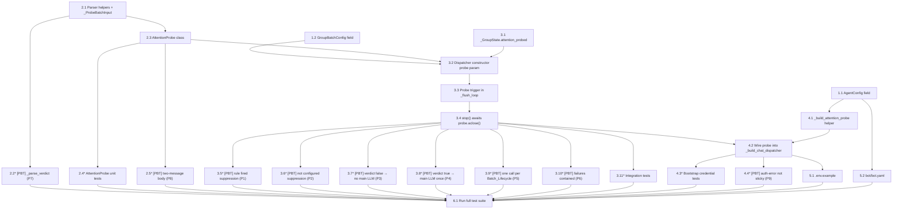

# Implementation Plan: Lightweight Attention Probe

## Overview

Implement the second-stage Attention Probe described in `design.md`. The probe is a lightweight yes/no LLM call invoked once at the `window_s` flush boundary when the rule-based attention detector has not fired. The implementation is strictly additive: every existing call site of `GroupBatchConfig`, `GroupBatchChatDispatcher`, and `_GroupState` keeps working unchanged, and the probe auto-disables when no API key resolves.

Tasks are ordered bottom-up — pure helpers first, then `AttentionProbe`, then dispatcher integration, then bootstrap wiring, then operator docs, then verification. Each task touches a single file (or a small, cohesive group) and produces committable code or doc edits. **No existing test file is modified.** The probe is exercised through three new test files only:

- `packages/agent/tests/test_attention_probe.py`
- `packages/agent/tests/test_group_batch_attention_probe.py`
- `packages/cli/tests/test_bootstrap_attention_probe.py`

Property-based tests are tagged with `[PBT]` in the task title so the runner can apply the property-test warning gate. Each property reference points to a numbered property in `design.md` §"Correctness Properties".

## Tasks

### Phase 1: Foundation

- [x] 1.1 Add `group_batch_attention_probe_enabled` field to `AgentConfig`
  - Edit `packages/core/src/linling_core/config.py`.
  - Add `group_batch_attention_probe_enabled: bool = True` to the existing `AgentConfig` model, placed alongside the other `group_batch_*` fields.
  - Field is purely declarative — no validator change needed (booleans have no cross-field constraint).
  - Verify the existing `test_config_*` tests still pass (the new field has a default and is back-compat).
  - _Requirements: R1.1, R3.3, R15.4 / Properties: P2_

- [x] 1.2 Add `attention_probe_enabled` field to `GroupBatchConfig`
  - Edit `packages/agent/src/linling_agent/group_batch.py`.
  - Add `attention_probe_enabled: bool = False` to the frozen dataclass, placed at the end of the existing fields so positional construction is unaffected. The default of `False` is the back-compat lever — every existing test in `test_group_batch.py` constructs `GroupBatchConfig(...)` without the new field and gets today's behaviour.
  - Do not modify `__post_init__`; the new field needs no constraint beyond its type.
  - Do not modify `_GroupState` in this task; that lives in 3.1.
  - _Requirements: R1.2, R15.3 / Properties: P2_

### Phase 2: `AttentionProbe` Class

- [x] 2.1 Create `attention_probe.py` with `_ProbeBatchInput` and parser helpers
  - Create `packages/agent/src/linling_agent/attention_probe.py`.
  - Add the frozen dataclass `_ProbeBatchInput(message_id, sender_name, timestamp, text)` per the design's "Data Models" section. The dataclass decouples the probe module from `group_batch._BufferedMessage` so the inbound dependency direction is clean.
  - Add the module-level constants `_YES_TOKENS = frozenset({"yes", "y", "true", "1", "是", "需要", "回复"})` and `_NO_TOKENS = frozenset({"no", "n", "false", "0", "否", "不需要", "不回复"})`.
  - Add the static helper `_parse_verdict(content: str) -> bool` that strips, lowercases, takes the first whitespace-split token, and looks it up in `_YES_TOKENS`. Return `False` for empty / whitespace-only strings and any non-yes token (fail-closed). Do not raise.
  - Add the static helper `_build_user_prompt(batch: list[_ProbeBatchInput], max_chars: int) -> str` that emits one JSON line per message with `message_id`, `sender_name`, `time`, `text`, capped at `max_chars` total characters.
  - Do not implement the `AttentionProbe` class yet — that is task 2.3.
  - _Requirements: R4.4, R13.4 / Properties: P7, P8_

- [x]* 2.2 [PBT] Property test for `_parse_verdict` token-prefix semantics
  - Create `packages/agent/tests/test_attention_probe.py`.
  - Use `hypothesis` with `max_examples=500` (the parser is microsecond-cheap so a higher count is justified).
  - **Property 7: yes-token-prefix parser** — for any string `s` generated by composing `(prefix ∈ YES_TOKENS ∪ NO_TOKENS ∪ random_text, casing_variation, leading_whitespace, suffix)`, assert that `_parse_verdict(s)` returns `True` if and only if `s.strip().split()[0].lower()` is a member of `_YES_TOKENS`. Cover empty strings, whitespace-only strings, JSON-shaped malformed output, and partial tokens.
  - Tag the test docstring with `Feature: lightweight-attention-probe, Property 7: yes-token-prefix parser`.
  - _Requirements: R9.2, R13.4 / Properties: P7_

- [x] 2.3 Implement `AttentionProbe` class with `judge` and `aclose`
  - Edit `packages/agent/src/linling_agent/attention_probe.py`.
  - Add the `AttentionProbe` class with the constructor signature from the design: `__init__(*, api_key, base_url, model, timeout=8.0, max_chars=6_000)`. Construct an `OpenAIProvider` instance internally with `timeout=timeout`; the probe owns its own httpx client separate from the main agent's provider.
  - Define `_SYSTEM_PROMPT` as a class constant: a fixed one-liner asking "is any message in this batch worth a reply, answer yes or no" (Chinese-friendly phrasing acceptable).
  - Implement `judge(batch, *, scope_id) -> bool`:
    - Empty / all-whitespace batch → return `False` without calling `provider.chat`.
    - Build the messages list as exactly two entries: `[Message(role="system", content=_SYSTEM_PROMPT), Message(role="user", content=_build_user_prompt(batch, max_chars))]`. No history.
    - Call `self._provider.chat(messages, tools=None, temperature=0.0, max_tokens=32)`.
    - Pass the response content through `_parse_verdict`.
    - Wrap the call in `try/except Exception` (NOT `BaseException`); convert every `httpx.TransportError`, `httpx.TimeoutException`, `LLMError`, `LLMAuthError`, `LLMRateLimitError`, and `ValueError` into `verdict=False`, emitting one `structlog.warning` with `event="group_batch.attention_probe.failed"` and `category` set per the table in the design's "Error Handling" section.
    - Re-raise `asyncio.CancelledError` so shutdown can clean up.
    - Emit one `structlog.debug` per successful call with `event="group_batch.attention_probe.judged"`, `scope_id`, `batch_size`, `verdict`.
  - Implement `aclose()` that awaits `self._provider.aclose()`. Safe to call repeatedly.
  - Add `model` and `base_url` properties returning the resolved values.
  - _Requirements: R4.1, R4.2, R4.3, R4.4, R9.1, R9.2, R9.3, R9.4, R10.1, R10.2, R12.1, R13.1, R13.2, R13.3, R13.5, R14.2, R14.3, R14.4 / Properties: P6, P7, P8_

- [x]* 2.4 Unit tests for `AttentionProbe` error handling and contract
  - Append to `packages/agent/tests/test_attention_probe.py`.
  - Use `pytest-asyncio` with a fake provider (monkeypatched `_provider.chat`) to exercise:
    - Successful "yes" / "no" / mixed-case / Chinese-token responses.
    - Empty batch and all-whitespace batch short-circuits (no `chat` call observed).
    - Each failure category (timeout, transport error, `LLMAuthError`, `LLMRateLimitError`, generic `LLMError`) returns `False` and emits one `warning` log record (use `structlog`'s test capture or `caplog`).
    - `judge` does not propagate exceptions other than `asyncio.CancelledError`.
    - `aclose` is idempotent (call twice; assert no exception).
  - _Requirements: R9.1, R9.2, R9.3, R9.4, R10.1, R10.2, R12.1 / Properties: P6_

- [x]* 2.5 [PBT] Property test for two-message body and no-history invariant
  - Append to `packages/agent/tests/test_attention_probe.py`.
  - Use `hypothesis` with `max_examples=100`, `deadline=None`.
  - **Property 8: two-message body** — for any generated `list[_ProbeBatchInput]`, install a fake `OpenAIProvider` whose `chat` records its `messages` argument; assert `len(messages) == 2`, `messages[0].role == "system"`, `messages[1].role == "user"`, and no other roles appear. Also assert `tools is None` and `temperature == 0.0` and `max_tokens <= 32`.
  - Tag the test docstring with `Feature: lightweight-attention-probe, Property 8: two-message body`.
  - _Requirements: R4.4, R13.1, R13.3, R13.5 / Properties: P8_

### Phase 3: Dispatcher Integration

- [x] 3.1 Add `attention_probed` field to `_GroupState` and clear in `_reset_state_locked`
  - Edit `packages/agent/src/linling_agent/group_batch.py`.
  - Add `attention_probed: bool = False` to the `_GroupState` dataclass after the existing `attention_seen` field.
  - Update `_reset_state_locked` to set `state.attention_probed = False` atomically alongside the existing field clears, so flush / drop / `clear_history` / `stop` all reset probe state in a single atomic step under `state.lock`.
  - Do not add `probe_task` (the design defers it; the inline-await path keeps it `None`).
  - _Requirements: R6.2, R6.3, R12.2, R12.3 / Properties: P5_

- [x] 3.2 Add keyword-only `probe` parameter to `GroupBatchChatDispatcher.__init__`
  - Edit `packages/agent/src/linling_agent/group_batch.py`.
  - Add the keyword-only parameter `probe: AttentionProbe | None = None` at the end of the constructor's kwargs block. Store as `self._probe`.
  - Add `from linling_agent.attention_probe import AttentionProbe` at the top of the file (TYPE_CHECKING-guarded if needed to avoid an unused-import lint at runtime when probe is None — prefer a real import since the module is small).
  - Do not modify any existing constructor argument; back-compat with `test_group_batch.py` requires every existing call site to keep working unchanged.
  - _Requirements: R15.2 / Properties: P2_

- [x] 3.3 Insert probe-eligibility check and invocation in `_flush_loop`
  - Edit `packages/agent/src/linling_agent/group_batch.py`.
  - Inside the existing `not flush_ready and not drop_ready` branch of `_flush_loop`, before the `wait_for(state.wakeup.wait(), timeout=...)` fallback, add the probe-eligibility predicate. The predicate (computed under `state.lock`) is the conjunction of: `self._probe is not None`, `self._cfg.attention_probe_enabled`, `self._cfg.require_attention`, `not state.attention_seen`, `not state.attention_probed`, and `elapsed >= self._cfg.window_s`.
  - When eligible:
    1. Snapshot `list(state.messages)` into a local, build a `list[_ProbeBatchInput]`, set `state.attention_probed = True`, capture `state.generation`.
    2. Release `state.lock`.
    3. If the snapshot is empty or every message resolves to whitespace-only after trimming, log `structlog.debug` `event="group_batch.attention_probe.skipped_empty"` and continue the loop without calling `judge`.
    4. Otherwise, `await self._probe.judge(snapshot, scope_id=event.scope.id)`. Wrap any unexpected exception in `try/except Exception` (the probe is supposed to absorb them, but defence-in-depth keeps the flush task alive — log and continue).
    5. Re-acquire `state.lock`, check `state.generation == captured_generation` AND `not self._closed` (generation guard — discard stale verdicts after `clear_history`).
    6. If the verdict is `True` and the guard passes, set `state.attention_seen = True` and `state.wakeup.set()`. Release the lock.
    7. Continue the flush loop (next iteration sees `flush_ready=True` when verdict was `True`).
  - The probe call MUST be outside `state.lock` (Requirement 11). Do not hold the lock across `await probe.judge(...)`.
  - Do not retry within a single Batch_Lifecycle — `attention_probed=True` is set before the call, so failure paths are intentionally non-recoverable for the current batch.
  - _Requirements: R5.1, R5.2, R5.3, R5.4, R5.5, R6.1, R6.3, R6.4, R7.1, R7.2, R7.3, R8.1, R8.2, R8.3, R10.1, R10.2, R10.3, R11.1, R11.2, R11.3, R14.2 / Properties: P1, P2, P3, P4, P5_

- [x] 3.4 Extend `GroupBatchChatDispatcher.stop()` to await `probe.aclose()`
  - Edit `packages/agent/src/linling_agent/group_batch.py`.
  - In `stop()`, after the existing `await asyncio.gather(*tasks, return_exceptions=True)` line that cancels flush tasks, add `if self._probe is not None: await self._probe.aclose()`.
  - The order matters: cancel flush tasks first (which propagates `asyncio.CancelledError` into any in-flight `judge` call), then close the probe's httpx client. This satisfies R12.4's "abort or await any in-flight probe HTTP call before returning".
  - _Requirements: R12.1, R12.4 / Properties: (none — pure shutdown hygiene)_

- [x]* 3.5 [PBT] Property test for rule-fired suppression
  - Create `packages/agent/tests/test_group_batch_attention_probe.py`.
  - Use `hypothesis` with `max_examples=100`, `deadline=None`.
  - **Property 1: rule fired → no probe** — generate `list[_BufferedMessage]` with at least one message whose `mentions_bot=True`, `reply_to_bot=True`, or whose text contains a configured bot name. Wire a probe spy whose `judge()` raises `AssertionError` if called. Drive the dispatcher with `attention_probe_enabled=True`, `require_attention=True`. Assert no exception escapes and the probe's call counter remains zero.
  - Tag the docstring with `Feature: lightweight-attention-probe, Property 1: rule fired → no probe`.
  - _Requirements: R5.2, R17.1 / Properties: P1_

- [x]* 3.6 [PBT] Property test for not-configured suppression
  - Append to `packages/agent/tests/test_group_batch_attention_probe.py`.
  - Use `hypothesis` with `max_examples=100`.
  - **Property 2: not configured → no probe** — generate any `list[_BufferedMessage]` and any cross-product of `(probe ∈ {None, spy}, attention_probe_enabled ∈ {True, False}, require_attention ∈ {True, False})`. Assert: `judge` is invoked only when `probe is spy AND attention_probe_enabled=True AND require_attention=True`. In every other configuration the spy's call count remains zero.
  - Tag the docstring with `Feature: lightweight-attention-probe, Property 2: not configured → no probe`.
  - _Requirements: R1.3, R5.3, R5.4, R15.4, R17.2 / Properties: P2_

- [x]* 3.7 [PBT] Property test for verdict false → main LLM uninvoked
  - Append to `packages/agent/tests/test_group_batch_attention_probe.py`.
  - Use `hypothesis` with `max_examples=100`, `deadline=None`.
  - **Property 3: verdict false → no main LLM** — generate batches with no rule-matching messages. Wire a probe stub returning `False` and an inner-dispatcher spy. Drive the dispatcher with `max_hold_s` accelerated to ~50ms. Assert that after the drop deadline, `inner.dispatch` and `inner.run` were called zero times and `state.attention_seen` is still `False`.
  - Tag the docstring with `Feature: lightweight-attention-probe, Property 3: verdict false → no main LLM`.
  - _Requirements: R8.1, R8.2, R8.3, R17.3 / Properties: P3_

- [x]* 3.8 [PBT] Property test for verdict true → main LLM invoked exactly once
  - Append to `packages/agent/tests/test_group_batch_attention_probe.py`.
  - Use `hypothesis` with `max_examples=100`, `deadline=None`.
  - **Property 4: verdict true → main LLM exactly once** — generate batches with no rule-matching messages. Wire a probe stub returning `True` and an inner-dispatcher spy. Assert `inner.dispatch` is invoked exactly once for the batch, the prompt contains every `message_id` from the probed snapshot, and `state.attention_seen` was flipped to `True`.
  - Tag the docstring with `Feature: lightweight-attention-probe, Property 4: verdict true → main LLM exactly once`.
  - _Requirements: R7.1, R7.2, R17.4 / Properties: P4_

- [x]* 3.9 [PBT] Property test for one-call-per-Batch_Lifecycle
  - Append to `packages/agent/tests/test_group_batch_attention_probe.py`.
  - Use `hypothesis` (stateful or sequence-based) with `max_examples=100`.
  - **Property 5: one probe call per Batch_Lifecycle** — generate sequences of `("ingest", _BufferedMessage)` and `("tick", float)` events. Replay against the dispatcher with a probe-call counter. Track `_reset_state_locked` invocations (via a hook or by observing the public `clear_history` / flush completion side-effects). Assert: between any two consecutive resets, the probe call count is at most 1. Empty-batch short-circuits count toward the cap (the predicate marks `attention_probed=True` even when no HTTP call is made).
  - Tag the docstring with `Feature: lightweight-attention-probe, Property 5: one call per Batch_Lifecycle`.
  - _Requirements: R6.1, R6.3, R6.4, R10.3, R17.5 / Properties: P5_

- [x]* 3.10 [PBT] Property test for failure containment
  - Append to `packages/agent/tests/test_group_batch_attention_probe.py`.
  - Use `hypothesis` with `max_examples=100`.
  - **Property 6: failures contained** — generate failure modes from `{httpx.TimeoutException(), httpx.ConnectError(), LLMAuthError(), LLMRateLimitError(), LLMError(), ValueError("bad json")}` and malformed-text strings. Wire a probe stub that raises / returns the chosen failure. Assert: no exception escapes `dispatcher.run` or the flush loop, the inner dispatcher's `dispatch`/`run` is never called for that batch, and the flush task is still running afterwards (i.e., `state.flush_task is not done` until the natural drop).
  - Tag the docstring with `Feature: lightweight-attention-probe, Property 6: failures contained`.
  - _Requirements: R9.1, R9.2, R9.3, R17.6 / Properties: P6_

- [x]* 3.11 Integration tests for end-to-end probe flows
  - Append to `packages/agent/tests/test_group_batch_attention_probe.py`.
  - Mirror the harness shape from `test_group_batch.py` (`_Inner`, `_AgentInner`, `_event(...)`, `_wait_for(...)`). Add the following example-based tests:
    1. **Probe-yes routes to main LLM** — probe stub returns `True`; assert exactly one `Action` is emitted by the inner JSON path.
    2. **Probe-no drops the batch** — probe stub returns `False`; assert `inner.calls == []` after `max_hold_s`.
    3. **Probe-disabled reproduces today's drop path** — wire `probe=None` with `require_attention=True` and assert behaviour identical to the existing `test_group_batch_drops_uninteresting_when_required` scenario (smoke check: no probe wiring activates).
    4. **Probe-failure drops with one warning log** — probe stub raises `LLMError`; assert one `warning` record with `event="group_batch.attention_probe.failed"`, `inner.calls == []`.
    5. **`stop()` awaits `probe.aclose()`** — install a probe spy whose `aclose` flips a boolean; call `dispatcher.stop()`; assert the flag is `True`.
    6. **`clear_history` during in-flight probe invalidates the verdict** — block the probe stub on an `asyncio.Event` until `clear_history` is called; release; assert `state.attention_seen` is still `False` (generation guard) and `inner.calls == []`. Mirrors `test_group_batch_clear_history_marks_inflight_tool_batch_stale`.
  - Do not modify `packages/agent/tests/test_group_batch.py`.
  - _Requirements: R7.1, R7.2, R8.1, R8.2, R8.3, R9.1, R9.3, R12.1, R12.2, R12.4, R14.2, R14.3, R15.1 / Properties: (integration coverage of P1–P6)_

### Phase 4: Bootstrap Wiring

- [x] 4.1 Add `_build_attention_probe` helper to bootstrap
  - Edit `packages/cli/src/linling_cli/bootstrap.py`.
  - Add the helper `_build_attention_probe(*, agent_config: AgentConfig, agent_def: AgentDef) -> AttentionProbe | None`, scoped near `_provider_for`.
  - Defer the `AttentionProbe` import to inside the helper (mirrors how `_provider_for` defers `OpenAIProvider`) so commandlines that don't reach this code path keep their zero-cost startup.
  - Implement the resolution algorithm from the design's "Configuration & Credential Resolution" section:
    1. If `agent_config.group_batch_attention_probe_enabled` is `False`, log `event="group_batch.attention_probe.disabled"`, `reason="config_off"` at `info`, return `None`.
    2. Resolve `api_key = os.environ.get("ATTENTION_PROBE_API_KEY") or os.environ.get("OPENAI_API_KEY") or ""`.
    3. If `api_key == ""`, log `reason="no_api_key"` at `info`, return `None`. Do not raise.
    4. Resolve `base_url = os.environ.get("ATTENTION_PROBE_BASE_URL") or os.environ.get("OPENAI_BASE_URL") or "https://api.openai.com/v1"`.
    5. Resolve `model = os.environ.get("ATTENTION_PROBE_MODEL") or agent_def.model`.
    6. Construct `AttentionProbe(api_key=api_key, base_url=base_url, model=model, timeout=8.0)`.
    7. Log `event="group_batch.attention_probe.configured"`, `model=model`, `base_url=base_url` at `info`.
    8. Return the probe.
  - The helper is internal; do not export it from `linling_cli`.
  - _Requirements: R2.1, R2.2, R2.3, R2.4, R2.5, R2.6, R3.1, R3.2, R3.3, R14.1 / Properties: P9_

- [x] 4.2 Wire `_build_attention_probe` into `_build_chat_dispatcher`
  - Edit `packages/cli/src/linling_cli/bootstrap.py`.
  - Inside the existing `if config.agent.group_batch_enabled:` block, before the `GroupBatchChatDispatcher(...)` construction, call `probe = _build_attention_probe(agent_config=config.agent, agent_def=agent_def)`.
  - Pass `probe=probe` as the new keyword argument to the dispatcher constructor.
  - When `probe is not None`, set `attention_probe_enabled=True` on the `GroupBatchConfig(...)` instance (the bootstrap is the only call site that flips this to `True`; tests keep the default `False`).
  - When `probe is None`, leave `attention_probe_enabled=False` (the default) so the eligibility predicate short-circuits cleanly.
  - Do not change anything outside this block — the rest of `_build_chat_dispatcher` is untouched.
  - _Requirements: R1.4, R3.1, R3.3, R5.4, R15.4 / Properties: P2_

- [x]* 4.3 Bootstrap credential-resolution and log-assertion tests
  - Create `packages/cli/tests/test_bootstrap_attention_probe.py`.
  - Use `pytest` + `monkeypatch` to manipulate `os.environ` and `caplog` (or a structlog test sink) for log assertions. Cases:
    1. `group_batch_attention_probe_enabled=False` → `_build_attention_probe` returns `None`, exactly one `info` record with `reason="config_off"`.
    2. `group_batch_attention_probe_enabled=True`, both `ATTENTION_PROBE_API_KEY` and `OPENAI_API_KEY` empty → returns `None`, exactly one `info` record with `reason="no_api_key"`. Bootstrap does not raise.
    3. `ATTENTION_PROBE_API_KEY` set → probe returned, `model` = `agent_def.model` when `ATTENTION_PROBE_MODEL` unset; one `info` record with `event="...configured"`, model and base_url logged.
    4. `ATTENTION_PROBE_API_KEY` unset, `OPENAI_API_KEY` set → fallback to `OPENAI_API_KEY`. Probe returned.
    5. `ATTENTION_PROBE_BASE_URL` unset, `OPENAI_BASE_URL` unset → final default `https://api.openai.com/v1`.
    6. `ATTENTION_PROBE_MODEL` set → overrides `agent_def.model`.
    7. End-to-end smoke: stub `OpenAIProvider.aclose` so the test does not need network; construct a real `AgentConfig` + `AgentDef`; run `_build_chat_dispatcher`-equivalent path; assert the resulting dispatcher has `self._probe is not None` and `self._cfg.attention_probe_enabled is True`.
  - _Requirements: R2.1, R2.2, R2.3, R2.4, R2.5, R3.1, R3.2, R3.3, R14.1 / Properties: P2_

- [x]* 4.4 [PBT] Property test for auth-error not sticky
  - Append to `packages/agent/tests/test_group_batch_attention_probe.py` (lives with the other dispatcher tests because it observes dispatcher behaviour across consecutive batches, not bootstrap behaviour).
  - Use `hypothesis` (stateful) with `max_examples=50`.
  - **Property 9: auth-error not sticky** — generate sequences `outcomes ∈ list[{"ok_yes", "ok_no", "raise_auth", "raise_other"}]`. For each sequence, drive the dispatcher through that many distinct Batch_Lifecycles (ingest → flush → reset). Assert that for every index `k`, the probe spy's `chat` call count after Batch_Lifecycle `k` equals `k+1` (i.e., every batch issues its own probe call regardless of prior auth failures). The probe is per-process-startup, not per-batch.
  - Tag the docstring with `Feature: lightweight-attention-probe, Property 9: auth-error not sticky`.
  - _Requirements: R9.4 / Properties: P9_

### Phase 5: Operator Documentation

- [x] 5.1 Document the probe env vars in `.env.example`
  - Edit `.env.example`.
  - Insert a new clearly labelled section between the existing `LINLING_MODEL=` line and the `ANTHROPIC_API_KEY=` line. Place the three new variables together so OpenAI-compatible vars stay grouped:
    ```
    # ---- Group-batch Attention Probe (optional) ----------------------
    # 群批 window_s 到点但规则未触发关注时,跑一个轻量 LLM (yes/no) 决定
    # 是否把这批消息交给主 LLM。关掉就回到老行为(直接丢弃)。
    #
    # Fallback chain:
    #   API key:  ATTENTION_PROBE_API_KEY -> OPENAI_API_KEY
    #   Base URL: ATTENTION_PROBE_BASE_URL -> OPENAI_BASE_URL -> https://api.openai.com/v1
    #   Model:    ATTENTION_PROBE_MODEL    -> 默认 agent 的 model
    #
    # Cost cap: max_tokens=32, temperature=0.0, timeout=8.0s per call.
    ATTENTION_PROBE_API_KEY=
    ATTENTION_PROBE_BASE_URL=
    ATTENTION_PROBE_MODEL=
    ```
  - Do not change any existing variable.
  - _Requirements: R16.1 / Properties: (none — documentation)_

- [x] 5.2 Document the YAML toggle in `bot/bot.yaml`
  - Edit `bot/bot.yaml`.
  - Inside the existing `agent:` block, alongside the other `group_batch_*` keys (e.g., right after `group_batch_max_hold_s`), add:
    ```yaml
      # 群批时窗到点仍未触发关注规则时,跑一个轻量 LLM (yes/no) 再决定要不要
      # 把这批消息交给主 LLM。关掉就回到老行为(直接丢弃)。配套的 API key /
      # base URL / model 在 .env 里设置(见 .env.example)。
      group_batch_attention_probe_enabled: true
    ```
  - Match existing comment style (Chinese, indented to align with siblings). Default `true` so an upgrade flips the feature on when credentials are present and stays inert when they aren't.
  - Do not change any existing key.
  - _Requirements: R1.1, R16.2 / Properties: (none — documentation)_

### Phase 6: Verification

- [x] 6.1 Run the full test suite and confirm no regressions
  - Run `pytest packages/agent packages/core packages/cli` from the repo root with the project's standard pytest configuration.
  - Confirm:
    - All existing tests in `packages/agent/tests/test_group_batch.py` still pass (Requirement 15.1 — back-compat).
    - All existing tests in `packages/agent/tests/`, `packages/core/tests/`, and `packages/cli/tests/` still pass.
    - The new tests in `test_attention_probe.py`, `test_group_batch_attention_probe.py`, and `test_bootstrap_attention_probe.py` pass.
    - No `DeprecationWarning` or `PytestUnraisableExceptionWarning` is introduced.
  - If any test fails, fix the underlying code (not the tests of `test_group_batch.py`) and rerun.
  - This is the final checkpoint — ensure all tests pass, ask the user if questions arise.
  - _Requirements: R15.1, R15.2, R15.3, R15.4 / Properties: (regression coverage of all properties)_

## Notes

- Tasks marked with `*` are optional (test sub-tasks) and can be skipped for a faster MVP path. Implementation tasks (1.1, 1.2, 2.1, 2.3, 3.1, 3.2, 3.3, 3.4, 4.1, 4.2, 5.1, 5.2, 6.1) are all required.
- Each task references specific Requirement IDs and Property IDs from `requirements.md` and `design.md` for traceability.
- Tasks marked `[PBT]` are property-based tests using `hypothesis`; the test runner should apply the property-test warning gate when executing them.
- Backward compatibility is enforced by default-value choices: `GroupBatchConfig.attention_probe_enabled=False`, `GroupBatchChatDispatcher(probe=None)`, `_GroupState.attention_probed=False`. The existing `packages/agent/tests/test_group_batch.py` is never modified.
- The probe call is performed outside `state.lock` (Requirement 11). All other state mutations stay under the lock per the existing dispatcher contract.

## Task Dependency Graph

```json
{
  "waves": [
    { "id": 0, "tasks": ["1.1", "1.2", "2.1"] },
    { "id": 1, "tasks": ["2.2", "2.3", "3.1"] },
    { "id": 2, "tasks": ["2.4", "2.5", "3.2", "4.1"] },
    { "id": 3, "tasks": ["3.3"] },
    { "id": 4, "tasks": ["3.4"] },
    { "id": 5, "tasks": ["3.5", "3.6", "3.7", "3.8", "3.9", "3.10", "3.11", "4.2"] },
    { "id": 6, "tasks": ["4.3", "4.4", "5.1", "5.2"] },
    { "id": 7, "tasks": ["6.1"] }
  ]
}
```

The same dependencies expressed as a Mermaid graph, for reading:


