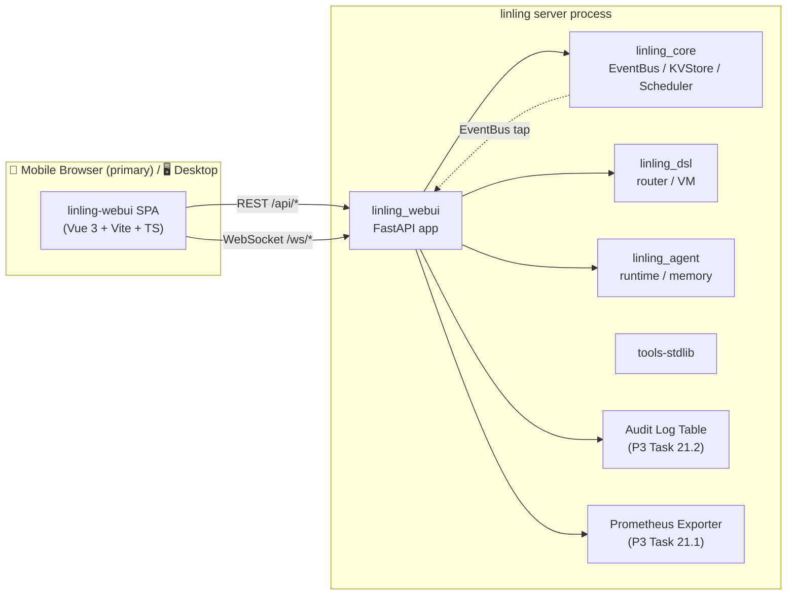

# Design — linling-webui（狐妖情缘主题 · 移动优先 Web UI）

> 本 spec 聚焦 P3 阶段的 Web UI。后端的 Prometheus 指标、审计表、Postgres、新适配器等仍归 `linling` 主 spec（任务 21/22/23/24/25）。
>
> 设计语言：**狐妖小红娘 · 情缘**。三个视觉锚点：
> - **苦情树**（intertwined red threads / petals falling）—— 关系与命线的隐喻，用于强调"牵连"。
> - **铃铛**（玲珑铃）—— 挂在树梢的风铃，作为 loader、通知、强调状态变化的 accent。
> - **幻粉微风**（dreamy pink breeze）—— 柔雾、浅粉渐变、慢速漂移，作为整体基调而非噪点。
>
> 设计原则：**移动优先 / 优雅留白 / 适度克制**。装饰层永远不能压过数据层；任何动画在 `prefers-reduced-motion: reduce` 下都退化为静态。

---

## 0. 总览 · 系统上下文



- **SPA 静态资源** 由 `linling_webui` FastAPI app `StaticFiles` 挂载；生产环境也可由 Caddy/Nginx 前置。
- **读路径**（事件流、KV 浏览、规则命中、Agent 流）为主，**写路径**仅在 KV 编辑、Agent 试聊、配置热加载、登录登出四处，按角色网关。
- WebUI **不引入新存储**：事件流走内存环形缓冲 + EventBus 订阅；审计读 `linling` 主 spec 产出的审计表。

---

## 1. 目标 / 非目标

### 1.1 目标

1. **观测**：事件流 / KV 浏览器 / 规则命中 / Agent 对话审计 一屏可达。
2. **移动优先**：在 iPhone 12 Mini（375 × 812）到 iPad Mini（768 × 1024）均优雅；桌面宽屏为 progressive enhancement（两栏 / 三栏 layout）。
3. **美观而不喧宾**：幻粉基调 + 苦情树/铃铛点缀 + 红线链接 = 有辨识度；但列表/表单/代码块使用高可读性设计。
4. **Pluggable**：
   - 主题 token 全部走 CSS variable，支持 **月白 / 暮紫** 明暗双模式；
   - 装饰层（花瓣、铃铛、雾气）可一键关闭（`preferences.decor = "full" | "subtle" | "off"`）。
5. **可替代性**：SPA 仅通过 HTTP/WS 接口依赖后端；未来换 Postgres / 分布式无需前端改动。

### 1.2 非目标

- ❌ 不做通用可视化规则编辑器（拖拽式写 DSL）；那是后续独立 spec。
- ❌ 不做公开消费端 UI（给聊天终端用户看的网页）；本次只面向 **Admin / 机器人作者**。
- ❌ 不做 SSR / Nuxt；纯 CSR SPA 足够，SEO 无关。
- ❌ 不做多语言；文案 **中文单语**，英文仅代码标识符/工具名。

---

## 2. 主题 · 视觉语言

### 2.1 配色（light + dark）

所有 token 以 **英文标识符 / 中文注释** 双形式给出，落地 Tailwind theme 时用英文：

| Token | Chinese name | Light (月白) | Dark (暮紫) | 用途 |
|---|---|---|---|---|
| `--color-bg` | 宣纸底 | `#FAF6F1` | `#1B1523` | 页面底 |
| `--color-bg-veil` | 月纱 | `#FFFDFA / 62%` | `#261B31 / 68%` | 卡片透明层（玻璃态） |
| `--color-bg-mist` | 幻粉雾 | `radial-gradient(#FADCE5 0%, #FFFDFA 72%)` | `radial-gradient(#4A2F47 0%, #1B1523 72%)` | 页面装饰层 |
| `--color-ink` | 墨竹 | `#2B2A2F` | `#F5EDE8` | 正文 |
| `--color-ink-soft` | 远山灰 | `#6B6870` | `#B7ADB9` | 次要文字 |
| `--color-sorrow` | 苦情红 | `#B8002D` | `#D44466` | 主强调（按钮、活跃 tab） |
| `--color-thread` | 红线 | `#E03A4A` | `#F06A7C` | 细线 accent、link |
| `--color-bell` | 铃铛金 | `#E0A95A` | `#F2C579` | 状态金点、通知铃 |
| `--color-petal` | 花瓣粉 | `#F7C8D3` | `#9B5A73` | 装饰粒子 |
| `--color-jade` | 灵玉青 | `#6CA893` | `#8DCBB3` | 成功 / 正增量 |
| `--color-ash` | 尘灰 | `#9A8C8C` | `#7A6C73` | 禁用 |
| `--color-alert` | 警玉朱 | `#C8442D` | `#E06653` | 错误 |
| `--ring-sorrow` | 红线环 | `rgba(224,58,74,0.35)` | `rgba(240,106,124,0.45)` | focus ring |

> 对比度：正文 `--color-ink / --color-bg` light 模式 13.4:1，dark 模式 11.8:1；`--color-sorrow / --color-bg` > 4.8:1 满足 WCAG AA。

### 2.2 字体

```css
--font-display: "Ma Shan Zheng", "Noto Serif SC", "Songti SC", serif;  /* 标题 · 手写楷体点缀 */
--font-serif:   "Noto Serif SC", "Source Han Serif SC", serif;         /* 副标题 / 诗句 */
--font-sans:    "HarmonyOS Sans SC", "PingFang SC", "Noto Sans SC", system-ui, sans-serif;
--font-mono:    "JetBrains Mono", "Noto Sans Mono CJK SC", Menlo, monospace;
```

- **标题**：页面主标题/空态插画配字用 `--font-display`（楷书手写感），做柔微倾斜 `letter-spacing: .04em`。
- **正文 / 数据 / 表单**：一律 `--font-sans`，数字和代码走 `font-feature-settings: "tnum"`。
- **代码 / DSL / JSON**：`--font-mono`。
- **字号 scale**（mobile base 16px）：`12 / 13 / 14 / 16 / 18 / 20 / 24 / 30 / 36`，line-height 1.55（正文）/ 1.25（标题）。
- 字体 **自宿**（self-host）：放在 `/static/fonts/`，woff2 子集化（含常用 3500 字 + ASCII），首屏仅加载 `--font-sans` 常规体，`--font-display` 走 `font-display: swap` 延迟加载。

### 2.3 形状 / 间距 / 阴影

```css
--radius-sm: 8px;   /* 小 chip */
--radius-md: 14px;  /* 卡片 */
--radius-lg: 22px;  /* 弹层、主卡片 */
--radius-xl: 32px;  /* 全屏 bottom sheet */

--space-1: 4px; --space-2: 8px; --space-3: 12px; --space-4: 16px;
--space-5: 24px; --space-6: 32px; --space-7: 48px; --space-8: 64px;

--shadow-petal: 0 1px 2px rgba(176,0,45,.04), 0 4px 14px rgba(176,0,45,.06);
--shadow-bell:  0 2px 4px rgba(224,169,90,.12), 0 10px 28px rgba(224,169,90,.14);
--blur-veil:    backdrop-filter: blur(14px) saturate(120%);
```

- 卡片默认 `--shadow-petal` + `--blur-veil`；活跃/通知类用 `--shadow-bell`。
- 表单输入 focus：`--color-sorrow` 1px 描边 + `--ring-sorrow` 3px 外环。

### 2.4 动效 token（关键）

| Token | 动画名 | 时长 / 曲线 | 描述 |
|---|---|---|---|
| `--motion-bell-swing` | 铃摇 | 1.2s `cubic-bezier(.45,.05,.55,.95)` alternate | 风铃加载器：旋转 -8° → 8° |
| `--motion-petal-fall` | 落樱 | 8-14s `linear` | 背景花瓣：y 0→100vh，x 正弦漂移 ±60px，rotate 0→360° |
| `--motion-breeze-drift` | 微风 | 24s `linear` | 雾层 backgroundPosition 左右漂移 |
| `--motion-thread-draw` | 红线 | 600ms `cubic-bezier(.65,0,.35,1)` | SVG `stroke-dashoffset` 从 1 → 0 |
| `--motion-tap` | 按压 | 120ms `ease-out` | 按钮 scale 0.97 |
| `--motion-sheet-rise` | 升帘 | 320ms `cubic-bezier(.2,.8,.2,1)` | bottom sheet 上滑 |
| `--motion-fade-in-up` | 浮出 | 240ms `ease-out` | 列表项进入 y 8→0 + opacity 0→1 |

**Reduced-motion 策略**（硬性）：

```css
@media (prefers-reduced-motion: reduce) {
  * { animation-duration: .001ms !important; animation-iteration-count: 1 !important; }
  .petal-canvas, .bell-idle, .breeze-layer { display: none !important; }
}
```

### 2.5 装饰层构成

三层叠放（`z-index` 由低到高），都是 `pointer-events: none`：

1. **雾层 `<BreezeLayer>`**（`<div>` + 渐变 `background`）：幻粉径向渐变 + `--motion-breeze-drift`。
2. **花瓣层 `<PetalCanvas>`**（`<canvas>`）：发射器节流在 **≤ 24 片同时在场**；关闭后彻底卸载 `requestAnimationFrame`。
3. **铃铛层 `<BellAccent>`**（SVG）：顶部右挂一枚，hover/tap 触发 `--motion-bell-swing`；同一页面最多一处。

> 性能预算：装饰层 CPU < 1.5% @ 60fps（Pixel 6 模拟 mid-tier mobile），首屏 JS < 180KB gzip。

---

## 3. 信息架构（移动优先）

### 3.1 页面清单与命名

| 路径 | 代号 | 中文门头 | 作用 |
|---|---|---|---|
| `/` | dashboard | **灵签** | 健康度 / 今日事件 / 热门规则 / Agent 用量 |
| `/events` | events | **因缘簿** | 实时事件流（WebSocket tail） |
| `/kv` | kv | **灵玉阁** | KV 浏览、编辑、排行榜 |
| `/rules` | rules | **签文** | 规则命中 & 最近 replay |
| `/agents` | agents | **红娘司** | Agent 列表 / 试聊 / 记忆查看 |
| `/audit` | audit | **命格** | 审计日志检索 |
| `/settings` | settings | **绳结** | 配置 / 热加载 / Bot 列表 / 白名单 |
| `/login` | login | **缘起** | 管理员登录 |

### 3.2 移动导航（底部 tab + 抽屉）

```
┌───────────────────────┐
│ ❖ 因缘簿              │  ← 顶部标题 + 铃铛通知
│                       │
│   [事件卡片]           │
│   [事件卡片]           │  ← 内容区 + 幻粉雾背景
│   …                   │
│                       │
├───────────────────────┤
│ 🜂灵签 · 🜁因缘 · 🜃灵玉 · 🜄签文 · ☰  │  ← 底部 tab（5 槽 + 抽屉）
└───────────────────────┘
```

- 底部 5 槽：**灵签 / 因缘簿 / 灵玉阁 / 签文 / 更多**。
- **更多**（抽屉从右上滑出全屏 sheet）：红娘司 / 命格 / 绳结 / 账户 / 深浅色切换 / 装饰开关。
- 顶部右：**铃铛通知**（未读 audit / 异常），点击展开气泡列表。
- **桌面 ≥ 1024px**：左侧 240px 侧栏 + 主区；导航项与移动相同，但竖排。
- **断点**：`sm 640 / md 768 / lg 1024 / xl 1280`。

### 3.3 手势与触达

- **下拉刷新**（因缘簿 / 灵玉阁 / 签文）：阈值 72px，触发后上方铃铛 swing 3 次。
- **长按 KV 行**：弹 bottom sheet 给 "编辑 / 删除 / 复制键 / 跳转排行榜"。
- **左滑删除**（命格搜索结果书签）：Material 风双级 swipe，二次确认。
- **触达区**：所有 tap target ≥ 44×44px；list row ≥ 56px；底部 tab icon ≥ 28px + 文字 11px，整槽 ≥ 56px。
- **安全区**：`env(safe-area-inset-*)` 内边距；底部 tab 背景延伸到 safe area 外，内容上移。

---

## 4. 页面级设计

### 4.1 灵签（Dashboard）

Hero：页面顶部一棵 SVG **苦情树** 插画（简笔 + 红线缠绕 + 一两枚 `<BellAccent>`），下方数字卡片 2×2 网格（移动）/ 4×1（桌面）：

- **今日事件** · 数字 + 日内 sparkline（24h）
- **规则命中 Top 3** · 彩色条形
- **Agent Token 消耗** · 金额 + 提供方 pill
- **系统健康** · 灯色 `灵玉青 / 铃铛金 / 警玉朱`

下方三段：
- **近期签文命中**（最新 10 条，跳转 `/rules`）
- **灵玉阁热键**（最近写入 10 条 KV，跳转 `/kv`）
- **红娘近话**（最近一次 agent 流，跳 `/agents/:name`）

### 4.2 因缘簿（Events）

- 虚拟化列表（`@tanstack/vue-virtual`），反向时间（新在上）。
- 顶部 filter chips：`all / message / notice / request / system` + 平台 + bot_id + scope kind + 命中/未命中。
- 每条事件卡（mobile）：

```
┌─────────────────────────────────────┐
│ 🦊 苏苏@群754800438            14:22│
│ 「打卡」                            │
│   ▸ 匹配 sign_in · 灵玉+3 · 17 ms   │
│ 点击展开 segments / raw / 回溯      │
└─────────────────────────────────────┘
```

- 展开后：Segment tag 列、工具调用链、LLM 费用。
- WS 断开：顶部贴一条幻粉 banner "红线松了 · 点此重连"，铃铛停摆。

### 4.3 灵玉阁（KV Browser）

- 左侧（桌面）/ 上部（移动）：namespace 面包屑 + scope/file 树。
- 主区：键值表（键 · 值预览 · 更新时间 · 操作）。
- 操作：**查看 / 编辑 / 删除 / 排行榜**。
- 编辑走 **bottom sheet**：字段类型推断（字符串 / 数字 / JSON），JSON 开启 Monaco mini；保存走 `PATCH` + 乐观更新 + 失败回滚。
- 排行榜视图：`scope/file` + 升/降 + topN + 格式，结果用彩色条渲染（类似 QRDic `$排行榜$`）。

### 4.4 签文（Rule hits）

- 每个 handler 一张卡：名、触发器正则、今日命中数、平均延迟、最近错误。
- 点开：最近 50 次 hit，每次可 **回溯**（re-dispatch 到 DSL dry-run 模式），输出并不真正发送 Action。
- 如果 lint（任务 14）报警告，卡片右上角 `⚠` 铃铛金 pill。

### 4.5 红娘司（Agents）

- 列表卡：头像 / 名 / provider/model / 今日 token / 最近延迟。
- 点开进入详情页：
  - **试聊**：气泡对话框（用户左 / agent 右，我方气泡用 `--color-thread` 外框 + 幻粉内填）。支持流式（WS `/ws/agents/:name/stream`）、工具调用可视化（每次 tool call 一段 collapsible）。
  - **记忆**：短期滚动窗口展开 / 长期向量条目（按 namespace 分组）。
  - **日志**：近期 LLM call（请求摘要 / 完成摘要 / token / 费用 / 耗时）。

### 4.6 命格（Audit）

- 搜索条：时间范围 / 用户 ID / 处理器 / 工具名 / 结果（ok/err） / bot_id。
- 结果列表虚拟化；单击展开 JSON 详情（`vue-json-pretty`，主题覆写）。
- 支持导出 CSV（最多 1 万行 / 请求）。

### 4.7 绳结（Settings）

- **Bot 列表**：bot_id / 平台 / 适配器状态；单 bot 卡右上角「重连」「热加载规则」「热加载 Agent」。
- **HTTP 白名单**：只读展示 `bot.yaml` 里的白名单；实际改动仍手工改 yaml（安全起见）。
- **装饰层开关**：全量 / 柔和 / 关闭。
- **主题**：跟随系统 / 月白 / 暮紫。
- **登出**。

### 4.8 缘起（Login）

- 仅一页：Logo（铃铛 + 红线）+ 用户名 + 密码 + 登录按钮。
- 输入框 focus 时下方出现一条从左到右绘出的红线（`--motion-thread-draw`），提示"缘起一线"。
- 错误：底部抖动 + 铃铛一次响（`--motion-bell-swing` 单次）。

---

## 5. 组件库草案

组件命名遵循 **`<Pascal>`**；前缀按职责分层：**`Ling-`** 业务 / **`Deco-`** 装饰 / **`Ui-`** 原子。

### 5.1 核心

```ts
// Ui-Button.vue
props: {
  kind: 'primary' | 'ghost' | 'thread' | 'danger' | 'jade'
  size: 'sm' | 'md' | 'lg'
  loading?: boolean   // 自动切换 <DecoBellLoader> 代替图标
  as?: 'button' | 'a' | RouteLocationRaw
}
// primary: --color-sorrow 底, 白字
// thread: 透明底 + --color-thread 1px 描边，按压时描边变 2px
// jade: --color-jade 底，用于 "保存" / 成功态
```

```ts
// Ui-Card.vue
props: {
  elevated?: boolean          // shadow-bell vs shadow-petal
  glass?: boolean             // backdrop-filter blur 14px
  padding?: 'sm'|'md'|'lg'
}
// 默认 radius-md + shadow-petal + bg-bg-veil
```

```ts
// Ui-Sheet.vue   (bottom sheet)
props: {
  open: boolean
  title?: string
  dismissible?: boolean
  maxHeight?: '50vh' | '75vh' | 'full'
}
// 使用 <dialog> + ::backdrop；drag-down 关闭；safe-area-inset-bottom
```

```ts
// Ui-Chip.vue, Ui-Pill.vue, Ui-Tabs.vue, Ui-VirtualList.vue
// Ui-EmptyState.vue  -> slot illustration, 默认使用 <DecoBellHang/> + 文案
// Ui-Skeleton.vue    -> shimmer 时不压装饰
```

### 5.2 装饰

```ts
// Deco-PetalCanvas.vue
props: {
  density: 'full' | 'subtle' | 'off'   // 绑定 preferences.decor
  maxParticles?: number                // 默认 full=24 / subtle=8
  palette?: string[]                   // 默认 [--color-petal, --color-thread]
}
// canvas 尺寸 = devicePixelRatio * parent；resize 时 throttle；
// window 不可见时 cancelAnimationFrame 省电。
```

```ts
// Deco-BellLoader.vue     // 加载器：铃铛 + 红线，swing 循环
// Deco-BellAccent.vue     // 角落挂铃，点击 swing 并响一次（Web Audio 轻音，可关）
// Deco-BreezeLayer.vue    // 幻粉径向渐变背景
// Deco-ThreadDivider.vue  // 两段红线中间一粒花瓣的分割线
// Deco-SorrowTree.vue     // dashboard hero 的苦情树 SVG（可接受 "bells" / "petals" 参数）
```

### 5.3 业务

```ts
// Ling-EventTail.vue          WS 实时事件列表 + filters
// Ling-EventCard.vue           单条事件（含 segments / handlers / latency）
// Ling-KvTree.vue              scope/file 树（可折叠）
// Ling-KvRow.vue               键值单行，长按菜单
// Ling-KvEditor.vue            bottom sheet 编辑器（类型切换 + Monaco-lite）
// Ling-RuleCard.vue            规则命中卡片
// Ling-AgentChat.vue           气泡对话，流式拼接，工具调用折叠
// Ling-AgentMemory.vue         短期 / 长期 记忆分栏
// Ling-AuditTable.vue          命格列表
// Ling-BotSwitcher.vue         顶部 bot 选择器（多租户 P3 Task 24）
// Ling-NotificationBell.vue    铃铛通知 popover
```

### 5.4 示意伪代码：`Ling-AgentChat.vue`

```vue
<template>
  <section class="flex flex-col h-full">
    <header class="px-4 py-3 border-b border-thread/20">
      <h1 class="font-display text-2xl">{{ agent.name }}</h1>
      <p class="text-ink-soft text-sm">{{ agent.model }}</p>
    </header>

    <ol ref="list" class="flex-1 overflow-y-auto px-4 py-3 space-y-3">
      <li v-for="msg in messages" :key="msg.id" :class="bubbleClass(msg)">
        <template v-if="msg.role === 'tool_call'">
          <LingToolCallCard :call="msg" />
        </template>
        <template v-else>
          <div class="bubble" v-html="render(msg.content)" />
        </template>
      </li>
      <li v-if="streaming" class="bubble assistant animate-pulse">
        <DecoBellLoader size="sm" /> 正在牵线…
      </li>
    </ol>

    <footer class="p-3 pb-safe border-t border-thread/20 bg-bg-veil">
      <UiInput v-model="draft" placeholder="说点什么…" @enter="send" />
      <UiButton kind="primary" :loading="streaming" @click="send">寄去</UiButton>
    </footer>
  </section>
</template>

<script setup lang="ts">
const ws = useAgentStream(agent.name, {
  onDelta: (d) => messages.value.at(-1)!.content += d,
  onToolCall: (c) => messages.value.push({ id: uid(), role: 'tool_call', ...c }),
  onDone: () => streaming.value = false,
})
</script>
```

---

## 6. 后端 API（REST + WebSocket）

### 6.1 REST（JSON, Bearer JWT 除 `/login` 外必须）

| Method | Path | 描述 | 返回 |
|---|---|---|---|
| POST | `/api/auth/login` | 用户名密码换 JWT | `{ access, refresh, profile }` |
| POST | `/api/auth/refresh` | 刷新 | `{ access }` |
| GET | `/api/profile` | 当前用户 + 可见 bot 列表 | `Profile` |
| GET | `/api/bots` | bot 列表 | `Bot[]` |
| POST | `/api/bots/:bot_id/hot-reload` | 热加载规则/Agent | `{ reloaded: number, errors: LintError[] }` |
| GET | `/api/events` | 分页查最近事件（db 回溯） | `Page<Event>` |
| GET | `/api/events/:id` | 详情 + handler trace | `EventDetail` |
| POST | `/api/events/:id/replay` | dry-run 重放 | `ReplayResult` |
| GET | `/api/kv` | 列 namespace（`scope/file`）及条目数 | `KvNamespace[]` |
| GET | `/api/kv/:scope/:file` | 列键值，分页/搜索 | `Page<KvRow>` |
| GET | `/api/kv/:scope/:file/:key` | 单条 | `KvRow` |
| PATCH | `/api/kv/:scope/:file/:key` | 编辑 | `KvRow` |
| DELETE | `/api/kv/:scope/:file/:key` | 删除 | `204` |
| GET | `/api/kv/:scope/:file/rank` | 排行榜（`?order=desc&top=10&sep=,&fmt=...`） | `RankResult` |
| GET | `/api/rules` | 所有 handler + 今日命中统计 | `RuleSummary[]` |
| GET | `/api/rules/:name/hits` | handler 最近 hit | `Page<RuleHit>` |
| GET | `/api/agents` | agent 列表 | `AgentSummary[]` |
| GET | `/api/agents/:name` | agent 详情 + memory 概览 | `AgentDetail` |
| GET | `/api/agents/:name/memory` | 记忆（短/长） | `MemoryView` |
| POST | `/api/agents/:name/chat` | 非流式试聊 | `ChatTurn` |
| GET | `/api/audit` | 审计检索 | `Page<AuditEntry>` |
| GET | `/api/audit.csv` | 导出 CSV | `text/csv` |
| GET | `/api/settings` | 可读配置（脱敏） | `Settings` |

所有分页统一：`?cursor=<opaque>&limit=<1..200>`，返回 `{ items, next_cursor?, total? }`。
Bearer 失效统一 `401`，前端 interceptor 刷新 `access` 一次，仍失败跳登录。

### 6.2 WebSocket

| Path | 描述 | 消息协议 |
|---|---|---|
| `/ws/events` | 实时事件 tail，可带 `?scope=group&bot=..&kind=message` | server→client: `{t:"event", data: Event}` / `{t:"ping"}` / `{t:"filter_ack"}`。client→server: `{t:"filter", data:{...}}` |
| `/ws/agents/:name/stream` | agent 流式试聊 | client→server: `{t:"input", content, context?}` / `{t:"cancel"}`。server→client: `{t:"delta",text}` / `{t:"tool_call",...}` / `{t:"tool_result",...}` / `{t:"done"}` / `{t:"error",msg}` |
| `/ws/rules/hits` | 实时签文命中 | `{t:"hit", data: RuleHit}` |

- **鉴权**：WS 握手查询串 `?token=<jwt>` 或 header `Sec-WebSocket-Protocol: bearer,<jwt>`（SPA 用前者）。
- **心跳**：server 每 25s 发 `ping`，client 15s 无消息回 `ping`。
- **事件积压**：客户端可在 `filter` 中 `{since: <event_id>}`，服务端从环形缓冲（容量 500/bot）补发。

### 6.3 数据契约（关键 TypeScript 摘录）

```ts
type Scope = { kind:'group'|'dm'|'system'; id:string; platform:string; channel_id?:string }
type Event = {
  id:string; platform:string; bot_id:string; scope:Scope; sender:User;
  time:string /* ISO8601 */; kind:'message'|'notice'|'request'|'system';
  segments:Segment[]; text:string;
  trace?: { handlers:HandlerHit[]; agents:AgentInvocation[] }
}
type KvRow = {
  bot_id:string; scope:string; file:string; key:string;
  value:string; updated_at:string;
}
type RuleHit = { rule:string; event_id:string; matched:Record<string,string>;
                  latency_ms:number; outcome:'ok'|'err'; error?:string }
type AuditEntry = {
  id:string; time:string; bot_id:string; user_id:string; scope_id:string;
  kind:'tool_call'|'llm_call'|'handler_dispatch'|'hot_reload'|'login';
  payload:Record<string,unknown>; outcome:'ok'|'err'; latency_ms:number;
}
```

---

## 7. 目录布局（新包 `packages/webui`）

```
packages/webui/
├── pyproject.toml
├── README.md
├── src/linling_webui/
│   ├── __init__.py
│   ├── app.py              # FastAPI app factory：create_app(config) -> FastAPI
│   ├── config.py           # WebUIConfig (pydantic-settings)，读 bot.yaml webui 段
│   ├── auth.py             # JWT sign/verify, 用户表（sqlite），密码 argon2
│   ├── deps.py             # FastAPI Depends: get_kv / get_bus / get_audit / require_admin
│   ├── routers/
│   │   ├── auth.py
│   │   ├── bots.py
│   │   ├── events.py
│   │   ├── kv.py
│   │   ├── rules.py
│   │   ├── agents.py
│   │   ├── audit.py
│   │   └── settings.py
│   ├── ws/
│   │   ├── events.py       # /ws/events
│   │   ├── agents.py       # /ws/agents/:name/stream
│   │   └── rules.py        # /ws/rules/hits
│   ├── buffers.py          # 内存环形缓冲（per-bot）
│   ├── audit_reader.py     # 读 audit 表
│   ├── schemas.py          # pydantic 响应模型
│   └── static/             # 打包后的前端产物（由 CI 注入或 dev 代理）
└── tests/
    ├── test_auth.py
    ├── test_kv_router.py
    ├── test_events_ws.py
    └── test_agents_ws.py

packages/webui/frontend/     # 前端独立子目录（pnpm workspace）
├── package.json
├── vite.config.ts
├── tsconfig.json
├── index.html
├── tailwind.config.ts
├── postcss.config.js
├── src/
│   ├── main.ts
│   ├── App.vue
│   ├── router.ts
│   ├── store/
│   │   ├── auth.ts
│   │   ├── events.ts
│   │   ├── kv.ts
│   │   ├── agents.ts
│   │   └── prefs.ts        # 主题 / 装饰 / 密度
│   ├── api/
│   │   ├── client.ts       # axios + interceptor
│   │   └── ws.ts           # useEventStream / useAgentStream composables
│   ├── theme/
│   │   ├── tokens.css      # 颜色/字体/动效 CSS vars
│   │   ├── tailwind.ts     # theme.extend 引用 tokens
│   │   └── fonts.css
│   ├── decor/              # DecoPetalCanvas 等
│   ├── components/         # Ui-*, Ling-*
│   ├── pages/
│   │   ├── Dashboard.vue
│   │   ├── Events.vue
│   │   ├── Kv.vue
│   │   ├── Rules.vue
│   │   ├── Agents.vue
│   │   ├── AgentDetail.vue
│   │   ├── Audit.vue
│   │   ├── Settings.vue
│   │   └── Login.vue
│   └── assets/
│       ├── tree.svg
│       ├── bell.svg
│       └── petal.svg
└── tests/
    ├── unit/*.spec.ts      # vitest
    └── e2e/*.spec.ts       # playwright（mobile viewport）
```

- **打包流程**：`pnpm --filter webui-frontend build` → 产物拷到 `packages/webui/src/linling_webui/static/`（CI 做），Python 包 `linling_webui.app` 用 `StaticFiles` 挂 `/`。
- **dev 模式**：Vite 起 `:5173`，FastAPI 起 `:8787`，Vite 代理 `/api` 与 `/ws` 到后端。

---

## 8. 状态管理与数据流

**Pinia** store，composables 封装 API。

```mermaid
sequenceDiagram
  participant P as 页面(Events.vue)
  participant S as Pinia(events store)
  participant W as useEventStream(WS)
  participant B as backend /ws/events
  participant Bus as EventBus(in-process)

  P->>S: mount; setFilter(...)
  S->>W: subscribe(filter)
  W->>B: open WS + {filter}
  B->>Bus: subscribe(priority=-10, name="webui:events")
  Bus-->>B: Event
  B-->>W: {t:"event", data}
  W-->>S: push(event) (cap 500, shift oldest)
  S-->>P: reactive list -> VirtualList
```

**要点**：

- `events` store 使用 **ring buffer**（容量 500）防内存泄漏。
- `kv` store 用 **分页缓存**（LRU 128 keys），编辑后只失效该 key，其他页不动。
- `agents` store 对每个 `name` 维护独立 messages / streaming / lastError。
- `prefs` store `persist: localStorage`；主题/装饰即时生效。
- 全局 `useApiClient()`：401 自动 `/api/auth/refresh` 一次；`5xx` 置顶 toast。

---

## 9. 鉴权 · 权限 · 多租户

- 单一 Admin 用户表（sqlite，密码 argon2id）。后续（P3 Task 24）扩为 `role: superadmin | bot_admin | readonly`。
- JWT：
  - `access` TTL 15m，`refresh` TTL 7d；`refresh` 落表，可撤销。
  - payload：`{ sub, role, bots: string[], iat, exp }`。
- **路由守卫**（前端）：`router.beforeEach` 查 `auth.isAuthed`，未登录重定向 `/login?next=`。
- **API 守卫**（后端）：FastAPI `Depends(require_role("bot_admin"))`，并按 `bots` 过滤可见 bot_id（与 Task 24 存储层 `bot_id` 分区对齐）。
- **WS 鉴权**：握手时校 token；订阅事件时再按 `bots` 过滤一次。

---

## 10. 移动端适配要点（落地清单）

| 关注点 | 方案 |
|---|---|
| **Viewport** | `<meta name="viewport" content="width=device-width,initial-scale=1,viewport-fit=cover,interactive-widget=resizes-content">` |
| **Safe area** | Tailwind 插件 + `pb-safe / pt-safe / px-safe` utilities 映射 `env(safe-area-inset-*)` |
| **点击目标** | Tailwind preset 里强制 `min-h-[44px]` on `.tap`；Lint via eslint-plugin-tailwindcss |
| **滚动容器** | `overscroll-behavior: contain; -webkit-overflow-scrolling: touch` |
| **虚拟键盘** | `interactive-widget=resizes-content` + 输入框聚焦时自动 `scrollIntoView({block:"center"})` |
| **下拉刷新** | `<UiPullRefresh>` 组件，阈值 72px，触发回调；iOS bounce 保留视觉衔接 |
| **Bottom sheet** | 使用 `<dialog>` + 动画；drag handle 垂直手势 >80px 关闭 |
| **图片** | `loading="lazy" decoding="async"`；KV / event 里的 image segment 走 `` 按 dpr |
| **字体** | 首屏 critical CSS 内联；`font-display: swap`；子集化限 3500 常用汉字 |
| **离线** | 可选 PWA manifest + service worker（仅缓存静态资源；API 不缓存）。**开放问题 Q-1**|
| **震感** | 关键交互（铃铛响、排行榜翻页）调 `navigator.vibrate(15)`（用户偏好可关） |
| **屏幕旋转** | 强制以竖屏为主；横屏时两栏 layout（桌面 layout 向下兼容） |

---

## 11. 性能预算（mobile mid-tier 为基准）

| 指标 | 目标 | 手段 |
|---|---|---|
| FCP | < 1.5s（4G, Pixel 6） | 关键 CSS 内联、字体自宿、首屏代码 < 180KB gzip |
| TTI | < 3.0s | 路由代码分割（每页独立 chunk）、装饰层懒加载 |
| 帧率 | 稳定 ≥ 55fps | `PetalCanvas` 节流、`requestIdleCallback` 调度非关键任务 |
| 内存 | < 80MB（30 分钟浏览） | 事件 ring buffer 500 条、WS 关闭时 teardown 所有 rAF |
| 滚动 | 60fps on 5k 行 KV | `@tanstack/vue-virtual` 虚拟滚动 + ItemKey 稳定 |

---

## 12. 可访问性（A11y）

- 全量 **ARIA landmark**：`<header role="banner">` `<nav>` `<main>` `<aside>` `<footer>`。
- 每张装饰层（PetalCanvas / BreezeLayer / BellAccent）`aria-hidden="true"`。
- 色彩对比 AA；**不允许仅靠颜色传达状态**（灯点旁边必带 icon + 文案 tooltip）。
- 键盘路径：Tab 顺序合理；`Esc` 关 sheet；`Enter` 触发主按钮；`/` 聚焦搜索。
- **`prefers-reduced-motion`** 硬拦截装饰动画。
- 触屏设备的 `hover` 降级：`@media (hover: hover)` 内才启用 hover 效果，触屏不抖。
- 屏幕阅读器：列表项带 `aria-describedby`；流式 bubble 用 `aria-live="polite"`。

---

## 13. 错误 & 空态设计

- **空态**：统一组件 `<UiEmptyState>`，内嵌 `<DecoBellHang>` 插画（一枚铃铛挂在红线上），配短句：
  - 因缘簿空：**"风未起，铃未响。"**
  - 灵玉阁空：**"阁中尚无玉。"**
  - 签文空：**"暂无签文。"**
- **错误态**：
  - 非致命：顶部 toast（幻粉底 + 红线边），3.5s 自隐。
  - 致命：全屏阴翳底 + 警玉朱铃铛，文案"**红线松了**" + 重试按钮。
- **离线**：SW 检测到离线切顶部 banner；UI 允许继续看缓存中的 KV 编辑草稿（localStorage 托底）。

---

## 14. Correctness Properties（可测可验）

以下为**跨层不变式**，应落到单测 / 集成测 / Playwright e2e：

| ID | 性质 | 检测方式 |
|---|---|---|
| WUI-C1 | **鉴权完整性**：除 `/api/auth/*` 外所有 REST/WS 未携带合法 JWT 时返回 401/握手失败 | FastAPI httpx 单测 + Playwright |
| WUI-C2 | **多租户隔离**：当前用户 `bots` 之外的 bot_id 不应出现在任何列表/聚合响应 | 集成测：双用户 fixture |
| WUI-C3 | **事件有序性**：`/ws/events` 在 `since` 补发后，到稳态时 event.id 序列单调（按 EventBus 顺序） | 模拟 1000 事件 + 重连 |
| WUI-C4 | **KV 编辑原子性**：`PATCH` 成功后 `GET` 同一 key 返回 new value，且 `updated_at` ≥ 请求前；失败则值不变 | Hypothesis 属性测：随机写/失败注入 |
| WUI-C5 | **KV 乐观并发**：`PATCH` 带 `If-Match: <updated_at>` 不匹配返 409；前端必须提示冲突 | 测后端 409；前端 Playwright 验证 sheet 提示 |
| WUI-C6 | **事件流内存**：连续注入 10k 事件后，`window.performance.memory.usedJSHeapSize` 增长 < 20MB（ring buffer 生效） | Playwright + chrome devtools protocol |
| WUI-C7 | **动效降级**：`prefers-reduced-motion: reduce` 下 `PetalCanvas`/`BreezeLayer`/`BellAccent` 不 mount | 组件单测 |
| WUI-C8 | **脱敏**：`/api/settings` 响应中 `${ENV}` 名字段（api_key、token）必须 `***` | 后端单测 |
| WUI-C9 | **审计完整**：任何写路径（KV 编辑 / 删除 / 热加载 / 登录 / agent 试聊）都产生 audit 一行，`outcome` 与实际一致 | 集成测 |
| WUI-C10 | **WS 断连自愈**：拔网 10s 后恢复，前端 3s 内重连并补发自最后一条 event.id 起的新事件 | Playwright + route interception |
| WUI-C11 | **触达尺寸**：所有可点击元素 bounding-box ≥ 44×44px | Playwright + `getBoundingClientRect` 扫一遍已注册 route |
| WUI-C12 | **对比度**：主要文字/背景组合 AA 达标 | axe-playwright 扫全页面 |
| WUI-C13 | **CSP**：WebUI 服务返回 `Content-Security-Policy` 禁用 `unsafe-inline`（字体/样式哈希白名单） | 后端单测 |

---

## 15. 安全与部署

- **CORS**：默认同源；`webui.cors.origins` 可配白名单。
- **CSRF**：WS + JWT Bearer 下不使用 cookie，天然免疫；若启用 cookie 模式则加 `SameSite=Lax` + CSRF token。
- **CSP**：`default-src 'self'; img-src 'self' data: blob:; style-src 'self' 'sha256-...'; font-src 'self'; connect-src 'self' ws: wss:; frame-ancestors 'none'`。
- **速率限制**：登录接口 5 次/分钟/IP；写接口 60 次/分钟/用户。
- **密码存储**：argon2id，参数 m=64MB, t=3, p=2。
- **敏感字段**：`/api/settings` / `/api/audit` 响应前过 redactor。
- **部署**：与主进程同 Python 进程内 mount，生产可独立进程（共享 SQLite WAL / Postgres）。
- **健康检查**：`GET /api/health` 返 `{status, version, bots:[{id,online,last_event_at}]}`。

---

## 16. 打包与工程

- **前端**：pnpm workspace + Vite + Vue 3 + TS。Tailwind v4（CSS-native `@theme`）。必要包：
  - `vue`, `vue-router`, `pinia`, `@tanstack/vue-virtual`, `@vueuse/core`, `@vueuse/motion`,
  - `gsap`（装饰层），`axios`,
  - `monaco-editor`（懒载，KV 编辑），`vue-json-pretty`，
  - `dayjs`（locale zh-cn）。
- **后端**：FastAPI + uvicorn + pyjwt + argon2-cffi。
- **Lint**：ESLint + `eslint-plugin-vue` + `eslint-plugin-tailwindcss`；Prettier；`stylelint`。
- **CI**：pnpm build → vitest → playwright（mobile viewport 375×812）→ Python pytest。
- **版本号**：前端读 `/api/health.version` 显示在 Settings 角标。

---

## 17. 决策记录（ADR 摘要）

| ID | 决策 | 选择 | 理由 |
|---|---|---|---|
| ADR-1 | 前端框架 | **Vue 3 + TS** | Pinia 原生集成、SFC 对主题 token 友好、小团队维护成本低；若团队偏 React 可整体替换（所有组件名/composables 可 1:1 映射） |
| ADR-2 | 样式方案 | **Tailwind v4 + CSS vars** | 快速原型 + 主题 token 原生切换（无需 JS） |
| ADR-3 | 动画库 | **@vueuse/motion + GSAP** | 简单过渡用 vueuse；花瓣/铃摆用 GSAP timeline |
| ADR-4 | 图表 | **ECharts（延迟 import）** | 中文场景最稳；只在 dashboard 用 |
| ADR-5 | 代码编辑 | **Monaco lite** | KV JSON 编辑舒适度；动态 import，不占首屏 |
| ADR-6 | 包管理 | pnpm + uv | 前后端分治，根 `pnpm-workspace.yaml` 与 `tool.uv.workspace` 并存 |
| ADR-7 | 字体 | 自宿 + 子集化 | 避免 CDN 风险、中文字体体积大 |

---

## 18. 开放问题（待拍板）

- **Q-1** 是否在 v0 就发 PWA（manifest + SW）？影响：可作为"灵签"首屏 App 图标加桌面；但离线策略要设计好。**推荐**：v0.1 只加 manifest，SW v0.2。
- **Q-2** 是否引入 React 版本并行？**推荐**：否；Vue 版本优先，所有 composables 抽象可移植。
- **Q-3** Audit CSV 导出大小上限（1 万行？）与异步任务边界？**推荐**：同步 ≤ 1 万行，再大走后台任务 + 邮件/下载链接。
- **Q-4** 铃铛音效是否默认关？**推荐**：默认关，Settings 里可开；开启时仍遵守 `prefers-reduced-motion`。
- **Q-5** KV 编辑是否支持 JSON Patch 部分更新？**推荐**：初版仅全量覆盖 + `If-Match` 并发控制，后续看需要。
- **Q-6** 是否在 Dashboard 引入 ECharts 还是用原生 SVG sparkline？**推荐**：sparkline 用 SVG，饼/面积用 ECharts。
- **Q-7** WebUI 是否在生产提供 "只读演示" 公开路由？**推荐**：否；安全优先。

---

## 19. 附录 A · Tailwind theme 片段

```ts
// packages/webui/frontend/tailwind.config.ts
export default {
  content: ['./index.html', './src/**/*.{vue,ts,tsx}'],
  theme: {
    extend: {
      colors: {
        bg:      'rgb(var(--color-bg) / <alpha-value>)',
        'bg-veil': 'rgb(var(--color-bg-veil) / <alpha-value>)',
        ink:     'rgb(var(--color-ink) / <alpha-value>)',
        'ink-soft': 'rgb(var(--color-ink-soft) / <alpha-value>)',
        sorrow:  'rgb(var(--color-sorrow) / <alpha-value>)',  // 苦情红
        thread:  'rgb(var(--color-thread) / <alpha-value>)',  // 红线
        bell:    'rgb(var(--color-bell) / <alpha-value>)',    // 铃铛金
        petal:   'rgb(var(--color-petal) / <alpha-value>)',   // 花瓣粉
        jade:    'rgb(var(--color-jade) / <alpha-value>)',    // 灵玉青
        alert:   'rgb(var(--color-alert) / <alpha-value>)',   // 警玉朱
      },
      fontFamily: {
        display: ['Ma Shan Zheng', 'Noto Serif SC', 'serif'],
        serif:   ['Noto Serif SC', 'serif'],
        sans:    ['HarmonyOS Sans SC', 'PingFang SC', 'Noto Sans SC', 'system-ui'],
        mono:    ['JetBrains Mono', 'Noto Sans Mono CJK SC', 'monospace'],
      },
      borderRadius: { sm:'8px', md:'14px', lg:'22px', xl:'32px' },
      boxShadow: {
        petal: '0 1px 2px rgba(176,0,45,.04), 0 4px 14px rgba(176,0,45,.06)',
        bell:  '0 2px 4px rgba(224,169,90,.12), 0 10px 28px rgba(224,169,90,.14)',
      },
      animation: {
        'bell-swing':   'bellSwing 1.2s cubic-bezier(.45,.05,.55,.95) infinite alternate',
        'petal-fall':   'petalFall var(--petal-dur, 12s) linear infinite',
        'breeze-drift': 'breezeDrift 24s linear infinite',
        'fade-in-up':   'fadeInUp .24s ease-out',
      },
      keyframes: {
        bellSwing: { from:{transform:'rotate(-8deg)'}, to:{transform:'rotate(8deg)'} },
        petalFall: {
          '0%':  { transform:'translate3d(0,-5vh,0) rotate(0deg)',  opacity:'0' },
          '10%': { opacity:'.9' },
          '100%':{ transform:'translate3d(var(--petal-x,60px),110vh,0) rotate(360deg)', opacity:'0' },
        },
        breezeDrift: {
          '0%':  { backgroundPosition:'0% 50%' },
          '50%': { backgroundPosition:'100% 50%' },
          '100%':{ backgroundPosition:'0% 50%' },
        },
        fadeInUp: { from:{opacity:'0', transform:'translateY(8px)'},
                    to:  {opacity:'1', transform:'translateY(0)'} },
      },
    },
  },
}
```

---

## 20. 附录 B · FastAPI mount 片段

```python
# packages/webui/src/linling_webui/app.py
from __future__ import annotations
from pathlib import Path
from fastapi import FastAPI
from fastapi.staticfiles import StaticFiles
from .config import WebUIConfig
from .routers import auth, bots, events, kv, rules, agents, audit, settings
from .ws import events as ws_events, agents as ws_agents, rules as ws_rules
from .deps import wire_dependencies


def create_app(config: WebUIConfig) -> FastAPI:
    app = FastAPI(title="linling-webui", version=config.version)
    wire_dependencies(app, config)

    # REST
    app.include_router(auth.router,     prefix="/api/auth")
    app.include_router(bots.router,     prefix="/api/bots")
    app.include_router(events.router,   prefix="/api/events")
    app.include_router(kv.router,       prefix="/api/kv")
    app.include_router(rules.router,    prefix="/api/rules")
    app.include_router(agents.router,   prefix="/api/agents")
    app.include_router(audit.router,    prefix="/api/audit")
    app.include_router(settings.router, prefix="/api/settings")

    # WS
    app.include_router(ws_events.router)
    app.include_router(ws_agents.router)
    app.include_router(ws_rules.router)

    # SPA
    static_dir = Path(__file__).parent / "static"
    if static_dir.exists():
        app.mount("/", StaticFiles(directory=static_dir, html=True), name="spa")
    return app
```

---

## 21. 小结

这份设计把 **狐妖小红娘 · 情缘** 的视觉语言系统化为一套可落地的 token、组件和装饰层策略，并在移动优先前提下给出清晰的页面 IA、REST/WS 契约、目录布局和性能 / 可访问性 / 正确性的验收项。一句话总括：

> **幻粉为底，墨竹为笔，红线为意；铃响则风起，签落则心明。**
> 观测与操作的每一次交互，都让人觉得像在一棵树下慢慢牵一根线。

下一步：
1. 和你对一遍本设计，确认 **ADR-1（Vue 而非 React）** 和 **ADR-2（Tailwind v4）**；
2. 基于本设计反推 `requirements.md`（用户故事 + 验收标准）；
3. 再写 `tasks.md` 分阶段执行（骨架 / 主题层 / 核心页面 / WS / 移动细节 / 联调 / e2e）。
