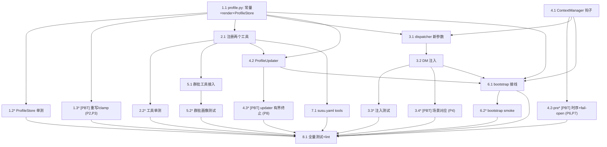

# Implementation Plan: Per-User Profile Memory

## Overview

Implement the per-user profile memory layer described in `design.md`. 画像是按
QQ 号组织的长期蒸馏记忆,存进现有 `KVStore` 的 `__profile__/<qq>` 下,跨 scope
共享、跨重启持久。三个交付面:

1. **两个 LLM 工具**(`read_user_profile` / `write_user_profile`)—— 私聊 ReAct、
   群聊 ReAct、压缩蒸馏三条路径随时可用。
2. **私聊 system 注入** —— DM 时把画像拼成 `<user_profile>` XML 注入 system;
   群聊不注入(改走工具)。
3. **压缩前蒸馏** —— `ContextManager` 折叠旧 turn 进 summary 前,跑一个有界、
   可丢弃的临时 ReAct 循环(`ProfileUpdater`)逼 LLM 全量更新涉及用户的画像。

实现遵循三条原则:**画像是蒸馏层不是日志**、**复用现有底座(KV / prefix_messages
/ @tool / 唯一压缩点)**、**fail-open(画像失败绝不阻塞用户当轮回复或压缩)**。

改造严格加性:所有新参数 keyword-only 且默认 `None`/不启用;现有 `AgentChatDispatcher`、
`ContextManager`、`GroupBatchChatDispatcher`、`tools_builtin` 的调用方不受影响。
**不新增任何配置字段** —— 所有调参以 `profile.py` 模块级常量给出默认值。

任务自底向上排序:先纯函数 + `ProfileStore`,再工具,再 DM 注入,再压缩钩子 +
`ProfileUpdater`,再群批接入,再 bootstrap,最后验证。Property-based 测试以
`[PBT]` 标记。每个 Property 引用指向 `design.md` §"Correctness Properties"。

## Tasks

### Phase 1: Foundation — `ProfileStore` 与纯函数

- [x] 1.1 创建 `profile.py`,定义常量、`render_profile_block`、`ProfileStore`
  - 新建 `packages/agent/src/linling_agent/profile.py`。
  - 模块级常量:`_PROFILE_SCOPE = "__profile__"`、`_PROFILE_KEY = "profile"`、
    `_NAME_KEY = "name"`、`PROFILE_MAX_CHARS = 400`、
    `PROFILE_UPDATE_TIMEOUT_S = 20.0`、`PROFILE_UPDATE_MAX_ROUNDS = 6`、
    `PROFILE_UPDATE_MAX_INPUT_TOKENS = 16_000`。
  - 类型别名 `OnBeforeCompact = Callable[[str, str, list[Message]], Awaitable[None]]`。
  - 纯函数 `render_profile_block(qq: str, name: str | None, profile: str) -> str | None`:
    `profile` 为空(strip 后)返回 `None`;否则拼出带引导语的 `<user_profile>`
    system 块(见 design §Data Models)。XML 属性值做最小转义(`&`/`<`/`>`/`"`)。
  - `ProfileStore.__init__(self, kv: KVStore, *, max_chars: int = PROFILE_MAX_CHARS)`。
  - `load(qq) -> str`:读 `(_PROFILE_SCOPE, qq, _PROFILE_KEY)`,缺失/空 qq 返回 `""`。
  - `load_name(qq) -> str`:读 `(_PROFILE_SCOPE, qq, _NAME_KEY)`,缺失/空 qq 返回 `""`。
  - `save(qq, profile, *, name=None)`:空 qq no-op;`profile` 先 clamp 到
    `max_chars`(超长截断 + `structlog.debug event="profile.clamped"`),写
    `_PROFILE_KEY`;`name` 非空时一并写 `_NAME_KEY`。
  - `touch_name(qq, name)`:空 qq 或空 name no-op;否则写 `_NAME_KEY`。
  - `ProfileStore` 方法不吞 KV 异常(由调用方按各自 fail-open 策略处理)。
  - 不实现 `ProfileUpdater`(在 4.2)。
  - _Requirements: R1.1, R1.2, R3.1, R4.3 / Properties: P1, P2, P3_

- [x]* 1.2 `render_profile_block` 与 `ProfileStore` 单元测试
  - 新建 `packages/agent/tests/test_profile.py`。
  - `render_profile_block`:空画像返回 `None`;非空含 `<user_profile` + qq/name
    属性 + 正文 + 引导语;特殊字符转义。
  - `ProfileStore`(用 in-memory / sqlite KV fixture,参考 `test_history.py` 的 `kv`):
    save→load 往返;全量重写(写两次,第二次完全覆盖第一次,不追加);
    超 `max_chars` 被 clamp;空 qq 时 `save`/`touch_name` no-op、`load` 返回 `""`;
    `save(..., name=...)` 后 `load_name` 命中;`touch_name` 单独更新昵称。
  - _Requirements: R2.1, R4.2, R4.3 / Properties: P2, P3_

- [x]* 1.3 [PBT] 全量重写与 clamp 不变量
  - 追加到 `packages/agent/tests/test_profile.py`。
  - 用 `hypothesis`(`max_examples=200`)。
  - **Property 2(全量重写)**:对任意两个文本 `p1`、`p2` 和任意 qq,
    `save(qq, p1)` 后 `save(qq, p2)`,断言 `load(qq) == clamp(p2)`,与 `p1` 无关。
  - **Property 3(字数不超限)**:对任意文本 `p`,`save(qq, p)` 后
    `len(load(qq)) <= max_chars`。
  - 文档串标注 `Feature: user-profile-memory, Property 2/3`。
  - _Requirements: R4.2, R4.3 / Properties: P2, P3_

### Phase 2: 两个 LLM 工具

- [x] 2.1 注册 `read_user_profile` / `write_user_profile`
  - 编辑 `packages/agent/src/linling_agent/profile.py`(与 `ProfileStore` 同模块,
    成为画像读写的唯一来源;agent 包 `__init__` 导入 profile 保证加载即注册)。
  - 用 `@tool` 注册两个工具,`dsl_name=""`、`llm_visible=True`:
    - `read_user_profile(ctx, qq) -> str`,`schema={"qq": "string"}`,`safe=True`。
    - `write_user_profile(ctx, qq, profile, name=None) -> str`,
      `schema={"qq": "string", "profile": "string", "name": "string?"}`,`safe=False`。
  - 工具内用 `ctx.kv` 就地构造 `ProfileStore(ctx.kv)`(吃默认 `PROFILE_MAX_CHARS`,
    与注入路径同源,单一存储逻辑)。放 agent 包而非 core:工具是 agent-only
    能力,DSL 不用;`profile` 已依赖 `linling_core.tools`,反向无依赖。
  - `read`:命中返回 `昵称：X\n画像：...`;未命中返回 `该用户(QQ {qq})暂无画像记忆。`;
    空 qq 返回 `错误：缺少有效的 QQ 号。`。
  - `write`:成功返回 `已更新 QQ {qq} 的画像。`(写前 clamp);空 qq 返回错误串。
  - 两个工具内部 `try/except Exception` 转 `错误：...` 串并
    `structlog.warning event="profile.read_tool_failed"/"profile.write_tool_failed"`,
    绝不抛出。
  - _Requirements: R4.1, R4.4 / Properties: P5_

- [x]* 2.2 工具单元测试
  - 新建 `packages/agent/tests/test_profile_tools.py`(import `linling_agent.profile`
    触发注册)。
  - 用 KV fixture + `ToolCtx`:`read` 未命中占位串;`write` 后 `read` 读回;
    全量重写;超长 clamp;空 qq 错误串;KV 异常(monkeypatch `kv.read`/`write` 抛错)
    转错误串且不抛出。
  - _Requirements: R4.1, R4.4 / Properties: P5_

### Phase 3: 私聊 system 注入

- [x] 3.1 `AgentChatDispatcher` 增加 `profile_store` / `on_before_compact` / `profile_inject_dm` 参数
  - 编辑 `packages/agent/src/linling_agent/dispatcher.py`。
  - 构造函数末尾加 keyword-only:`profile_store: ProfileStore | None = None`、
    `on_before_compact: OnBeforeCompact | None = None`、`profile_inject_dm: bool = True`。
    存为 `self._profile_store` / `self._profile_inject_dm`。
  - 把 `on_before_compact` 透传进内部构造的 `ContextManager`(依赖 4.1 的钩子参数);
    `context_budget is None`(无 ContextManager)时忽略该回调。
  - import `ProfileStore` / `render_profile_block` / `OnBeforeCompact`
    (来自 `linling_agent.profile`)。
  - 不改任何现有参数;现有不传新参数的调用方行为逐位不变。
  - _Requirements: R6.1 / Properties: P9_

- [x] 3.2 DM 注入 `<user_profile>` system 块
  - 编辑 `packages/agent/src/linling_agent/dispatcher.py` 的 `dispatch()`。
  - 在现有 `prefix_messages` 组装处(`_linling_prompt_system` 注入点旁)加:
    当 `self._profile_store is not None` 且 `event.scope.kind == "dm"` 且
    `not event.raw.get("_linling_group_batch")` 时:
    - `block = await self._render_profile_block(event.sender.id, event.sender.display_name)`,
      非 `None` 则 `prefix_messages.append(Message(role="system", content=block))`。
    - `await self._touch_name_safe(event.sender.id, event.sender.display_name)`。
  - 私有助手 `_render_profile_block(qq, name) -> str | None`:读 `load(qq)`,空返回
    `None`;否则 `render_profile_block(qq, name, profile)`;**任何异常 fail-open**:
    `structlog.debug event="profile.inject_load_failed"`,返回 `None`。
  - 私有助手 `_touch_name_safe(qq, name)`:`try/except` 包 `store.touch_name`,
    异常吞掉记 debug(fail-open)。
  - 注入块自动被现有 `prepare` / `fit_current_input` 的 token 预算统计覆盖
    (`prefix_messages` 已计入 `reserved`),无需额外裁剪逻辑。
  - 群聊路径(`scope.kind=="group"` 或带 `_linling_group_batch`)**不注入**。
  - _Requirements: R2.1, R2.2, R3.2 / Properties: P3, P4_

- [x]* 3.3 DM 注入测试
  - 新建 `packages/agent/tests/test_profile_inject.py`(或并入 `test_history.py` 风格)。
  - 用 `_RecordingProvider` 捕获传给 provider 的 messages:
    - dm + 有画像 → messages 含且仅含一条 `<user_profile>` system 块,qq/name 正确。
    - dm + 空画像 → 不注入。
    - group scope → 不注入。
    - `_linling_group_batch` 标记 → 不注入。
    - `profile_store=None` → 不注入(向后兼容)。
    - KV 读异常 → fail-open,不注入、`dispatch` 仍正常返回。
    - 注入后 `touch_name` 被调用(昵称写入 KV)。
  - _Requirements: R2.1, R2.2, R3.2 / Properties: P3, P4, P9_

- [x]* 3.4 [PBT] 注入与场景的对应关系
  - 追加到 `packages/agent/tests/test_profile_inject.py`。
  - 用 `hypothesis`(`max_examples=100`)。
  - **Property 4**:对任意 `(scope.kind ∈ {dm, group}, profile ∈ {空, 非空},
    group_batch_flag ∈ {有, 无})` 的笛卡尔积,断言 `<user_profile>` 块出现
    当且仅当 `kind==dm AND profile 非空 AND 无 group_batch_flag`;且出现时恰好一条。
  - 文档串标注 `Feature: user-profile-memory, Property 4`。
  - _Requirements: R2.2, R3.2 / Properties: P4_

### Phase 4: 压缩钩子与 `ProfileUpdater`

- [x] 4.1 `ContextManager` 增加 `on_before_compact` 钩子
  - 编辑 `packages/agent/src/linling_agent/context.py`。
  - 构造函数加 keyword-only `on_before_compact: OnBeforeCompact | None = None`,
    存为 `self._on_before_compact`(`OnBeforeCompact` 从 `linling_agent.profile`
    import,或在 context.py 内本地定义同形别名以避免循环 import —— 取本地定义,
    profile.py 再 import context 的类型;实现时确认无环)。
  - 在 `prepare()` 折叠分支里,`older` 非空、`_summarize(summary, older)` **之前**
    插入 `await self._safe_before_compact(scope_id, sender_id, older)`。
  - `_safe_before_compact`:`self._on_before_compact is None` 直接 return;否则
    `try/except`:`CancelledError` 重抛;其它 `Exception`
    `logger.exception event="context.before_compact_failed"`(fail-open)。
  - 不改其它逻辑;`on_before_compact is None`(现有所有调用)行为逐位不变。
  - _Requirements: R5.1, R5.2, R5.3 / Properties: P6, P7, P9_

- [x]* 4.2-pre [PBT] 压缩前钩子时序与 fail-open
  - 追加到 `packages/agent/tests/test_history.py` 风格的新文件
    `packages/agent/tests/test_context_before_compact.py`。
  - **Property 6(先蒸馏后摘要)**:用 spy 钩子记录调用时刻 + spy provider 记录
    `_summarize` 调用时刻,构造触发压缩的历史,断言钩子在 summarize 前被调用恰好一次,
    且 `older` 参数等于被折叠的那段。
  - **Property 7(fail-open)**:钩子抛 `RuntimeError`/`TimeoutError` 时,断言
    summary 仍生成、`prepare` 仍返回、异常不逃逸;钩子抛 `CancelledError` 时断言透传。
  - 文档串标注 `Feature: user-profile-memory, Property 6/7`。
  - _Requirements: R5.1, R5.2, R5.3 / Properties: P6, P7_

- [x] 4.2 实现 `ProfileUpdater`
  - 编辑 `packages/agent/src/linling_agent/profile.py`。
  - 构造函数(全部 keyword-only,见 design §Public API):`provider`、`store`、`kv`、
    `registry`、`model`、`bot_id="linling"`、`max_tool_rounds=PROFILE_UPDATE_MAX_ROUNDS`、
    `timeout_s=PROFILE_UPDATE_TIMEOUT_S`、`temperature=0.3`、
    `max_input_tokens=PROFILE_UPDATE_MAX_INPUT_TOKENS`。
  - `run(self, scope_id, sender_id, older) -> None`:
    - `older` 空 → 立即 return(零开销)。
    - 整体用 `asyncio.wait_for(self._loop(...), timeout=self._timeout_s)` 包裹。
    - `try/except`:`CancelledError` 重抛;`TimeoutError` →
      `warning event="profile.update_timeout"` 后 return;其它 `Exception` →
      `warning event="profile.update_failed"` 后 return(双层 fail-open 的内层)。
  - `_loop`:
    - 构造临时 `messages`:`[system(蒸馏指令), user(_render_transcript(older))]`。
      `sender_id` 非空时在 system 里点明"当前对话对象 QQ={sender_id}";群聊为空时
      提示"参与者见对话里的 sender_id"。
    - 工具 schema 取 `read_user_profile` / `write_user_profile` 的
      `registry.get(name)` → 转 `ToolSchema`(参考 `AgentRuntime._build_tool_schemas`)。
    - `fit_messages_to_budget(messages, max_input_tokens)`。
    - ReAct 循环 ≤ `max_tool_rounds` 轮:`provider.chat(messages, tools=...,
      temperature, max_tokens=...)`;无 `tool_calls` → 正常终止(模型收尾"好了");
      有则用 `ToolCtx(kv=self._kv, event=None, bot_id=self._bot_id)` 执行每个工具、
      append `tool` 消息、继续。
    - 轮数耗尽 → `info event="profile.update_rounds_exhausted"` 后返回(已写的画像保留)。
  - 蒸馏指令文案见 design §Components 5。
  - _Requirements: R5.1, R5.4, R4.1, R4.4 / Properties: P5, P8_

- [x]* 4.3 `ProfileUpdater` 单元 + [PBT] 测试
  - 新建 `packages/agent/tests/test_profile_updater.py`。
  - 用 `_RecordingProvider` 脚本化 tool_call 序列 + 真实 registry(import
    `linling_tools_stdlib` 触发工具注册)+ KV fixture:
    - 多用户:provider 依次发 `read(123)`→`write(123)`→`read(456)`→`write(456)`→无 tool_call;
      断言两个 QQ 画像都被写入,循环正常终止。
    - 无 tool_call 首轮即终止。
    - **Property 8(有界终止)** [PBT]:provider 始终发 tool_call(永不停)时,断言
      循环在 `max_tool_rounds` 轮截断;`timeout_s` 很小时断言超时 fail-open;
      `CancelledError` 透传。`max_examples=50`。
    - `older` 为空 → 不调用 provider。
    - provider 抛异常 → `run` 不抛出(fail-open)。
  - 文档串标注 `Feature: user-profile-memory, Property 8`。
  - _Requirements: R5.1, R5.4 / Properties: P5, P8_

### Phase 5: 群批工具接入

- [x] 5.1 群批工具表加入两个画像工具 + 执行分支
  - 编辑 `packages/agent/src/linling_agent/group_batch.py`。
  - `_group_batch_tool_schemas()` 末尾追加 `read_user_profile` /
    `write_user_profile` 两个 `ToolSchema`(schema 与 tools_builtin 注册一致)。
  - 新增工具名常量 `_TOOL_READ_PROFILE = "read_user_profile"`、
    `_TOOL_WRITE_PROFILE = "write_user_profile"`。
  - `_execute_batch_tool()` 增加两个分支:命中画像工具时,用 `self._kv` 构造
    `ProfileStore(self._kv)` 执行对应 read/write,返回
    `(_tool_json(结果), None, False, False)` —— 不产生外发动作、不计 read 配额、
    不终止循环。空 qq / 异常按工具契约返回错误串(包进 `_tool_json`)。
  - import `ProfileStore`(以及需要的常量)。`self._kv` 可能为 `None`(老测试构造)
    → 此时返回错误串,不崩。
  - 可选:在 `_build_tool_system_prompt` 补一句画像工具用途说明(非必须,description
    已足够)。
  - _Requirements: R3.1, R4.1, R4.4 / Properties: P5_

- [x]* 5.2 群批画像工具测试
  - 新建 `packages/agent/tests/test_group_batch_profile.py`(mirror
    `test_group_batch.py` 的 `_AgentInner` / `_event` / `_wait_for` harness)。
  - 工具表含两个画像工具;provider 发 `read_user_profile` tool_call 时
    `_execute_batch_tool` 返回画像结果、不产生 Action、循环继续;发
    `write_user_profile` 时 KV 被写入;工具结果随产生外发动作的轮次经
    `_record_tool_history` 进入群历史。
  - `self._kv is None` 时画像工具返回错误串、不崩。
  - 不修改 `test_group_batch.py`。
  - _Requirements: R3.1, R4.1, R4.4 / Properties: P5_

### Phase 6: Bootstrap 接线

- [x] 6.1 组装 `ProfileStore` / `ProfileUpdater` 并注入 dispatcher
  - 编辑 `packages/cli/src/linling_cli/bootstrap.py` 的 `_build_chat_dispatcher`。
  - deferred import `from linling_agent.profile import ProfileStore, ProfileUpdater`。
  - 在构造 `AgentChatDispatcher` 前:
    `profile_store = ProfileStore(kv)`(默认 max_chars);
    `profile_updater = ProfileUpdater(provider=provider, store=profile_store, kv=kv,
    registry=global_registry, model=agent_def.model, bot_id=config.bot_id,
    temperature=min(agent_def.temperature, 0.3))`(其余吃默认常量)。
  - 给 `AgentChatDispatcher(...)` 传 `profile_store=profile_store`、
    `on_before_compact=profile_updater.run`。
  - 群批 dispatcher 已 `inner=dispatcher` 且复用同一 `ContextManager`,群聊压缩
    自动触发蒸馏 —— **不** 在群批侧重复接线。群批画像工具复用其已持有的 `kv`。
  - 不改该 block 外的任何代码。
  - _Requirements: R5.1, R6.1 / Properties: P6, P9_

- [x]* 6.2 Bootstrap 接线 smoke 测试
  - 新建 `packages/cli/tests/test_bootstrap_profile.py`(参考
    `test_bootstrap.py` 风格,stub provider/aclose 避免联网)。
  - 断言构造出的 dispatcher 内部 `_profile_store is not None`,且其
    `ContextManager._on_before_compact` 已绑定(= `profile_updater.run`)。
  - 断言现有 bootstrap 行为不变(无画像相关报错)。
  - _Requirements: R6.1 / Properties: P9_

### Phase 7: 配置文件(仅工具开关)

- [x] 7.1 `susu.yaml` 列出两个画像工具
  - 编辑 `bot/agents/susu.yaml`。
  - 把 `tools: []` 改为:
    ```yaml
    tools:
      - read_user_profile
      - write_user_profile
    ```
  - 可选:在 system 里补一句简短说明苏苏拥有"长期记住某人"的能力(非必须)。
  - 不改其它字段。**不新增任何 bot.yaml / ConversationConfig 配置项**(调参走
    `profile.py` 常量)。
  - _Requirements: R4.4 / Properties: P5_

### Phase 8: 验证

- [x] 8.1 跑全量测试并确认无回归
  - 仓库根目录跑 `pytest packages/agent packages/core packages/cli`(项目标准配置)。
  - 确认:
    - 现有 `test_group_batch.py`、`test_history.py`、`test_memory.py`、`test_tools.py`、
      `test_config.py`、`test_bootstrap.py` 等全部通过(向后兼容,Property 9)。
    - 新增 `test_profile.py`、`test_profile_tools.py`、`test_profile_inject.py`、
      `test_context_before_compact.py`、`test_profile_updater.py`、
      `test_group_batch_profile.py`、`test_bootstrap_profile.py` 通过。
    - 无新增 `DeprecationWarning` / `PytestUnraisableExceptionWarning`。
  - 跑 `ruff` + `mypy`(项目 pre-commit 约定),修掉新代码的告警。
  - 任何失败修底层代码(不改现有测试),重跑。最终检查点 —— 有疑问问用户。
  - _Requirements: R6.1 / Properties: (回归覆盖全部 properties)_

## Notes

- 标 `*` 的是可选测试子任务,可为更快的 MVP 跳过。实现任务(1.1, 2.1, 3.1, 3.2,
  4.1, 4.2, 5.1, 6.1, 7.1, 8.1)全部必需。
- 标 `[PBT]` 的是 `hypothesis` property-based 测试,跑测时应用 property-test 告警门。
- **不新增任何配置字段**:所有画像调参以 `profile.py` 模块级常量给默认值,
  工具与注入共用同一个 `PROFILE_MAX_CHARS`(单一来源,无双路径分叉)。
- 向后兼容由默认值保证:`AgentChatDispatcher(profile_store=None, on_before_compact=None)`、
  `ContextManager(on_before_compact=None)`。现有测试文件不被修改。
- fail-open 是硬约束:画像的任何失败(读/写/蒸馏/超时)都不得阻塞用户当轮回复
  或上下文压缩。`CancelledError` 始终透传,绝不转 fail-open。
- core 不得反向 import agent:画像工具与 `ProfileStore` 同住 agent 包
  (`linling_agent.profile`),agent 包 `__init__` 导入 profile 保证加载即注册;
  DM/群批/蒸馏三条路径共用同一份工具与 `ProfileStore`,无第二份实现。

## Task Dependency Graph

```json
{
  "waves": [
    { "id": 0, "tasks": ["1.1"] },
    { "id": 1, "tasks": ["1.2", "1.3", "2.1", "4.1"] },
    { "id": 2, "tasks": ["2.2", "3.1", "4.2-pre", "4.2"] },
    { "id": 3, "tasks": ["3.2", "4.3", "5.1"] },
    { "id": 4, "tasks": ["3.3", "3.4", "5.2", "6.1"] },
    { "id": 5, "tasks": ["6.2", "7.1"] },
    { "id": 6, "tasks": ["8.1"] }
  ]
}
```

The same dependencies expressed as a Mermaid graph, for reading:


