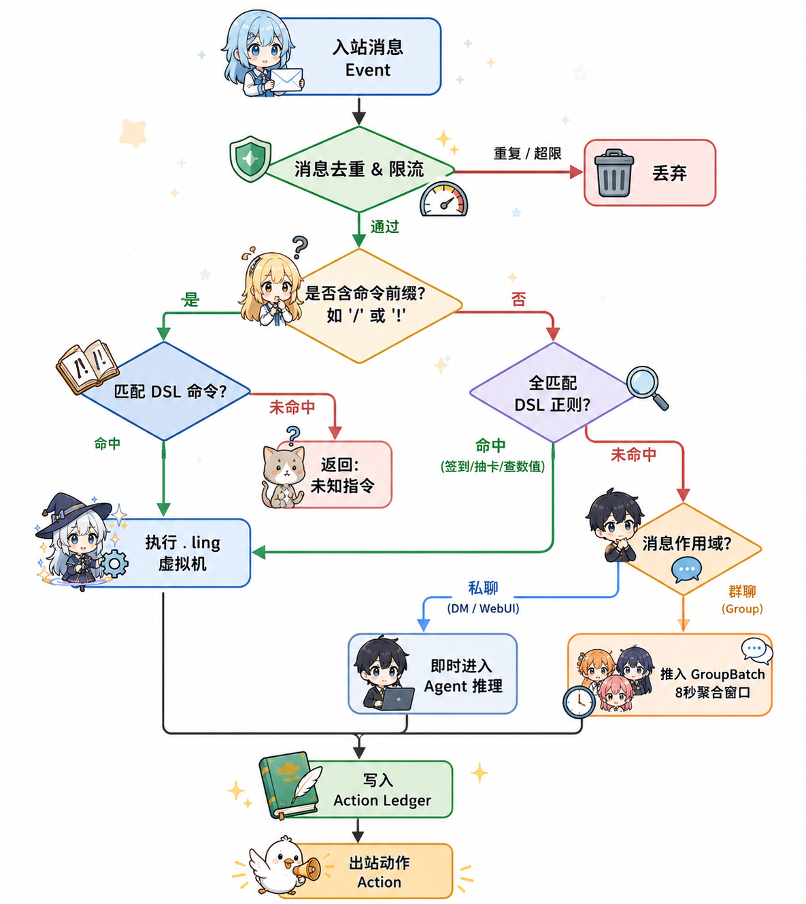
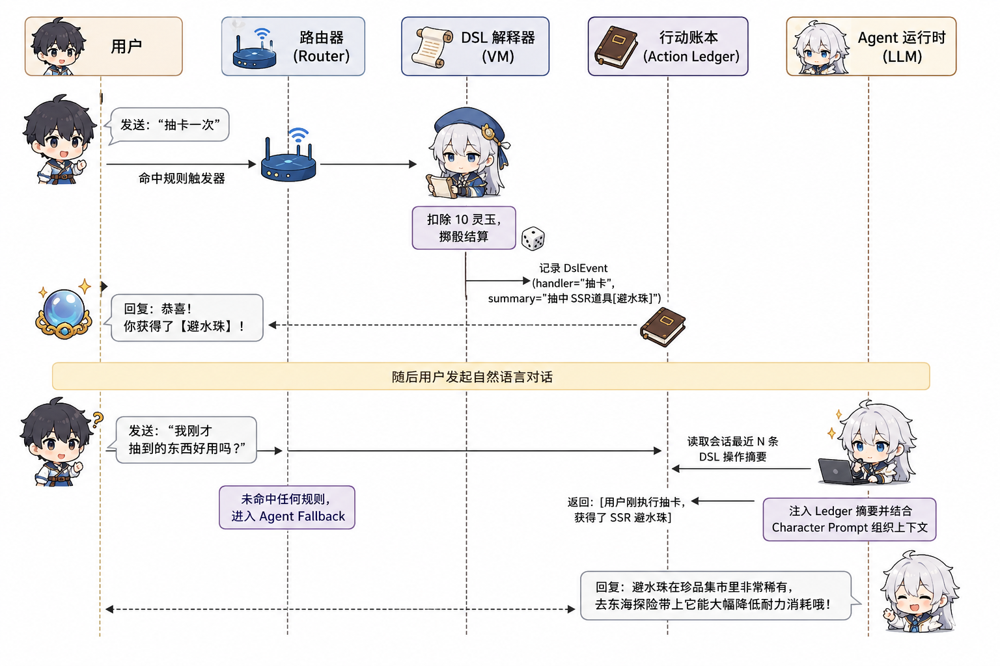
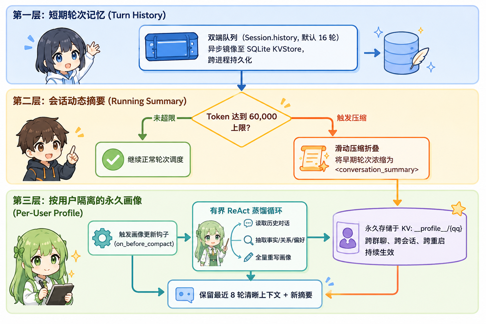

# linling (铃)

> **面向 IM 场景的双轨对话智能体平台：极速确定性中文 DSL 虚拟机 + 现代 LLM ReAct Agent + 统一工具与记忆底座。**

`linling`（铃）由原 Android QRSpeed / QRDic 规则引擎演化重写而来。目标是解决传统聊天机器人在**高频确定性业务（数值游戏/签到/道具集市/群管）**与**现代大模型开放性对话（拟人闲聊/意图理解/工具推理）**之间的冲突，构建一个跨平台（QQ / Web / CLI / 预留微信与飞书）、低成本、高可靠的异步 Python 智能体系统。

---

## 🎯 核心设计思想：为什么需要双轨架构？

在即时通讯（IM，尤其是高活跃群聊）场景下，纯代码机器人与纯大模型机器人各自存在明显的架构短板：

- **纯代码/纯规则机器人（如 NoneBot2、Koishi 或经典 QRSpeed）**：
  执行速度快、零 Token 消耗、逻辑 100% 确定可控；但在处理自然语言多轮对话、模糊意图识别和开放域闲聊时表现僵硬。
- **纯大模型机器人（如各类基于 API 转发的 ChatGPT/LLM 插件）**：
  语言理解能力出众，但面对群聊每分钟数十上百条消息的洪峰，**每句调用 LLM 会导致 Token 账单与延迟急剧失控**；此外，纯 Prompt 极难精准保证道具转移、扣款、背包管理等数值状态机的强一致性。

`linling` 采用**双轨协同架构（Dual-Track Hybrid Architecture）**将二者结合：

1. **指令轨（DSL VM）**：所有带前缀指令或全匹配规则直接进入 `.ling` 虚拟机执行，直接操作 KV 状态机，**0 Token、0 外部 API 依赖、毫秒级响应**；
2. **认知轨（Agent Engine）**：非指令文本走 Fallback 链路，由群聊聚合窗口与注意力探针控制触发频率，按需调起大模型；
3. **行动账本（Action Ledger）**：DSL 执行后产生的行为元数据被记录进账本。当用户在几轮指令后转入自然语言询问时，Agent 自动注入账本摘要，**彻底解决规则系统与大模型系统之间的上下文断层**。

---

## 📊 同类方案全维度对比

| 评估维度 | 经典中文脚本框架<br>*(QRSpeed / 酷Q)* | 传统开源 Bot 框架<br>*(NoneBot2 / Koishi)* | 纯 LLM 对话插件<br>*(AstrBot / 通用GPT Bot)* | **linling (本系统)** |
| :--- | :--- | :--- | :--- | :--- |
| **执行引擎** | 专用单机正则脚本解释器 | 纯 Python / TypeScript 代码驱动 | 外部 LLM API 转发 + 简易正则钩子 | **中文 DSL VM + ReAct Agent 双轨运行时** |
| **规则编写门槛** | 极低（零代码玩家编写中文脚本） | 较高（需编写代码并维护依赖） | 中等（配置 Prompt 与系统提示词） | **双层兼容：小白写 `.ling`，工程师写 Python Agent** |
| **执行延迟与成本** | 0 Token，本地毫秒级 | 0 Token，本地毫秒级 | 每条消息必调 LLM，成本高昂且有几秒延迟 | **规则 0 Token 瞬发；开放闲聊智能控频** |
| **规则与 AI 上下文互通** | 无原生 AI 支持 | 插件间状态割裂，AI 插件无法自动感知业务状态 | 规则仅作为触发前缀，无独立状态机 | **独创【行动账本 (Action Ledger)】，AI 自动感知规则行为** |
| **群聊防刷屏与成本控制** | 依赖简单计数器或 CD | 依赖限流中间件 | 频繁触发容易产生巨额账单，或只能死板依靠 `@` | **窗口聚合 (Group Batching) + 双阶注意力探针 (Fail-Closed)** |
| **记忆体系** | 本地文本/ini 键值 | 由具体插件自行实现 | 大多仅支持最近 N 轮滑动窗口 | **三层立体记忆：轮次历史 + 动态摘要 + 用户画像蒸馏** |
| **工具生态规范** | 平台内置特有宏函数 | 框架专有 Hook / Matcher | OpenAI Function Calling | **一源三态统一模型（Python / DSL / LLM Schema 自动衍生）** |

---

## 🔬 核心原理与设计图解

### 1. 消息路由决策流

输入消息在内核 [`linling_core.router`](packages/core/src/linling_core/router.py) 中完成去重、限流与意图分流：

<p align="center">
  
</p>

---

### 2. 破除上下文断层：DSL 行动账本 (Action Ledger)

当用户在群内使用 DSL 指令与机器人交互后，又紧接着使用自然语言闲聊时，系统如何避免“大模型失忆”？

<p align="center">
  
</p>

- **解耦设计**：DSL 执行结果 `DslEvent` 仅记录紧凑摘要，不污染原始对话 History 队列；
- **按需注入**：当 Agent 启动时，由 `LedgerRenderer` 将最近的 DSL 行为渲染成轻量上下文带给大模型，确保大模型对用户的业务行为心知肚明。

---

### 3. 群聊窗口聚合与双阶轻量注意力探针

在多人活跃群聊中，若每条消息都调用主力大模型，不仅延迟高，而且 Token 开销极大。`linling` 实现了**时间窗口聚合与两阶段判决机制**：

```text
群消息流 ──► [ 8秒窗口 / 50条缓冲 ] ──► 关注规则检查（@/回复/称谓/问句）
                                               │
                      ┌────────────────────────┴────────────────────────┐
                      ▼                                                 ▼
                  [未命中]                                           [命中]
                      │                                                 │
              轻量注意力探针 (Micro Probe)                              │
          (max_tokens=32, temp=0, Fail-Closed)                          │
                      │                                                 │
            ┌─────────┴─────────┐                                       │
            ▼                   ▼                                       │
       False / 超时           True                                      │
            │                   └───────────────┬───────────────────────┘
            ▼                                   ▼
        静默丢弃 (0 Token)             主力 Agent 深度处理 (选择性回复 1~3 条)
```

- **超低开销探针**：使用轻量端点（如 `gpt-4o-mini` 或本地轻量模型），限制输出 32 Tokens，单次判定成本极微；
- **Fail-Closed 闭环容错**：探针若发生网络超时、401 或解析失败，强制判定为 `False` 并静默，杜绝主模型被故障流量击穿；
- **选择性回复**：主力大模型获得整批消息上下文后，持有 `reply_to_message` 工具，自主决定回复其中最有价值的 1~3 条消息。

---

### 4. 三层立体记忆体系与压缩前画像蒸馏

为了平衡 Token 上下文预算、推理成本与长期事实沉淀，`linling` 实现了三层分级记忆：

<p align="center">
  
</p>

- **私聊场景**：自动将当前对象的画像以 `<user_profile>` 注入系统提示词（默认限额 400 字符）；
- **群聊场景**：开放 `read_user_profile` 与 `write_user_profile` 工具，模型根据语境按需调阅；
- **Fail-Open 保护**：画像蒸馏为辅助增强链路，如更新失败或超时则跳过，绝不阻断用户本轮消息的实时响应。

---

### 5. 一源三态：统一工具元模型

系统内所有工具仅需通过 [`linling_core.tools`](packages/core/src/linling_core/tools.py) 的 `@tool` 注册一次：

```python
@tool(
    name="read_kv",
    dsl_name="读",
    description="读取一个键值；默认值在未命中时返回",
    safe=True,
)
async def read_kv(ctx: ToolCtx, scope: str, file: str, key: str, default=None):
    return await ctx.kv.read(scope, file, key, default)
```

框架底层自动派生出三端可用形态：
- **形态 1（Python 原生）**：`ctx.tools.read_kv(...)`，用于内部扩展与测试；
- **形态 2（中文 DSL）**：`$读 作用域/文件名 键名 默认值$`，直接嵌入 `.ling` 规则；
- **形态 3（LLM Schema）**：自动导出符合 OpenAI 标准的 Function Calling JSON Schema。

---

## 📦 项目包结构

项目采用 `pnpm` + `uv` 双 Monorepo 工作区管理：

```
packages/
├── core/             # 内核 (linling_core)：事件总线、路由、状态机、工具注册表、配置
├── dsl/              # DSL 引擎 (linling_dsl)：词法语法解析、AST、虚拟机、Action Ledger
├── agent/            # 智能体引擎 (linling_agent)：ReAct 运行时、三层记忆、群批聚合、注意力探针
├── adapters/
│   ├── onebot/       # QQ 适配器 (OneBot v11 协议 / LLBot)
│   └── cli/          # 终端调试适配器 (CLI REPL)
├── tools-stdlib/     # 标准工具集：KV、HTTP 访问、编解码、字符串、图文、集市等
├── webui/            # Web 控制台：FastAPI 后端 + Vue 3 SPA 前端
└── cli/              # 命令行工具与服务启动装配器 (linling_cli)

bot/                  # 真实运行的 Bot 配置（以涂山苏苏为例）
├── bot.yaml          # 全局服务配置（存储路径、模型参数、适配器、白名单）
├── agents/           # Agent 定义文件（角色提示词、模型名、记忆配置）
├── rules/            # 中文规则脚本（*.ling，签到/游戏/集市等）
└── assets/picture/   # 本地静态图文资产（@pic: 协议本地解析）
```

---

## 🛠️ 快速开发与启动

### 1. 安装依赖

确保已安装 [uv](https://docs.astral.sh/uv/)（Python 包管理）与 Node.js 18+（若需要构建 WebUI 前端）：

```bash
# 同步安装所有 workspace 的 Python 依赖
uv sync --all-packages

# 运行自动化测试套件
uv run pytest

# 静态类型检查与 Lint
uv run ruff check .
uv run mypy
```

### 2. 配置环境变量

```bash
cp .env.example .env
```

在 `.env` 中填入你的大模型配置（兼容 OpenAI、DeepSeek、Kimi、Azure 或任意 vLLM 端点）：

```dotenv
OPENAI_API_KEY=sk-xxxxxxxxxxxxxxxxxxxxxxxx
OPENAI_BASE_URL=https://api.openai.com/v1
LINLING_MODEL=gpt-4o-mini
```

### 3. 启动服务

#### 模式 A：终端交互 + WebUI 同进程（推荐开发与日常使用）

```bash
uv run linling run bot/bot.yaml --webui --webui-port 8787
```

- **终端直接交互**：在终端打字即与 Bot 对话；
- **WebUI 控制台**：浏览器打开 `http://127.0.0.1:8787`：
  - **因缘（事件流）**：实时 WebSocket 观察所有入站事件与处理时延；
  - **灵玉（KV 浏览器）**：实时查看/修改玩家数值、背包与积分，具备 ETag 乐观锁；
  - **红娘（在线试聊）**：独立调试 Agent 角色设定与工具调用；
  - **命格（审计日志）**：全链路 `trace_id` 检索与执行复盘。

#### 模式 B：纯终端 REPL 调试

```bash
uv run linling run bot/bot.yaml
```

#### 模式 C：接入 QQ（OneBot v11）

在 `bot/bot.yaml` 中配置 OneBot 适配器：

```yaml
adapters:
  - kind: cli
  - kind: onebot
    ws_url: ${ONEBOT_WS_URL}     # 例如 ws://127.0.0.1:3001
    access_token: ${ONEBOT_TOKEN}
```

启动时注入环境变量即可：

```bash
export ONEBOT_WS_URL='ws://127.0.0.1:3001'
export ONEBOT_TOKEN=''
uv run linling run bot/bot.yaml
```

> **说明**：`linling` 本身不实现 QQ 私有协议，外部使用 OneBot v11 标准实现（推荐 [LLBot](docker/llbot/docker-compose.yml)、Lagrange 或 gocq）完成协议翻译与反向 WebSocket 对接。

#### 摊位图卡字体提醒

`摊位` / `摊位@某人` 等命令会生成动态渲染的图卡，需要 CJK 字体支持（如思源黑体）：
```bash
mkdir -p data/fonts
# 将 NotoSansSC-Regular.otf 或任意中文字体放入 data/fonts 即可
```

---

## 💡 规则编写示例 (.ling)

`.ling` 文件使用空行切分 Handler，规则顶格为正则触发器，支持中文内置函数与流程控制：

```ling
&&<配置>兼容模式:是

// 1. 基础签到逻辑与防重
签到
如果:$读 用户数据/签到 %QQ% 0$==%时间yyyyMMdd%
你今天已经签过到啦，明天再来找我玩吧！
返回
如果尾
$写 用户数据/签到 %QQ% %时间yyyyMMdd%$
$写 用户数据/灵玉 %QQ% [$读 用户数据/灵玉 %QQ% 0$+50]$
±img=@pic:道具宝箱.png±
签到成功！赠送 50 灵玉，当前余额：$读 用户数据/灵玉 %QQ% 0$。

// 2. 状态查询与正则捕获
查询(.*)
如果:%括号1%==灵玉
你的当前灵玉余额为：$读 用户数据/灵玉 %QQ% 0$。
返回
如果尾
如果:%括号1%==背包
你的背包物品：$读 用户数据/背包 %QQ% 空空如也$。
返回
如果尾
未知查询类别，请输入【查询灵玉】或【查询背包】。
```

修改 `.ling` 文件后无需重启服务，发送 `SIGHUP` 信号即可实现**无缝热重载**：

```bash
kill -HUP $(pgrep -f 'linling run')
```

---

## 📖 文档导航

- 🏛️ **[技术架构全景 / Architecture](docs/architecture.md)** — 模块职责、启动装配流与边界约束
- 📜 **[DSL 语法手册 / Grammar](docs/dsl/grammar.md)** — `.ling` 完整 EBNF 语法与内置函数索引
- 🔍 **[QRSpeed 兼容性对比 / QRSpeed Comparison](docs/dsl/qrspeed-comparison.md)** — 语法差异与迁移指引
- 💻 **[WebUI 规范与接口 / WebUI](packages/webui/README.md)** — 前端工程架构、REST/WS 规范与鉴权
- 🏪 **[集市交易系统 / Marketplace](docs/marketplace.md)** — 玩家摆摊交易设计与 Pillow 动态绘卡
- 📊 **[可观测性与监控 / Observability](docs/observability/README.md)** — Prometheus 监控指标体系与 Grafana 看板
- 📐 **[设计规范提案 / Specs](.kiro/specs/)** — 架构需求、方案与演进任务清单

---

## ⚖️ 开源协议与版权声明

- **开源协议**：本项目基于 [MIT License](LICENSE) 授权。
- **免责声明**：本项目为对话智能体与中文 DSL 解释器技术研究项目。仓库内默认示例 Bot（涂山苏苏）涉及的角色设定及相关像素图素材，其著作权归属于原版权方，仅用于本地测试演练，严禁用于商业用途。
